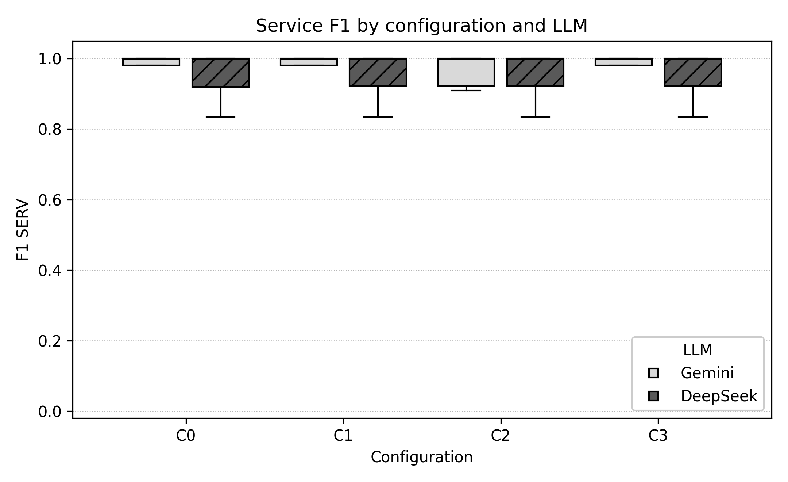
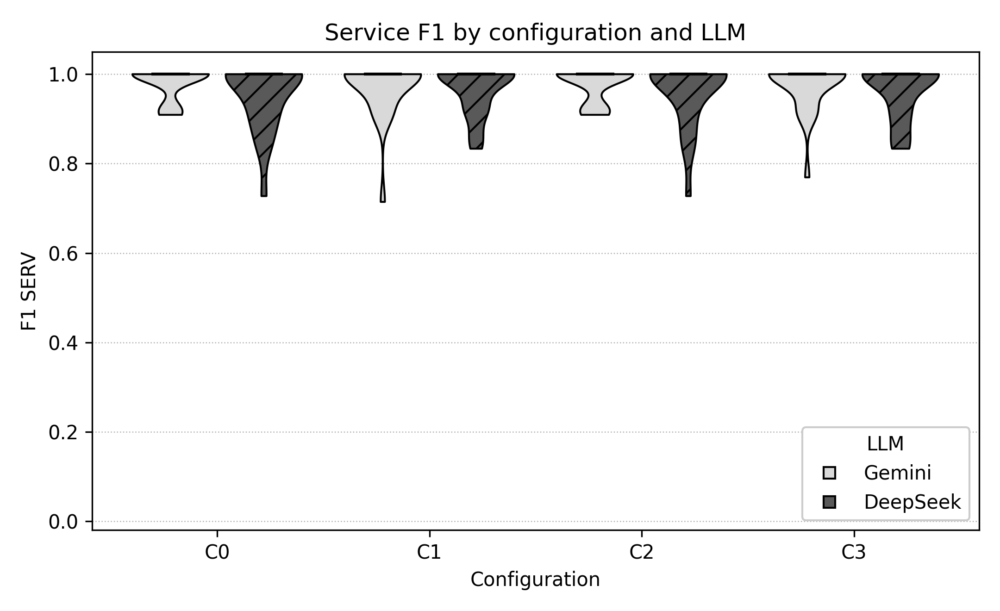
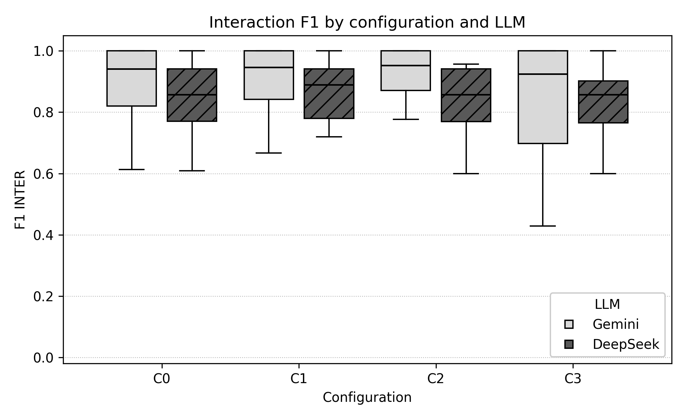
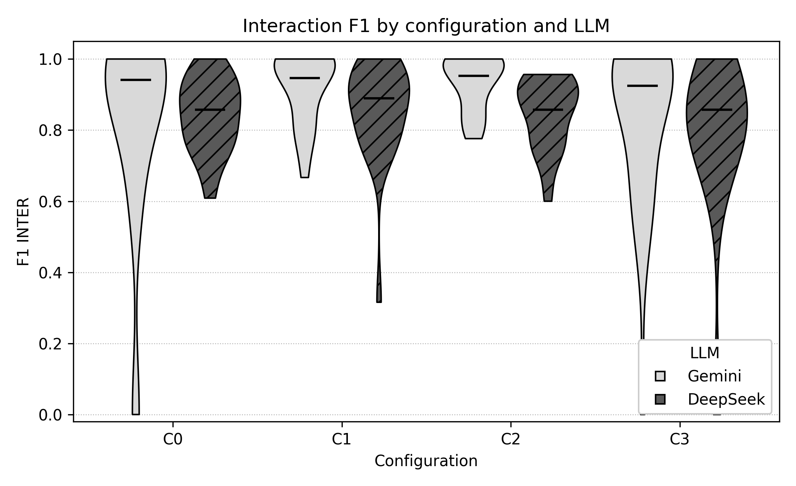
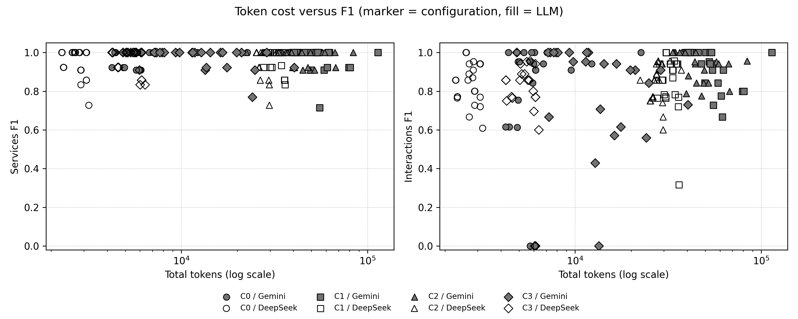

# DAVINCI Architect - Consolidated Experimental Report (FSE 2027)

> **Single-document consolidation of the `2027-FSE-Report-and-Dates` tree.**  This report gathers, in English, the quantitative analysis frozen in `Quantitative-Analysis/`, the re-analysis of the extended corpus (three LLMs x five configurations, C0-C4) and the qualitative syntheses produced for every (model, configuration) cell, together with the date/run calendar decoded from the execution metadata.

## About this document

The tree `2027-FSE-Report-and-Dates/` contains three kinds of artifacts:

- **PDF metrics reports and YAML specifications**, one set per (model, configuration, round);
- **TXT syntheses** named `*-Synthesize-two-three-tests.txt`, one per (model, configuration) cell, written by hand over the PDFs;
- **JSON execution metadata**, one per (model, configuration, round), with the tracer entries of every agent.

The frozen analysis in `Quantitative-Analysis/` already consolidated the *Gemini* and *DeepSeek* artifacts over C0-C3 into 192 observations and a set of tables and figures.  Its text is **reproduced verbatim** in section 2 of this document, with the figure links pointed at the original directory; nothing inside `Quantitative-Analysis/` was modified, recomputed or moved.

On top of that baseline this document adds, for the whole tree:

1. the **artifact inventory and run calendar** (section 1), with the interval of each round decoded from the execution ids;
2. a **re-analysis of the extended corpus** - 45 round artifacts, 15 (model, configuration) cells and 360 observations, adding Claude and the C4 configuration to the corpus of the frozen analysis - using the same statistical procedures (section 3);
3. the **fifteen qualitative syntheses** converted into Markdown, together with the cross-check of every value they quote against the PDFs (section 4);
4. **integrated conclusions, limitations and an artifact index** (sections 5 to 7), plus the commands that reproduce every table (Appendix A).

### How to read it

Section 2 is the frozen reference corpus (Gemini + DeepSeek, C0-C3) and section 3 is the extended corpus (Gemini + DeepSeek + Claude, C0-C4).  The two are consistent by construction - same metrics, same convention for the final architecture, same statistical procedures - so the numbers of section 3 are directly comparable with the ones of section 2; where they differ, the difference is a property of the corpus and not of the method, and it is discussed in section 6.

### Contents

- [1. The 2027-FSE dataset at a glance](#1-the-2027-fse-dataset-at-a-glance)
  - [1.1 Experimental design](#11-experimental-design)
  - [1.2 Artifact inventory and run calendar](#12-artifact-inventory-and-run-calendar)
  - [1.3 Provenance, extraction and consistency notes](#13-provenance-extraction-and-consistency-notes)
- [2. Frozen quantitative analysis (Gemini and DeepSeek, C0-C3)](#2-frozen-quantitative-analysis-gemini-and-deepseek-c0-c3)
- [3. Re-analysed quantitative results (three models x C0-C4)](#3-re-analysed-quantitative-results-three-models-x-c0-c4)
- [4. Qualitative syntheses](#4-qualitative-syntheses)
- [5. Integrated conclusions](#5-integrated-conclusions)
- [6. Limitations and known inconsistencies](#6-limitations-and-known-inconsistencies)
- [7. Artifact index](#7-artifact-index)
- [Appendix A. Reproduction commands](#appendix-a-reproduction-commands)

---

## 1. The 2027-FSE dataset at a glance

### 1.1 Experimental design

DAVINCI Architect is a multi-agent pipeline that turns a high-level architectural description of a software system into a detailed, machine-readable architectural specification.  Five agents cooperate:

| Agent | Role |
|---|---|
| Agent 1 - DDD Architect | Produces a first architectural proposal from the domain description (bounded contexts, aggregates, services, interactions). |
| Agent 2 - Communication Specialist | Produces an independent second proposal, driven by a catalogue of interaction patterns. |
| Agent 2.1 - Generalised Architect (C4) | Replaces Agent 2 in C4: the same prompt as Agent 1 with a different few-shot example, so that the second proposal is generated by a generalist instead of a specialist. |
| Agent 4 - Refiner | Refines each proposal (completeness, consistency, naming, architectural smells). |
| Agent 3 - Consolidator | Merges the two refined proposals into a single architecture. |
| Agent 5 - YAML Exporter | Serialises the final architecture into the YAML specification consumed by the validator. |

Five configurations were executed by every LLM, each of them repeated for three rounds on the same eight subject systems:

| Configuration | Agents | Purpose |
|---|---|---|
| C0 | Agent 1 | Only Agent 1 (DDD Architect) ran: no second proposal, no refinement, no consolidation and no dedicated YAML export stage. |
| C1 | Agents 1, 2, 3, 4, 5 | The complete pipeline: Agent 1 (DDD Architect) and Agent 2 (Communication Specialist) produce two independent proposals, Agent 4 (Refiner) refines both, Agent 3 (Consolidator) merges them, and Agent 5 (YAML Exporter) writes the specification. |
| C2 | Agents 1, 2, 3, 5 | Same as C1 with Agent 4 (Refiner) removed, which isolates the contribution of the refinement stage. |
| C3 | Agents 1, 4, 5 | Agent 2 and Agent 3 are removed together: a single proposal is produced by Agent 1, refined by Agent 4 and exported by Agent 5.  Without a second independent proposal there is nothing to consolidate, so the configuration evaluates the joint absence of the Communication Specialist and of consolidation. |
| C4 | Agents 1, 2.1, 3, 4, 5 | Agent 2 (Communication Specialist, with 50 hardcoded interaction patterns) is replaced by Agent 2.1, a generalized Software Architect cloned from Agent 1's prompt and differentiated only by a distinct few-shot example.  The experiment isolates the effect of replacing a specialized agent by a generalist one. |

The subject systems are the eight open-source applications used by the experiment: `7ep`, `AcmeAir`, `Cargo-Tracker`, `DayTrader7`, `Jokul`, `JPetStore`, `PetClinic`, `TNTConcept`.

#### Metrics

- **F1 of services** - harmonic mean of precision and recall of the services proposed with respect to the reference architecture.
- **F1 of interactions** - the same measure for the interactions between services.
- **YAML validity** - a specification is valid when the exporter emits a well-formed document with the expected schema.  Two variants are reported: the *raw* verdict (exactly as emitted) and the *normalised* verdict (after removing the fences and the prose that some models wrap around the document), which separates the structural correctness of the specification from the extraction problem.
- **Cost** - total tokens and wall-clock duration recorded by the execution metadata of each round (all agents of the pipeline summed).

Every metric is aggregated per system before the statistical tests: a system contributes a single value per configuration (the mean of its rounds), which keeps the pairing valid and avoids pseudo-replication.

### 1.2 Artifact inventory and run calendar

Every experiment round leaves three artifacts inside the tree: a metrics report (PDF, sometimes accompanied by a TXT copy), a YAML specification and an execution metadata JSON.  The table below enumerates the rounds the scanner found, with the reference execution id and the time window decoded from that id.

#### Artifact inventory

| LLM | Config | Test | Reference run id | First execution | Last execution | Systems with F1 | Total tokens | YAML normalised / raw |
|---|---|---|---|---|---|---|---|---|
| Gemini | C0 | T1 | `20260903_205005_269258` | 2026-09-03 20:50 | 2026-09-03 20:51 | 8/8 | 47 285 | 8/8 / 0/8 |
| Gemini | C0 | T2 | `20260903_205456_340115` | 2026-09-03 20:54 | 2026-09-03 20:57 | 8/8 | 65 209 | 7/8 / 0/8 |
| Gemini | C0 | T3 | `20260903_210342_295723` | 2026-09-03 21:03 | 2026-09-03 21:05 | 8/8 | 50 335 | 8/8 / 0/8 |
| Gemini | C1 | T1 | `20260902_234526_208847` | 2026-09-02 23:45 | 2026-09-02 23:52 | 8/8 | 412 612 | 7/8 / 0/8 |
| Gemini | C1 | T2 | `20260903_165851_722305` | 2026-09-03 16:58 | 2026-09-03 17:08 | 8/8 | 493 968 | 7/8 / 0/8 |
| Gemini | C1 | T3 | `20260903_171623_364024` | 2026-09-03 17:16 | 2026-09-03 17:23 | 8/8 | 427 386 | 8/8 / 0/8 |
| Gemini | C2 | T1 | `20260907_225212_288556` | 2026-09-07 22:52 | 2026-09-07 22:56 | 8/8 | 323 765 | 8/8 / 0/8 |
| Gemini | C2 | T2 | `20260907_230416_109126` | 2026-09-07 23:04 | 2026-09-07 23:11 | 8/8 | 424 574 | 8/8 / 0/8 |
| Gemini | C2 | T3 | `20260907_231654_505656` | 2026-09-07 23:16 | 2026-09-07 23:22 | 8/8 | 363 900 | 7/8 / 0/8 |
| Gemini | C3 | T1 | `20260908_092444_857580` | 2026-09-08 09:24 | 2026-09-08 09:29 | 8/8 | 119 259 | 8/8 / 0/8 |
| Gemini | C3 | T2 | `20260908_095439_959423` | 2026-09-08 09:54 | 2026-09-08 09:58 | 8/8 | 134 913 | 7/8 / 0/8 |
| Gemini | C3 | T3 | `20260908_100504_289248` | 2026-09-08 10:05 | 2026-09-08 10:09 | 8/8 | 108 742 | 8/8 / 0/8 |
| Gemini | C4 | T1 | `20260924_000010_980908` | 2026-09-24 00:00 | 2026-09-24 00:09 | 8/8 | 304 696 | 8/8 / 0/8 |
| Gemini | C4 | T2 | `20260924_001923_344442` | 2026-09-24 00:19 | 2026-09-24 00:31 | 8/8 | 371 635 | 6/8 / 0/8 |
| Gemini | C4 | T3 | `20260924_003550_639923` | 2026-09-24 00:35 | 2026-09-24 00:48 | 8/8 | 380 025 | 8/8 / 0/8 |
| DeepSeek | C0 | T1 | `20260909_000015_985111` | 2026-09-09 00:00 | 2026-09-09 00:01 | 8/8 | 22 011 | 8/8 / 0/8 |
| DeepSeek | C0 | T2 | `20260909_000859_000025` | 2026-09-09 00:08 | 2026-09-09 00:09 | 8/8 | 21 803 | 8/8 / 0/8 |
| DeepSeek | C0 | T3 | `20260909_001652_547770` | 2026-09-09 00:16 | 2026-09-09 00:17 | 8/8 | 21 825 | 8/8 / 0/8 |
| DeepSeek | C1 | T1 | `20260909_103416_609424` | 2026-09-09 10:34 | 2026-09-09 10:36 | 8/8 | 254 534 | 8/8 / 0/8 |
| DeepSeek | C1 | T2 | `20260909_105109_067579` | 2026-09-09 10:51 | 2026-09-09 10:53 | 8/8 | 258 565 | 8/8 / 0/8 |
| DeepSeek | C1 | T3 | `20260909_110058_895107` | 2026-09-09 11:00 | 2026-09-09 11:03 | 8/8 | 262 881 | 8/8 / 0/8 |
| DeepSeek | C2 | T1 | `20260908_224214_029631` | 2026-09-08 22:42 | 2026-09-08 22:44 | 8/8 | 226 513 | 8/8 / 0/8 |
| DeepSeek | C2 | T2 | `20260908_225951_345790` | 2026-09-08 22:59 | 2026-09-08 23:01 | 8/8 | 220 993 | 8/8 / 0/8 |
| DeepSeek | C2 | T3 | `20260908_231022_456089` | 2026-09-08 23:10 | 2026-09-08 23:12 | 8/8 | 225 880 | 8/8 / 0/8 |
| DeepSeek | C3 | T1 | `20260908_151742_978495` | 2026-09-08 15:17 | 2026-09-08 15:18 | 8/8 | 43 189 | 8/8 / 0/8 |
| DeepSeek | C3 | T2 | `20260908_154127_309666` | 2026-09-08 15:41 | 2026-09-08 15:42 | 8/8 | 42 560 | 8/8 / 0/8 |
| DeepSeek | C3 | T3 | `20260908_160635_241482` | 2026-09-08 16:06 | 2026-09-08 16:07 | 8/8 | 42 651 | 8/8 / 0/8 |
| DeepSeek | C4 | T1 | `20260923_211952_489245` | 2026-09-23 21:19 | 2026-09-23 21:22 | 8/8 | 159 133 | 3/8 / 0/8 |
| DeepSeek | C4 | T2 | `20260923_212418_795526` | 2026-09-23 21:24 | 2026-09-23 21:26 | 8/8 | 159 349 | 1/8 / 0/8 |
| DeepSeek | C4 | T3 | `20260923_213704_642391` | 2026-09-23 21:37 | 2026-09-23 21:39 | 8/8 | 159 489 | 2/8 / 0/8 |
| Claude | C0 | T1 | `20260916_223630_376472` | 2026-09-16 22:36 | 2026-09-16 22:37 | 8/8 | 24 494 | 6/8 / 0/8 |
| Claude | C0 | T2 | `20260916_224740_799307` | 2026-09-16 22:47 | 2026-09-16 22:49 | 8/8 | 24 500 | 6/8 / 0/8 |
| Claude | C0 | T3 | `20260916_230748_054613` | 2026-09-16 23:07 | 2026-09-16 23:09 | 8/8 | 24 641 | 5/8 / 0/8 |
| Claude | C1 | T1 | `20260916_204840_069250` | 2026-09-16 20:48 | 2026-09-16 20:56 | 8/8 | 342 369 | 6/8 / 0/8 |
| Claude | C1 | T2 | `20260916_210937_728290` | 2026-09-16 21:09 | 2026-09-16 21:17 | 8/8 | 343 202 | 6/8 / 0/8 |
| Claude | C1 | T3 | `20260916_212915_510308` | 2026-09-16 21:29 | 2026-09-16 21:36 | 8/8 | 340 357 | 6/8 / 0/8 |
| Claude | C2 | T1 | `20260916_235104_467530` | 2026-09-16 23:51 | 2026-09-16 23:57 | 8/8 | 301 316 | 6/8 / 0/8 |
| Claude | C2 | T2 | `20260917_000358_257329` | 2026-09-17 00:03 | 2026-09-17 00:10 | 8/8 | 266 879 | 6/8 / 0/8 |
| Claude | C2 | T3 | `20260917_000358_257329` | 2026-09-17 00:03 | 2026-09-17 00:10 | 8/8 | 303 647 | 5/8 / 0/8 |
| Claude | C3 | T1 | `20260919_002149_858658` | 2026-09-19 00:21 | 2026-09-19 00:24 | 8/8 | 47 526 | 6/8 / 0/8 |
| Claude | C3 | T2 | `20260919_002638_418100` | 2026-09-19 00:26 | 2026-09-19 00:29 | 8/8 | 47 409 | 6/8 / 0/8 |
| Claude | C3 | T3 | `20260919_003327_984877` | 2026-09-19 00:33 | 2026-09-19 00:36 | 8/8 | 47 726 | 6/8 / 0/8 |
| Claude | C4 | T1 | `20260923_201116_632460` | 2026-09-23 20:11 | 2026-09-23 20:25 | 8/8 | 198 831 | 6/8 / 0/8 |
| Claude | C4 | T2 | `20260923_203006_446980` | 2026-09-23 20:30 | 2026-09-23 20:36 | 8/8 | 199 160 | 6/8 / 0/8 |
| Claude | C4 | T3 | `20260923_204021_670087` | 2026-09-23 20:40 | 2026-09-23 20:45 | 4/8 | 105 267 | 7/8 / 4/8 |

#### Cell summary and run calendar

The next table aggregates the rounds of each (model, configuration) cell: the window is the earliest and the latest timestamp found in its metadata, and the last two columns average the F1 of the final architecture over every observation of the cell.

| LLM | Config | Test rounds | Execution window | Total tokens | Mean F1 services | Mean F1 interactions |
|---|---|---|---|---|---|---|
| Gemini | C0 | 3 | 2026-09-03 20:50 to 2026-09-03 21:05 | 162 829 | 0.9790 | 0.8270 |
| Gemini | C1 | 3 | 2026-09-02 23:45 to 2026-09-03 17:23 | 1 333 966 | 0.9709 | 0.9187 |
| Gemini | C2 | 3 | 2026-09-07 22:52 to 2026-09-07 23:22 | 1 112 239 | 0.9758 | 0.9318 |
| Gemini | C3 | 3 | 2026-09-08 09:24 to 2026-09-08 10:09 | 362 914 | 0.9732 | 0.8182 |
| Gemini | C4 | 3 | 2026-09-24 00:00 to 2026-09-24 00:48 | 1 056 356 | 0.9790 | 0.8905 |
| DeepSeek | C0 | 3 | 2026-09-09 00:00 to 2026-09-09 00:17 | 65 639 | 0.9526 | 0.8422 |
| DeepSeek | C1 | 3 | 2026-09-09 10:34 to 2026-09-09 11:03 | 775 980 | 0.9656 | 0.8556 |
| DeepSeek | C2 | 3 | 2026-09-08 22:42 to 2026-09-08 23:12 | 673 386 | 0.9602 | 0.8469 |
| DeepSeek | C3 | 3 | 2026-09-08 15:17 to 2026-09-08 16:07 | 128 400 | 0.9608 | 0.7725 |
| DeepSeek | C4 | 3 | 2026-09-23 21:19 to 2026-09-23 21:39 | 477 971 | 0.9496 | 0.8283 |
| Claude | C0 | 3 | 2026-09-16 22:36 to 2026-09-16 23:09 | 73 635 | 0.9208 | 0.8265 |
| Claude | C1 | 3 | 2026-09-16 20:48 to 2026-09-16 21:36 | 1 025 928 | 0.9336 | 0.8559 |
| Claude | C2 | 3 | 2026-09-16 23:51 to 2026-09-17 00:10 | 871 842 | 0.9391 | 0.8257 |
| Claude | C3 | 3 | 2026-09-19 00:21 to 2026-09-19 00:36 | 142 661 | 0.9234 | 0.8274 |
| Claude | C4 | 3 | 2026-09-23 20:11 to 2026-09-23 20:45 | 503 258 | 0.9125 | 0.8087 |

### 1.3 Provenance, extraction and consistency notes

Every number of this document comes from the PDF artifacts, from the TXT syntheses and from the metadata JSON files stored in this tree.  The extraction follows the pipeline of the frozen analysis and was reimplemented for the extended corpus in a separate, self-contained scanner (`scan_all.py`) that reuses the parsing helpers of `_source_scan.py` and text extraction with `pdfplumber`:

1. **Metrics reports.** Each PDF (or its cached text) is parsed into the per-system table of the report: *Proposal A*, *Proposal B* (labelled `Proposal B (2.1)` in C4), *Consolidated*, and the breakdown by service/interaction.  As in the frozen analysis, the *final* value of a round is the consolidated line when it exists and *Proposal A* otherwise, which is the case for the single-proposal configurations (C0 and C3).
2. **YAML validity.** Each specification is validated twice with `pyyaml`: the *raw* verdict applies the parser to the emitted text, and the *normalised* verdict applies the documented normalisation of `normalize_pdf_yaml`, which re-indents `to:` entries under their `from:` entry and strips the prose/fences wrapped around the document by some models.  The normalisation touches syntax only and never changes an F1, token or duration value.
3. **Cost.** `total_tokens` and `duration_ms` are summed over the agents recorded in each execution metadata file.
4. **Execution ids.** The metadata files name their executions as `YYYYMMDD_HHMMSS_*`; the calendar of section 1.2 is decoded from those ids, so the timestamps are the ones recorded by the pipeline itself and not the file timestamps of the artifacts.

The scan covered **45 round artifacts**, i.e. **15 of the 15 (model, configuration) cells** of the design (3 models x 5 configurations x 3 rounds = 45 rounds in total).  The overall execution window decoded from the metadata is **2026-09-02 23:45 to 2026-09-24 00:48**.

All 15 cells contain the three planned rounds, so the corpus is balanced (15 cells x 3 rounds x 8 systems = 360 observations).

Three different layouts of the metadata JSON coexist in the tree and were normalised during the scan: (i) a plain list of tracer entries (most of the Gemini artifacts); (ii) an object with a `tracers` list (Gemini, C4, Test-2); and (iii) an object with a single summary plus an `aggregates` block (Gemini, C4, Test-3).  The DeepSeek and Claude metadata files omit the `system` field of each tracer; in those cases the position of the tracer is mapped onto the fixed order of the subject systems declared in `_source_scan.CANONICAL_SYSTEMS`.

**Duplicate execution ids.** In 0 of the 45 round artifacts at least two tracer entries share the same execution id (the ids are reused across systems within a round).  This does not affect any metric - each row is matched to its own system - but it means that the ids identify *executions of the round*, not individual system runs, and the calendar of section 1.2 therefore reports one interval per round.

**Scope of the consolidation.** The frozen analysis (`Quantitative-Analysis/`) is reproduced verbatim in section 2 and was not recomputed: its 192 observations and its plots are the reference.  Section 3 recomputes the *same* statistics with the *same* procedures over the extended corpus of this tree (three models x five configurations), which allows the two corpora to be compared.  Where the two disagree, the discrepancy is reported in section 6.

---

## 2. Frozen quantitative analysis (Gemini and DeepSeek, C0-C3)

This section reproduces `Quantitative-Analysis/report.md` **verbatim**: the same 192 observations, the same extraction conventions and the same statistical procedures.  Only the depth of the headings was shifted (so that the consolidated document keeps a single title) and the figure links were rewritten to `Quantitative-Analysis/figures/`; no file of that directory was modified.  The numbering used *inside* the reproduction (1, 2, 3, ...) belongs to the frozen report and is independent of the numbering of this consolidated document.

### Quantitative Analysis of the Experiments on Microservice Architecture Generation

### 1. Introduction

This report presents the statistical analysis of the experimental results obtained with the **DAVINCI Architect** pipeline, which generates microservice architectures from textual requirements. The objective is to quantitatively and reproducibly evaluate how different pipeline configurations and different language models affect the quality of the produced architectures, in addition to characterizing the associated computational cost.

The experiment follows a factorial ablation design. Four pipeline configurations, denoted **C0**, **C1**, **C2**, and **C3**, were evaluated on two language models (**Gemini** and **DeepSeek**), across **eight reference systems**. Each combination of configuration and model was executed **three times**, totaling 24 executions and 192 observations at the system level.

The configurations differ in the agents that compose the pipeline:

- **C0** - uses only Agent 1 (DDD Architect), with no refinement, no communication specialization, and no consolidation;
- **C1** - full pipeline, with Agent 1, the Communication Specialist, the Refiner, and the Consolidator, plus the specification generator;
- **C2** - same as C1, but without the Refiner;
- **C3** - uses only Agent 1 (DDD Architect), Agent 4 (Refiner), and Agent 5 (YAML Exporter). Agents 2 (Communication Specialist) and 3 (Consolidator) are removed together: without the second independent proposal generated by Agent 2, the consolidation step no longer makes sense, as there is no longer more than one candidate architecture to compare. C3 therefore evaluates the combined effect of the absence of communication specialization and the absence of consolidation on the final architecture, keeping the refinement of a single proposal as an intermediate stage.

The quality metrics are the F1-score of **services** and the F1-score of **interactions**, calculated on the final architecture recommended by the pipeline and compared to the reference ground truth. The cost metrics are the total tokens consumed and the execution time.

### 2. Methodology

#### 2.1 Data source and organization

The data were extracted from the raw artifacts generated by the pipeline, organized by model, configuration, and execution. For each execution, three types of artifacts were read: the metrics report (PDF or TXT), which contains the F1 tables for services and interactions; the architectural specification (PDF or TXT), which contains the generated YAML; and the execution metadata JSON file, which records tokens and time per system.

The consolidated table, saved in `data.csv`, has one row per (system, configuration, model, execution), totaling 192 records with the columns `system`, `config`, `llm`, `execution`, `f1_serv`, `f1_inter`, `yaml_valid`, `total_tokens`, and `duration_ms`.

#### 2.2 Extraction and normalizations

The extraction of PDF reports was performed with the `pdfplumber` library. Some care was necessary due to inconsistencies in the artifacts:

1. **Consolidated result.** For C1 and C2, there is an explicit line called *Consolidated* in the metrics report. For C0 and C3, which produce a single proposal, the final architecture is equivalent to *Proposal A*; in these cases, that value was adopted as the consolidated result.
2. **Computational cost.** The metrics artifacts do not contain a *Tracer* section; the values of `total_tokens` and `duration_ms` were obtained from the execution metadata JSON file, which records consumption per system.
3. **System identification.** Some JSON files do not carry the `system` field; in these cases, the records were associated by positional order, following the canonical order of the eight systems. This hypothesis was validated against the per-system cost tables of the synthesized reports, yielding exact correspondence of values.
4. **Name normalization.** Naming divergences between artifacts were corrected (for example, `acmeair`/`AcmeAir`, `Pet-Clinic`/`PetClinic`, and the typo `7ed`/`7ep`).

#### 2.3 YAML validation

The variable `yaml_valid` indicates whether the generated YAML is syntactically valid, that is, whether it can be loaded by `yaml.safe_load`. It is important to note that PDF rendering **destroys YAML formatting**: the two-space indentation of the `to:` lines is lost and long lines are truncated. For this reason, the raw text extracted from PDFs is not valid in any case.

To obtain an informative measure, a **documented normalization** was applied, which re-indents the `to:` lines under the corresponding `- from:` entry, restoring the intended structure of the document. With this normalization, 187 of the 192 observations (97.4%) present valid YAML. The five exceptions are discussed in the limitations section. The normalization is implemented in the function `normalize_pdf_yaml` and is restricted to syntax evaluation, not altering any F1, token, or time value.

#### 2.4 Statistical procedures

All analysis was conducted in Python 3.12, with the libraries `pandas`, `numpy`, `scipy`, `matplotlib`, `pyyaml`, and `pdfplumber`. The following procedures were adopted:

- **Descriptive statistics:** mean, median, and standard deviation per configuration-model combination, accompanied by a 95% confidence interval obtained by non-parametric bootstrap with 1,000 resamples and a fixed seed;
- **Paired tests:** the Wilcoxon signed-rank test was applied to the comparisons C0 vs C1, C1 vs C2, and C1 vs C3, separately by model. The eight systems were treated as paired units, using the average of the three executions of each system to reduce stochastic noise;
- **Effect size:** for each comparison, Cliff's delta was calculated, classified as negligible (|d| < 0.147), small (|d| < 0.330), medium (|d| < 0.474), or large (|d| >= 0.474);
- **Correlation:** Spearman's rank correlation coefficient was used to evaluate the association between token cost and the three outcome variables (F1 of services, F1 of interactions, and YAML validity), both globally and within each configuration.

The significance level adopted is 5%, and the results were not corrected for multiple comparisons, which is discussed in the limitations.

### 3. Descriptive statistics

The following tables summarize performance by configuration and by model. Each cell presents the mean, the standard deviation in parentheses, and the 95% confidence interval in brackets. The number of observations is 24 per cell (eight systems in three executions).

#### 3.1 F1 of services

| Configuration | Gemini | DeepSeek |
|---|---|---|
| C0 | 0.9790 (0.0373) [0.9639; 0.9930] | 0.9526 (0.0732) [0.9205; 0.9801] |
| C1 | 0.9709 (0.0645) [0.9416; 0.9930] | 0.9656 (0.0545) [0.9425; 0.9866] |
| C2 | 0.9758 (0.0387) [0.9598; 0.9904] | 0.9602 (0.0730) [0.9293; 0.9876] |
| C3 | 0.9732 (0.0553) [0.9481; 0.9930] | 0.9608 (0.0610) [0.9339; 0.9839] |

#### 3.2 F1 of interactions

| Configuration | Gemini | DeepSeek |
|---|---|---|
| C0 | 0.8270 (0.2840) [0.6962; 0.9294] | 0.8422 (0.1038) [0.8015; 0.8829] |
| C1 | 0.9187 (0.1013) [0.8768; 0.9576] | 0.8556 (0.1436) [0.7946; 0.9068] |
| C2 | 0.9318 (0.0774) [0.8992; 0.9613] | 0.8469 (0.0987) [0.8088; 0.8874] |
| C3 | 0.8182 (0.2457) [0.7079; 0.9069] | 0.7725 (0.2571) [0.6590; 0.8583] |

**Commentary.** Service identification is practically insensitive to configuration variations. The means remain between 0.9526 and 0.9790, and the range across the four configurations is only 0.0081 for Gemini and 0.0130 for DeepSeek. In all cells, the median equals 1.0000, indicating that most observations reach the metric's ceiling; the small standard deviations confirm this stability. In other words, the additional agent effort in C1 and C2 does not produce relevant service gains.

The behavior of interactions is quite different and constitutes the main differentiator among configurations. In Gemini, the best mean performance occurs in **C2** (0.9318), closely followed by C1 (0.9187); in DeepSeek, the best result is also from **C1** (0.8556). Configuration C3 presents the worst mean performance in both models (0.8182 and 0.7725, respectively) and, above all, the highest dispersion (standard deviations of 0.2457 and 0.2571), revealing instability: without the Communication Specialist, implicit dependencies are no longer consistently recovered.

It is worth noting that the confidence intervals of C1 and C2 overlap widely in both models, suggesting that removing the Refiner (C2) does not compromise the average quality of interactions. The interval for C3, however, is visibly wider and located at a lower level, especially in DeepSeek.

### 4. Paired tests

The following table presents the results of the Wilcoxon test and Cliff's delta for each configuration contrast, separately by model. The column `n_nonzero` indicates in how many of the eight pairs the difference between configurations is non-zero; when this number is very low, the test has little statistical power.

| Metric | Comparison | Model | Pairs | Non-zero differences | W statistic | p-value | Cliff's delta | Magnitude |
|---|---|---|---|---|---|---|---|---|
| F1 of services | C0 vs C1 | Gemini | 8 | 1 | 0.0000 | 1.0000 | 0.0156 | negligible |
| F1 of interactions | C0 vs C1 | Gemini | 8 | 5 | 2.0000 | 0.1875 | -0.1719 | small |
| F1 of services | C1 vs C2 | Gemini | 8 | 2 | 1.0000 | 1.0000 | 0.0781 | negligible |
| F1 of interactions | C1 vs C2 | Gemini | 8 | 4 | 3.0000 | 0.6250 | -0.0312 | negligible |
| F1 of services | C1 vs C3 | Gemini | 8 | 1 | 0.0000 | 1.0000 | -0.0156 | negligible |
| F1 of interactions | C1 vs C3 | Gemini | 8 | 7 | 2.0000 | 0.0469 | 0.3906 | medium |
| F1 of services | C0 vs C1 | DeepSeek | 8 | 3 | 1.0000 | 0.5000 | 0.0156 | negligible |
| F1 of interactions | C0 vs C1 | DeepSeek | 8 | 6 | 8.0000 | 0.6875 | -0.1094 | negligible |
| F1 of services | C1 vs C2 | DeepSeek | 8 | 4 | 3.0000 | 0.6250 | -0.0469 | negligible |
| F1 of interactions | C1 vs C2 | DeepSeek | 8 | 7 | 13.0000 | 0.9375 | 0.0781 | negligible |
| F1 of services | C1 vs C3 | DeepSeek | 8 | 2 | 1.0000 | 1.0000 | -0.0312 | negligible |
| F1 of interactions | C1 vs C3 | DeepSeek | 8 | 7 | 8.0000 | 0.3750 | 0.2656 | small |

**Commentary.** Considering a 5% significance level, only one comparison reaches statistical significance: C1 vs C3 (Gemini, F1 of interactions): p = 0.0469, delta = 0.3906 (medium). In the other contrasts, p-values are high, which is consistent with the small number of non-zero differences and the sample size of eight pairs.

Two patterns deserve attention. First, for F1 of services, all deltas are practically null (|delta| <= 0.08), reinforcing that service identification does not depend on configuration. Second, for F1 of interactions, deltas are larger and consistently positive in the expected direction: the contrasts C0 vs C1 and C1 vs C3 favor C1, while C1 vs C2 shows a negligible effect.

The most expressive case is Gemini in the **C1 vs C3** comparison: with seven of eight non-zero differences, we obtain p = 0.0469 and Cliff's delta = 0.3906 (medium effect), indicating that removing the Communication Specialist detectably degrades interaction recovery. In DeepSeek, the effect points in the same direction, but with small magnitude (delta = 0.2656) and without significance (p = 0.3750), suggesting greater variability across executions in that model.

It is also noteworthy that the C1 vs C2 comparison produces negligible effects in both models and for both metrics. This result is the quantitative evidence that the Refiner can be dispensed with without measurable loss of quality, which has a direct impact on the cost-benefit relationship discussed later.

### 5. Spearman correlation

The following table presents Spearman's rank correlation between token cost and the three outcome variables, calculated globally (192 observations) and within each configuration (48 observations).

| Variable X | Variable Y | Scope | n | rho | p-value |
|---|---|---|---|---|---|
| Tokens | F1 of services | Global | 192 | 0.0118 | 0.8715 |
| Tokens | F1 of services | C0 | 48 | 0.1056 | 0.4750 |
| Tokens | F1 of services | C1 | 48 | -0.0879 | 0.5525 |
| Tokens | F1 of services | C2 | 48 | -0.0619 | 0.6761 |
| Tokens | F1 of services | C3 | 48 | -0.1123 | 0.4471 |
| Tokens | F1 of interactions | Global | 192 | 0.1840 | 0.0106 |
| Tokens | F1 of interactions | C0 | 48 | 0.2773 | 0.0564 |
| Tokens | F1 of interactions | C1 | 48 | 0.0765 | 0.6054 |
| Tokens | F1 of interactions | C2 | 48 | 0.3113 | 0.0313 |
| Tokens | F1 of interactions | C3 | 48 | -0.0471 | 0.7505 |
| Tokens | Valid YAML | Global | 192 | -0.1354 | 0.0611 |
| Tokens | Valid YAML | C0 | 48 | -0.2264 | 0.1218 |
| Tokens | Valid YAML | C1 | 48 | -0.3010 | 0.0376 |
| Tokens | Valid YAML | C2 | 48 | -0.1632 | 0.2677 |
| Tokens | Valid YAML | C3 | 48 | -0.2159 | 0.1406 |

**Commentary.** There is no relevant association between token cost and F1 of services, either globally (rho = 0.0118; p = 0.8715) or in any isolated configuration. This result is consistent with the discrete nature of the service metric, which saturates at 1.0000 in most observations.

For interactions, a weak but positive association is observed (rho = 0.1840; p = 0.0106 in the global scope): executions that consume more tokens tend to produce better interaction results. The association is clearer within C2 (rho = 0.3113; p = 0.0313), where higher consumption is linked to more complex systems that require more communication inference. In C1, the correlation is practically null, suggesting that, in this configuration, quality depends more on consensus among agents than on computational effort.

Regarding YAML validity, the global correlation is negative and marginally non-significant (rho = -0.1354; p = 0.0611), and within C1 it reaches significance (rho = -0.3010; p = 0.0376). The most prudent reading is that this effect does not express a causal relationship between cost and syntax failure, but rather the higher incidence of truncation of long lines in more complex systems, addressed in the limitations section.

In summary, computational cost is not a good predictor of architectural quality: the correlations are weak and do not support the idea that spending more tokens guarantees better results.

### 6. Visualizations

All figures were generated in grayscale, at 300 dpi, so that they remain legible in print. In grouped plots, the light tone represents Gemini and the dark tone represents DeepSeek; in box plots, DeepSeek's fill receives hatching to reinforce the distinction without relying on color.

#### 6.1 Distribution of F1 of services



*Figure 1 - Box plot of F1 of services. The distributions are strongly concentrated near 1.0000 in all configurations, with few observations below the third quartile. The absence of outliers with expressive deviation confirms that service identification is stable regardless of configuration and model.*



*Figure 2 - Violin plot of F1 of services. The flattened shape shifted toward the top reinforces the concentration of observations at the metric's maximum value.*

#### 6.2 Distribution of F1 of interactions



*Figure 3 - Box plot of F1 of interactions. The dispersion is much larger than that observed for services. C3 presents the lowest box and the largest interquartile range, especially in DeepSeek, evidencing the loss of quality resulting from removing the Communication Specialist.*



*Figure 4 - Violin plot of F1 of interactions. A bimodal distribution is observed in some configurations, resulting from the coexistence of "easy" systems (interactions explicit in the requirements) and systems with implicit dependencies.*

#### 6.3 Token cost versus quality



*Figure 5 - Scatter between total tokens (log scale) and F1. The marker shape identifies the configuration and the fill identifies the model, so the figure remains informative in black and white. In the services panel, points concentrate at the top, with no visible relationship with cost. In the interactions panel, it is noticeable that higher costs (associated with C1 and C2) accompany more stable values, while C0 and C3 occupy the lower-cost and higher-dispersion range.*

#### 6.4 Computational cost

The following table presents the average cost per system execution, in tokens and milliseconds.

| Configuration | Gemini | DeepSeek |
|---|---|---|
| C0 | 6785 tokens / 14581 ms | 2735 tokens / 4160 ms |
| C1 | 55582 tokens / 69900 ms | 32332 tokens / 20761 ms |
| C2 | 46343 tokens / 51543 ms | 28058 tokens / 17647 ms |
| C3 | 15121 tokens / 40541 ms | 5350 tokens / 6699 ms |

**Commentary.** Cost grows sharply with the number of agents involved. In Gemini, the average tokens per system goes from approximately 6785 in C0 to about 55582 in C1, an increase of roughly 8.2 times; in DeepSeek, the same jump occurs from 2735 to 32332 (11.8 times). Configuration C2 sits at an intermediate level (46343 tokens in Gemini and 28058 in DeepSeek), reducing the cost relative to C1.

This cost difference is the main argument against the indiscriminate use of the full pipeline and supports the recommendation of C2 as an intermediate configuration, developed in the discussion.

### 7. Discussion

#### 7.1 Synthesis of findings

The analysis allows separating two effects clearly. The first is that of **service identification**, which proves robust and practically invariant: means remain above 0.95 in all configurations and models, with small standard deviations and medians equal to 1.0000. The second is that of **interaction recovery**, which is sensitive to configuration and accounts for almost all the variation observed among the generated architectures.

Interactions also concentrate the highest variability. In both models, C3 presents simultaneously the lowest mean and the highest standard deviation, indicating that the absence of the Communication Specialist not only reduces expected performance but also makes the result less predictable. C1 and C2, on the other hand, present similar means and smaller standard deviations, characterizing greater stability.

#### 7.2 Answers to the research questions

**RQ1 - Does the multi-agent pipeline improve quality relative to the single agent?** For services, there is no evidence of gain: the measured effects are negligible. For interactions, the answer is affirmative, though moderate in statistical terms. The means favor C1 and C2 in both models, and Cliff's delta consistently points in that direction, even though only the C1 vs C3 contrast in Gemini reaches conventional significance. The defensible conclusion is that the gain exists and is especially relevant in systems whose requirements omit implicit dependencies, but the sample size limits the strength of the evidence.

**RQ2 - Which pipeline components really matter?** The results isolate the Communication Specialist (removed in C3) as the critical component for interactions: its absence reduces the mean and increases dispersion. The Refiner (removed in C2) shows no measurable contribution, since C1 vs C2 produces negligible effects in both models and for both metrics. This supports the hypothesis that the value of the pipeline lies in specialization and consolidation, not in the number of agents.

**RQ3 - What is the trade-off between quality, stability, and cost?** Cost grows much faster than quality. Compared to C0, the full pipeline consumes an order of magnitude more tokens, while the interaction gain is incremental. Since C2 maintains average quality close to C1 at lower cost and shows no detectable loss, it configures itself as the best balance. C0 remains attractive only when requirements are well structured and explicitly state dependencies, a situation in which its instability does not compromise the result. C3, in turn, presents the worst cost-benefit ratio: it costs more than C0 and delivers worse interactions than C1 and C2.

#### 7.3 Role of the language models

No systematic quality differences were observed between Gemini and DeepSeek. Service identification is equivalent, and in interactions, both models exhibit the same qualitative ordering of configurations, although DeepSeek shows greater dispersion across executions. This behavior is consistent with the weak correlations between cost and quality: the determining factor appears to be the clarity of requirements and the presence of specialized agents, not the model employed.

### 8. Limitations

The results should be interpreted in light of the following limitations:

1. **Small sample size.** There are eight systems and three executions per combination, resulting in eight pairs per test at the system level. This limited statistical power explains why only one of the twelve contrasts reaches significance, even when effect sizes point to consistent differences.
2. **Single ground truth.** The precision, recall, and F1 metrics were calculated against a single reference set per system. The quality of the metrics depends on how faithfully this ground truth represents the desired architecture, and legitimate design variations may be penalized.
3. **High frequency of ties.** Due to the saturation of F1 of services at 1.0000, many paired differences are null. This reduces the number of non-zero ranks and compromises the performance of the Wilcoxon test.
4. **No correction for multiple comparisons.** Since twelve tests were performed, there is a risk of Type I error inflation. With a Bonferroni correction, for example, the single significant result would no longer be so. Effect sizes, being independent of sample size, should be considered the primary evidence.
5. **Artifacts truncated by PDF.** The truncation of long lines in PDF rendering affects YAML validation in five observations (all from Gemini) and also prevents content evaluation, since the text is cut off. The `yaml_valid` variable, therefore, measures the syntactic validity of what survived extraction, not necessarily the quality of the YAML produced by the pipeline.
6. **Dependence on inference for metadata.** Some metadata files do not explicitly record which system each entry refers to; the association was made by positional order, validated against an independent table. Nevertheless, the strategy relies on a premise not verifiable in all files.
7. **Partially inconsistent cost metadata.** Some records report `prompt_tokens` equal to zero, although `total_tokens` is consistent with the number of calls. For this reason, only `total_tokens` was used.
8. **Scope of evaluated configurations.** Temperature 0.0 and a single few-shot prompting strategy were used. The results do not automatically generalize to other temperatures, prompting strategies, or models.

Despite these limitations, the observed patterns are consistent across the two models and converge with the qualitative analysis recorded in the synthesized reports, which reinforces the reliability of the conclusions presented.

---

## 3. Re-analysed quantitative results (three models x C0-C4)

The frozen analysis covers two models (Gemini, DeepSeek) and four configurations (C0-C3).  This section repeats the same analysis over the *whole* tree: three models (Gemini, DeepSeek, Claude Sonnet 4.5) and five configurations (C0-C4), that is, **360 observations** - 8 systems x 3 rounds x 15 cells, of which 356 carry the F1 metrics.  Every table below is recomputed from the artifacts of this tree; the metrics, the convention for the final architecture and the statistical procedures are the ones of the frozen pipeline, so the two sections are directly comparable.

### 3.1 Data preparation

The extended corpus was rebuilt from the artifacts of this tree: **360 observations**, one per (system, configuration, model, round), of which **356 carry the F1 metrics** used by the analysis below.  Every (model, configuration) cell holds 24 observations, i.e. the eight subject systems over the three rounds of the design.  The metrics are the same as in the frozen analysis, with the same convention for the final architecture (consolidated proposal when available, *Proposal A* otherwise).

The executions without a metric are Claude Sonnet 4.5 C4 round 3 (4 systems: Jokul, JPetStore, PetClinic, TNTConcept).  Their round recorded execution metadata - including a YAML verdict - but its metrics artifact has no entry for those systems, so they are counted in the inventory and in the cost tables only; the cost statistics use the rounds that recorded a budget, and every metric table below states the observations it rests on.

The statistical procedures replicate the frozen pipeline exactly:

- **Descriptive statistics** - mean, standard deviation and a 95% confidence interval obtained by non-parametric bootstrap with 1,000 resamples and a fixed seed (`descriptive_stats.bootstrap_ci`).
- **Paired tests** - Wilcoxon signed-rank test on the per-system means of the two configurations being compared, with Cliff's delta as effect size and the magnitude thresholds of `paired_tests.effect_magnitude` (negligible below 0.147, small below 0.33, medium below 0.474, large above).
- **Correlations** - Spearman's rho with the p-value of `scipy.stats.spearmanr` (`correlation.spearman`), computed globally and within each configuration.

The pairing unit is the **system**: for every configuration each of the eight systems contributes the mean of the rounds it has - three of them, or fewer where a round produced no metric, in which case the mean rests on the rounds that do exist.  Rounds feed the descriptive statistics only.  This is what makes the Wilcoxon test work on 8 pairs per comparison instead of on individual observations.

Tokens are reported as the total consumed by all agents of a round; across the corpus one system execution costs between 2 281 and 113 905 tokens (mean 24 696).

### 3.2 Descriptive statistics of the final architecture

#### Descriptive statistics - F1 of services

| Configuration | Gemini (gemini-flash-latest) | DeepSeek | Claude Sonnet 4.5 |
|---|---|---|---|
| C0 | 0.9790 (0.0373) [0.9639; 0.9930] | 0.9526 (0.0732) [0.9205; 0.9801] | 0.9208 (0.1267) [0.8653; 0.9652] |
| C1 | 0.9709 (0.0645) [0.9416; 0.9930] | 0.9656 (0.0545) [0.9425; 0.9866] | 0.9336 (0.0989) [0.8896; 0.9684] |
| C2 | 0.9758 (0.0387) [0.9598; 0.9904] | 0.9602 (0.0730) [0.9277; 0.9849] | 0.9391 (0.1134) [0.8878; 0.9776] |
| C3 | 0.9732 (0.0553) [0.9481; 0.9930] | 0.9608 (0.0610) [0.9339; 0.9839] | 0.9234 (0.1257) [0.8658; 0.9683] |
| C4 | 0.9790 (0.0373) [0.9639; 0.9930] | 0.9496 (0.0496) [0.9285; 0.9700] | 0.9181 (0.1208) [0.8615; 0.9637] |

*Observations per cell: Gemini (gemini-flash-latest): 24 executions per configuration, all of them with metrics; DeepSeek: 24 executions per configuration, all of them with metrics; Claude Sonnet 4.5: 24 executions per configuration, with metrics in C0 24/24, C1 24/24, C2 24/24, C3 24/24, C4 20/24.*

#### Descriptive statistics - F1 of interactions

| Configuration | Gemini (gemini-flash-latest) | DeepSeek | Claude Sonnet 4.5 |
|---|---|---|---|
| C0 | 0.8270 (0.2840) [0.6968; 0.9312] | 0.8422 (0.1038) [0.8027; 0.8824] | 0.8265 (0.2041) [0.7369; 0.9002] |
| C1 | 0.9187 (0.1013) [0.8772; 0.9562] | 0.8556 (0.1436) [0.7900; 0.9078] | 0.8559 (0.1685) [0.7866; 0.9187] |
| C2 | 0.9318 (0.0774) [0.8981; 0.9633] | 0.8469 (0.0987) [0.8077; 0.8852] | 0.8257 (0.1949) [0.7379; 0.8968] |
| C3 | 0.8182 (0.2457) [0.7144; 0.9055] | 0.7725 (0.2571) [0.6640; 0.8605] | 0.8274 (0.2160) [0.7318; 0.9083] |
| C4 | 0.8905 (0.2072) [0.7935; 0.9547] | 0.8283 (0.1533) [0.7640; 0.8896] | 0.8181 (0.2129) [0.7175; 0.9029] |

*Observations per cell: Gemini (gemini-flash-latest): 24 executions per configuration, all of them with metrics; DeepSeek: 24 executions per configuration, all of them with metrics; Claude Sonnet 4.5: 24 executions per configuration, with metrics in C0 24/24, C1 24/24, C2 24/24, C3 24/24, C4 20/24.*

#### Reading the descriptive tables

**F1 of services.** The best cell of the corpus is **Gemini (gemini-flash-latest) / C4** with a mean of 0.9790, and the weakest is **Claude Sonnet 4.5 / C4** with 0.9181.  The paired differences between adjacent configurations are:

- **Gemini (gemini-flash-latest)** - C0 -> C1 -0.0081 (0.9790 -> 0.9709); C1 -> C2 +0.0049; C1 -> C3 +0.0023; C3 -> C4 +0.0058; C1 -> C4 +0.0081.
- **DeepSeek** - C0 -> C1 +0.0130 (0.9526 -> 0.9656); C1 -> C2 -0.0054; C1 -> C3 -0.0048; C3 -> C4 -0.0112; C1 -> C4 -0.0160.
- **Claude Sonnet 4.5** - C0 -> C1 +0.0128 (0.9208 -> 0.9336); C1 -> C2 +0.0055; C1 -> C3 -0.0102; C3 -> C4 -0.0054; C1 -> C4 -0.0155.

**F1 of interactions.** The best cell of the corpus is **Gemini (gemini-flash-latest) / C2** with a mean of 0.9318, and the weakest is **DeepSeek / C3** with 0.7725.  The paired differences between adjacent configurations are:

- **Gemini (gemini-flash-latest)** - C0 -> C1 +0.0917 (0.8270 -> 0.9187); C1 -> C2 +0.0132; C1 -> C3 -0.1005; C3 -> C4 +0.0723; C1 -> C4 -0.0282.
- **DeepSeek** - C0 -> C1 +0.0134 (0.8422 -> 0.8556); C1 -> C2 -0.0086; C1 -> C3 -0.0831; C3 -> C4 +0.0558; C1 -> C4 -0.0273.
- **Claude Sonnet 4.5** - C0 -> C1 +0.0294 (0.8265 -> 0.8559); C1 -> C2 -0.0301; C1 -> C3 -0.0285; C3 -> C4 -0.0093; C1 -> C4 -0.0378.

The confidence intervals are wide - eight systems per cell over three rounds, except the four systems that one round left without metrics (JPetStore, Jokul, PetClinic, TNTConcept), whose mean rests on two rounds - so the tables are best read as effect sizes rather than as significance statements; the paired tests of section 3.4 provide the inferential counterpart.

### 3.3 Per-system behaviour

#### Per-system means - F1 of services

| System | C0 | C1 | C2 | C3 | C4 |
|---|---|---|---|---|---|
| 7ep | 1.0000 | 1.0000 | 1.0000 | 1.0000 | 1.0000 |
| AcmeAir | 1.0000 | 1.0000 | 1.0000 | 1.0000 | 1.0000 |
| Cargo-Tracker | 0.9091 | 0.8442 | 0.9091 | 0.8625 | 0.9091 |
| DayTrader7 | 1.0000 | 1.0000 | 0.9744 | 1.0000 | 1.0000 |
| Jokul | 1.0000 | 1.0000 | 1.0000 | 1.0000 | 1.0000 |
| JPetStore | 1.0000 | 1.0000 | 1.0000 | 1.0000 | 1.0000 |
| PetClinic | 1.0000 | 1.0000 | 1.0000 | 1.0000 | 1.0000 |
| TNTConcept | 0.9231 | 0.9231 | 0.9231 | 0.9231 | 0.9231 |

*Gemini (gemini-flash-latest) - mean over the available test rounds.*

| System | C0 | C1 | C2 | C3 | C4 |
|---|---|---|---|---|---|
| 7ep | 1.0000 | 0.9778 | 1.0000 | 1.0000 | 1.0000 |
| AcmeAir | 1.0000 | 1.0000 | 1.0000 | 1.0000 | 1.0000 |
| Cargo-Tracker | 0.8838 | 0.9744 | 1.0000 | 0.9141 | 0.9091 |
| DayTrader7 | 0.8138 | 0.8492 | 0.8059 | 0.8492 | 0.9231 |
| Jokul | 1.0000 | 1.0000 | 0.9524 | 1.0000 | 0.9524 |
| JPetStore | 1.0000 | 1.0000 | 1.0000 | 1.0000 | 1.0000 |
| PetClinic | 1.0000 | 1.0000 | 1.0000 | 1.0000 | 0.8889 |
| TNTConcept | 0.9231 | 0.9231 | 0.9231 | 0.9231 | 0.9231 |

*DeepSeek - mean over the available test rounds.*

| System | C0 | C1 | C2 | C3 | C4 |
|---|---|---|---|---|---|
| 7ep | 1.0000 | 1.0000 | 1.0000 | 1.0000 | 1.0000 |
| AcmeAir | 1.0000 | 1.0000 | 1.0000 | 1.0000 | 1.0000 |
| Cargo-Tracker | 0.6154 | 0.7179 | 0.6667 | 0.6154 | 0.6667 |
| DayTrader7 | 0.9231 | 0.9231 | 0.9231 | 0.9231 | 0.9231 |
| Jokul | 0.9047 | 0.9047 | 1.0000 | 1.0000 | 0.9285 |
| JPetStore | 1.0000 | 1.0000 | 1.0000 | 1.0000 | 1.0000 |
| PetClinic | 1.0000 | 1.0000 | 1.0000 | 0.9259 | 0.9445 |
| TNTConcept | 0.9231 | 0.9231 | 0.9231 | 0.9231 | 0.9231 |

*Claude Sonnet 4.5 - mean over the available test rounds.*

#### Per-system means - F1 of interactions

| System | C0 | C1 | C2 | C3 | C4 |
|---|---|---|---|---|---|
| 7ep | 0.9524 | 0.9841 | 0.9683 | 0.9683 | 1.0000 |
| AcmeAir | 0.8718 | 1.0000 | 1.0000 | 0.8571 | 0.9412 |
| Cargo-Tracker | 0.2807 | 0.8038 | 0.8421 | 0.4674 | 0.5614 |
| DayTrader7 | 0.9091 | 0.8283 | 0.9152 | 0.9091 | 0.9116 |
| Jokul | 1.0000 | 1.0000 | 1.0000 | 1.0000 | 1.0000 |
| JPetStore | 0.9412 | 0.9412 | 0.9412 | 0.7703 | 0.9412 |
| PetClinic | 1.0000 | 1.0000 | 1.0000 | 0.8889 | 1.0000 |
| TNTConcept | 0.6606 | 0.7920 | 0.7880 | 0.6844 | 0.7685 |

*Gemini (gemini-flash-latest) - mean over the available test rounds.*

| System | C0 | C1 | C2 | C3 | C4 |
|---|---|---|---|---|---|
| 7ep | 0.9104 | 0.8538 | 0.9062 | 0.8889 | 0.9333 |
| AcmeAir | 0.8323 | 0.9412 | 0.9063 | 0.9063 | 1.0000 |
| Cargo-Tracker | 0.7758 | 0.8827 | 0.9407 | 0.8174 | 0.8421 |
| DayTrader7 | 0.6993 | 0.6017 | 0.6691 | 0.7128 | 0.7521 |
| Jokul | 0.9524 | 1.0000 | 0.8571 | 0.9524 | 0.7460 |
| JPetStore | 0.9412 | 0.9412 | 0.9412 | 0.3137 | 1.0000 |
| PetClinic | 0.8571 | 0.8571 | 0.7857 | 0.8214 | 0.6000 |
| TNTConcept | 0.7692 | 0.7669 | 0.7692 | 0.7669 | 0.7524 |

*DeepSeek - mean over the available test rounds.*

| System | C0 | C1 | C2 | C3 | C4 |
|---|---|---|---|---|---|
| 7ep | 1.0000 | 1.0000 | 1.0000 | 1.0000 | 1.0000 |
| AcmeAir | 1.0000 | 1.0000 | 1.0000 | 1.0000 | 1.0000 |
| Cargo-Tracker | 0.3478 | 0.5328 | 0.4348 | 0.3636 | 0.4149 |
| DayTrader7 | 0.8404 | 0.8575 | 0.8353 | 0.8454 | 0.7899 |
| Jokul | 0.8333 | 0.7778 | 0.6667 | 1.0000 | 0.8750 |
| JPetStore | 0.9412 | 0.8971 | 0.9412 | 0.8971 | 0.9081 |
| PetClinic | 0.8571 | 1.0000 | 0.9524 | 0.7333 | 0.8000 |
| TNTConcept | 0.7919 | 0.7817 | 0.7754 | 0.7795 | 0.7907 |

*Claude Sonnet 4.5 - mean over the available test rounds.*

#### Reading the per-system tables

- **F1 of services** - the widest spread across systems is Claude Sonnet 4.5/C3 (range 0.3846) and the narrowest is Gemini (gemini-flash-latest)/C0 (range 0.0909).
- **F1 of interactions** - the widest spread across systems is Gemini (gemini-flash-latest)/C0 (range 0.7193) and the narrowest is Gemini (gemini-flash-latest)/C1 (range 0.2080).

Per-system variation is larger than per-configuration variation for every model, and the same systems sit at both ends of every cell, which is precisely why the analysis is paired by system.

### 3.4 Paired tests (Wilcoxon signed-rank and Cliff's delta)

For each model the five configurations are compared pairwise on both metrics.  The two configurations are paired **by subject system**: each system contributes the mean of the rounds that produced metrics, which yields eight pairs per contrast and avoids pseudo-replication.  The test is the two-sided Wilcoxon signed-rank test with zero differences discarded (`zero_method='wilcox'`), and the effect size is Cliff's delta with the magnitude thresholds of the frozen analysis (negligible < 0.147, small < 0.33, medium < 0.474, large otherwise).

| Metric | Comparison | Model | Pairs | Non-zero differences | W statistic | p-value | Cliff's delta | Magnitude |
|---|---|---|---|---|---|---|---|---|
| F1 of services | C0 vs C1 | Gemini (gemini-flash-latest) | 8 | 1 | 0.0000 | 1.0000 | 0.0156 | negligible |
| F1 of interactions | C0 vs C1 | Gemini (gemini-flash-latest) | 8 | 5 | 2.0000 | 0.1875 | -0.1719 | small |
| F1 of services | C1 vs C2 | Gemini (gemini-flash-latest) | 8 | 2 | 1.0000 | 1.0000 | 0.0781 | negligible |
| F1 of interactions | C1 vs C2 | Gemini (gemini-flash-latest) | 8 | 4 | 3.0000 | 0.6250 | -0.0312 | negligible |
| F1 of services | C1 vs C3 | Gemini (gemini-flash-latest) | 8 | 1 | 0.0000 | 1.0000 | -0.0156 | negligible |
| F1 of interactions | C1 vs C3 | Gemini (gemini-flash-latest) | 8 | 7 | 2.0000 | 0.0469 | 0.3906 | medium |
| F1 of services | C1 vs C4 | Gemini (gemini-flash-latest) | 8 | 1 | 0.0000 | 1.0000 | -0.0156 | negligible |
| F1 of interactions | C1 vs C4 | Gemini (gemini-flash-latest) | 8 | 5 | 5.0000 | 0.6250 | 0.0938 | negligible |
| F1 of services | C3 vs C4 | Gemini (gemini-flash-latest) | 8 | 1 | 0.0000 | 1.0000 | -0.0156 | negligible |
| F1 of interactions | C3 vs C4 | Gemini (gemini-flash-latest) | 8 | 7 | 0.0000 | 0.0156 | -0.3594 | medium |
| F1 of services | C0 vs C1 | DeepSeek | 8 | 3 | 1.0000 | 0.5000 | 0.0156 | negligible |
| F1 of interactions | C0 vs C1 | DeepSeek | 8 | 6 | 8.0000 | 0.6875 | -0.1094 | negligible |
| F1 of services | C1 vs C2 | DeepSeek | 8 | 4 | 3.0000 | 0.6250 | -0.0469 | negligible |
| F1 of interactions | C1 vs C2 | DeepSeek | 8 | 7 | 13.0000 | 0.9375 | 0.0781 | negligible |
| F1 of services | C1 vs C3 | DeepSeek | 8 | 2 | 1.0000 | 1.0000 | -0.0312 | negligible |
| F1 of interactions | C1 vs C3 | DeepSeek | 8 | 7 | 8.0000 | 0.3750 | 0.2656 | small |
| F1 of services | C1 vs C4 | DeepSeek | 8 | 5 | 5.0000 | 0.6250 | 0.2188 | small |
| F1 of interactions | C1 vs C4 | DeepSeek | 8 | 8 | 18.0000 | 1.0000 | 0.2188 | small |
| F1 of services | C3 vs C4 | DeepSeek | 8 | 4 | 3.0000 | 0.6250 | 0.1719 | small |
| F1 of interactions | C3 vs C4 | DeepSeek | 8 | 8 | 14.0000 | 0.6406 | -0.0938 | negligible |
| F1 of services | C0 vs C1 | Claude Sonnet 4.5 | 8 | 1 | 0.0000 | 1.0000 | -0.0156 | negligible |
| F1 of interactions | C0 vs C1 | Claude Sonnet 4.5 | 8 | 6 | 8.0000 | 0.6875 | -0.0625 | negligible |
| F1 of services | C1 vs C2 | Claude Sonnet 4.5 | 8 | 2 | 1.0000 | 1.0000 | -0.1250 | negligible |
| F1 of interactions | C1 vs C2 | Claude Sonnet 4.5 | 8 | 6 | 3.0000 | 0.1562 | 0.1250 | negligible |
| F1 of services | C1 vs C3 | Claude Sonnet 4.5 | 8 | 3 | 2.0000 | 0.7500 | -0.0625 | negligible |
| F1 of interactions | C1 vs C3 | Claude Sonnet 4.5 | 8 | 5 | 4.0000 | 0.4375 | 0.0625 | negligible |
| F1 of services | C1 vs C4 | Claude Sonnet 4.5 | 8 | 4 | 2.0000 | 0.3750 | 0.0312 | negligible |
| F1 of interactions | C1 vs C4 | Claude Sonnet 4.5 | 8 | 6 | 7.0000 | 0.5625 | 0.0312 | negligible |
| F1 of services | C3 vs C4 | Claude Sonnet 4.5 | 8 | 4 | 5.0000 | 1.0000 | 0.0625 | negligible |
| F1 of interactions | C3 vs C4 | Claude Sonnet 4.5 | 8 | 6 | 10.0000 | 1.0000 | 0.0000 | negligible |

#### Reading the paired tests

2 of the 30 contrasts reach p < 0.05 and 0 of them show a large effect size (|delta| >= 0.474).  The significant contrasts are:

- **F1 of interactions, C3 vs C4 (Gemini (gemini-flash-latest))** - W = 0.0000, p = 0.0156, delta = -0.3594 (medium), 7 of 8 pairs with a non-zero difference.
- **F1 of interactions, C1 vs C3 (Gemini (gemini-flash-latest))** - W = 2.0000, p = 0.0469, delta = 0.3906 (medium), 7 of 8 pairs with a non-zero difference.

Two conventions of the frozen analysis are preserved: zero-difference pairs are discarded from the statistic (`zero_method='wilcox'`) and the test is two-sided.  With only eight pairs the smallest attainable p-value is 0.0078, so a non-significant result must be read as *absence of evidence* rather than as evidence of absence.

### 3.5 Cost, quality and validity: correlations

Spearman's rho is computed on the pooled observations (all models and configurations together) and again inside each configuration, always for the three pairs of interest: tokens against the F1 of services, tokens against the F1 of interactions, and tokens against YAML validity.  The pooled coefficient is the one of the frozen report extended to the new cells; the per-configuration coefficients answer the question that matters for the pipeline, namely whether spending more tokens *inside a fixed configuration* is associated with a better architecture.

| Variable X | Variable Y | Scope | n | rho | p-value |
|---|---|---|---|---|---|
| Tokens | F1 of services | Global | 355 | 0.0032 | 0.9514 |
| Tokens | F1 of services | C0 | 72 | 0.0336 | 0.7794 |
| Tokens | F1 of services | C1 | 72 | -0.1418 | 0.2346 |
| Tokens | F1 of services | C2 | 71 | -0.1780 | 0.1375 |
| Tokens | F1 of services | C3 | 72 | -0.0645 | 0.5903 |
| Tokens | F1 of services | C4 | 68 | 0.1491 | 0.2250 |
| Tokens | F1 of interactions | Global | 355 | 0.0863 | 0.1046 |
| Tokens | F1 of interactions | C0 | 72 | 0.1818 | 0.1263 |
| Tokens | F1 of interactions | C1 | 72 | 0.0242 | 0.8403 |
| Tokens | F1 of interactions | C2 | 71 | 0.0844 | 0.4839 |
| Tokens | F1 of interactions | C3 | 72 | -0.0787 | 0.5112 |
| Tokens | F1 of interactions | C4 | 68 | 0.0874 | 0.4785 |
| Tokens | Valid YAML | Global | 359 | -0.0108 | 0.8382 |
| Tokens | Valid YAML | C0 | 72 | 0.0234 | 0.8454 |
| Tokens | Valid YAML | C1 | 72 | -0.2190 | 0.0645 |
| Tokens | Valid YAML | C2 | 71 | -0.2239 | 0.0605 |
| Tokens | Valid YAML | C3 | 72 | 0.1207 | 0.3126 |
| Tokens | Valid YAML | C4 | 72 | 0.4303 | 0.0002 |

#### Reading the correlations

- **Tokens vs F1 of services** - rho = +0.0032 (p = 0.9514, n = 355): a negligible, positive association on the whole corpus.
- **Tokens vs F1 of interactions** - rho = +0.0863 (p = 0.1046, n = 355): a negligible, positive association on the whole corpus.
- **Tokens vs YAML validity** - rho = -0.0108 (p = 0.8382, n = 359): a negligible, negative association on the whole corpus.

The correlation is computed on the pooled observations and repeated inside each configuration.  Pooling mixes models and configurations, so a global coefficient must be read together with the per-configuration ones, which are usually smaller.

### 3.6 Cost of the pipeline and YAML validity

The cost columns average, over the observations of a cell, the total tokens and the wall-clock duration recorded in the execution metadata (all agents of a round summed).  The YAML columns count the well-formed specifications produced by a cell out of its 24 executions, in the normalised and in the raw variant.

| Configuration | Gemini (gemini-flash-latest) | DeepSeek | Claude Sonnet 4.5 |
|---|---|---|---|
| C0 | 6785 tokens / 14581 ms | 2735 tokens / 4160 ms | 3068 tokens / 9894 ms |
| C1 | 55582 tokens / 69900 ms | 32332 tokens / 20761 ms | 42747 tokens / 62111 ms |
| C2 | 46343 tokens / 51543 ms | 28058 tokens / 17647 ms | 37906 tokens / 51241 ms |
| C3 | 15121 tokens / 40541 ms | 5350 tokens / 6699 ms | 5944 tokens / 20138 ms |
| C4 | 44015 tokens / 98811 ms | 19915 tokens / 17032 ms | 25163 tokens / 48621 ms |

#### YAML validity

| Configuration | Gemini (gemini-flash-latest) | DeepSeek | Claude Sonnet 4.5 |
|---|---|---|---|
| C0 | 23/24 (0/24 unnormalised) | 24/24 (0/24 unnormalised) | 17/24 (0/24 unnormalised) |
| C1 | 22/24 (0/24 unnormalised) | 24/24 (0/24 unnormalised) | 18/24 (0/24 unnormalised) |
| C2 | 23/24 (0/24 unnormalised) | 24/24 (0/24 unnormalised) | 17/24 (0/24 unnormalised) |
| C3 | 23/24 (0/24 unnormalised) | 24/24 (0/24 unnormalised) | 18/24 (0/24 unnormalised) |
| C4 | 22/24 (0/24 unnormalised) | 6/24 (0/24 unnormalised) | 19/24 (4/24 unnormalised) |

#### Reading the cost and YAML tables

The most expensive cell of the corpus is **Gemini (gemini-flash-latest) / C1** (55582 tokens per system execution on average) and the cheapest is **DeepSeek / C0** (2735 tokens).  The ordering follows the number of agents that run: the single-agent baseline C0 is the cheapest configuration for every model, while the complete pipeline and its variants (C1, C2, C3, C4) multiply the token budget.

The YAML columns report how many well-formed specifications a cell produced out of its 24 executions, in the normalised and in the raw variant.  The gap between the two is the share of invalid specifications caused by the fencing/prose emitted around the document rather than by the document itself - the correction introduced by the frozen analysis and reproduced here.

### 3.7 C4 in detail: two proposals and what the consolidation keeps

C4 replaces the Communication Specialist (Agent 2) by Agent 2.1, a generalised architect cloned from Agent 1's prompt and differentiated only by its few-shot example.  The two tables below list, per system and per model, the F1 of proposal A (Agent 1), of proposal B (Agent 2.1) and of the consolidated architecture that is scored as the final result.

#### Proposal comparison - F1 of services

| System (model) | Proposal A (Agent 1) | Proposal B (Agent 2.1) | Consolidated (final) |
|---|---|---|---|
| 7ep (Gemini (gemini-flash-latest)) | 1.0000 | 1.0000 | 1.0000 |
| AcmeAir (Gemini (gemini-flash-latest)) | 1.0000 | 1.0000 | 1.0000 |
| Cargo-Tracker (Gemini (gemini-flash-latest)) | 0.9091 | 0.9091 | 0.9091 |
| DayTrader7 (Gemini (gemini-flash-latest)) | 1.0000 | 1.0000 | 1.0000 |
| Jokul (Gemini (gemini-flash-latest)) | 1.0000 | 1.0000 | 1.0000 |
| JPetStore (Gemini (gemini-flash-latest)) | 1.0000 | 1.0000 | 1.0000 |
| PetClinic (Gemini (gemini-flash-latest)) | 1.0000 | 1.0000 | 1.0000 |
| TNTConcept (Gemini (gemini-flash-latest)) | 0.9231 | 0.9231 | 0.9231 |
| 7ep (DeepSeek) | 1.0000 | 0.9778 | 1.0000 |
| AcmeAir (DeepSeek) | 1.0000 | 1.0000 | 1.0000 |
| Cargo-Tracker (DeepSeek) | 0.9091 | 0.9091 | 0.9091 |
| DayTrader7 (DeepSeek) | 0.9231 | 0.9231 | 0.9231 |
| Jokul (DeepSeek) | 0.9524 | 1.0000 | 0.9524 |
| JPetStore (DeepSeek) | 1.0000 | 1.0000 | 1.0000 |
| PetClinic (DeepSeek) | 0.8889 | 0.8889 | 0.8889 |
| TNTConcept (DeepSeek) | 0.9231 | 0.9231 | 0.9231 |
| 7ep (Claude Sonnet 4.5) | 1.0000 | 1.0000 | 1.0000 |
| AcmeAir (Claude Sonnet 4.5) | 1.0000 | 1.0000 | 1.0000 |
| Cargo-Tracker (Claude Sonnet 4.5) | 0.6154 | 0.6667 | 0.6667 |
| DayTrader7 (Claude Sonnet 4.5) | 0.9231 | 0.9231 | 0.9231 |
| Jokul (Claude Sonnet 4.5) | 0.8571 | 1.0000 | 0.9285 |
| JPetStore (Claude Sonnet 4.5) | 1.0000 | 0.9616 | 1.0000 |
| PetClinic (Claude Sonnet 4.5) | 0.9445 | 0.9445 | 0.9445 |
| TNTConcept (Claude Sonnet 4.5) | 0.9231 | 0.9231 | 0.9231 |

#### Proposal comparison - F1 of interactions

| System (model) | Proposal A (Agent 1) | Proposal B (Agent 2.1) | Consolidated (final) |
|---|---|---|---|
| 7ep (Gemini (gemini-flash-latest)) | 0.9508 | 1.0000 | 1.0000 |
| AcmeAir (Gemini (gemini-flash-latest)) | 0.9412 | 0.8095 | 0.9412 |
| Cargo-Tracker (Gemini (gemini-flash-latest)) | 0.2807 | 0.5614 | 0.5614 |
| DayTrader7 (Gemini (gemini-flash-latest)) | 0.8695 | 0.9116 | 0.9116 |
| Jokul (Gemini (gemini-flash-latest)) | 1.0000 | 1.0000 | 1.0000 |
| JPetStore (Gemini (gemini-flash-latest)) | 0.5079 | 0.9020 | 0.9412 |
| PetClinic (Gemini (gemini-flash-latest)) | 1.0000 | 1.0000 | 1.0000 |
| TNTConcept (Gemini (gemini-flash-latest)) | 0.7685 | 0.7387 | 0.7685 |
| 7ep (DeepSeek) | 0.9333 | 0.9444 | 0.9333 |
| AcmeAir (DeepSeek) | 1.0000 | 1.0000 | 1.0000 |
| Cargo-Tracker (DeepSeek) | 0.8421 | 0.8140 | 0.8421 |
| DayTrader7 (DeepSeek) | 0.7521 | 0.5565 | 0.7521 |
| Jokul (DeepSeek) | 0.7460 | 0.6667 | 0.7460 |
| JPetStore (DeepSeek) | 1.0000 | 0.9412 | 1.0000 |
| PetClinic (DeepSeek) | 0.6000 | 0.5818 | 0.6000 |
| TNTConcept (DeepSeek) | 0.7524 | 0.7463 | 0.7524 |
| 7ep (Claude Sonnet 4.5) | 1.0000 | 1.0000 | 1.0000 |
| AcmeAir (Claude Sonnet 4.5) | 1.0000 | 1.0000 | 1.0000 |
| Cargo-Tracker (Claude Sonnet 4.5) | 0.3694 | 0.3831 | 0.4149 |
| DayTrader7 (Claude Sonnet 4.5) | 0.7899 | 0.8696 | 0.7899 |
| Jokul (Claude Sonnet 4.5) | 0.7084 | 0.8334 | 0.8750 |
| JPetStore (Claude Sonnet 4.5) | 0.9081 | 0.8917 | 0.9081 |
| PetClinic (Claude Sonnet 4.5) | 0.8000 | 0.8000 | 0.8000 |
| TNTConcept (Claude Sonnet 4.5) | 0.7907 | 0.7752 | 0.7907 |

#### Reading the C4 proposal tables

C4 is the only configuration that exposes two heterogeneous proposals side by side: Agent 1 (generalist DDD architect) and Agent 2.1 (the same prompt with a different few-shot example).  Comparing the two columns isolates the diversity introduced by the second architect, and the third column shows what the consolidation keeps.

- **F1 of services** - Gemini (gemini-flash-latest) A 0.9790, B 0.9790, final 0.9790 - the consolidation lands between the two proposals (A-B gap 0.0000, final-A +0.0000); DeepSeek A 0.9496, B 0.9527, final 0.9496 - the consolidation lands between the two proposals (A-B gap 0.0032, final-A +0.0000); Claude Sonnet 4.5 A 0.9032, B 0.9214, final 0.9181 - the consolidation lands between the two proposals (A-B gap 0.0181, final-A +0.0148).
- **F1 of interactions** - Gemini (gemini-flash-latest) A 0.7898, B 0.8654, final 0.8905 - the consolidation lands above both proposals (A-B gap 0.0756, final-A +0.1007); DeepSeek A 0.8283, B 0.7814, final 0.8283 - the consolidation lands between the two proposals (A-B gap 0.0469, final-A +0.0000); Claude Sonnet 4.5 A 0.7946, B 0.8179, final 0.8181 - the consolidation lands above both proposals (A-B gap 0.0233, final-A +0.0235).

A consolidation that lands between the two proposals, or above both, indicates that the merge is not merely selecting one of them; a consolidation that tracks proposal A indicates that the second proposal contributed little to the final architecture.

### 3.8 Answers to the research questions (extended corpus)

The frozen report answers the research questions for the Gemini and DeepSeek corpora over C0-C3.  Re-running the same procedures for the three models and the five configurations of this tree gives the following reading.

**RQ1 - Does the multi-agent pipeline improve the architectural quality over the single-agent baseline?**  The relevant contrast is C0 vs C1.  For the F1 of services, the change from C0 to C1 is Gemini (gemini-flash-latest) -0.0081, DeepSeek +0.0130, Claude Sonnet 4.5 +0.0128.  For the F1 of interactions, the change from C0 to C1 is Gemini (gemini-flash-latest) +0.0917, DeepSeek +0.0134, Claude Sonnet 4.5 +0.0294.  The per-contrast significance is in section 3.4.

**RQ2 - Which stage of the pipeline carries the quality?**  The ablation contrasts C1 vs C2 (Refiner removed) and C1 vs C3 (Communication Specialist and Consolidator removed) show how much of the final quality depends on the refinement stage and on the existence of a second independent proposal.  The best cell of the corpus is **Gemini (gemini-flash-latest) / C4** (0.9790 for services, 0.8905 for interactions) and the weakest is **Claude Sonnet 4.5 / C4** (0.9181 for services, 0.8181 for interactions); which ablation contrasts survive the 5 % threshold is reported in section 3.4.

**RQ3 - Does replacing the specialised Communication Specialist by a generalist architect (C4) change the result?**  C4 is compared with C1 (the complete pipeline with the specialist) and with C3 (the single-proposal pipeline).  The C4 proposal tables of section 3.7 quantify how far apart proposals A and B are and what the consolidation retains; the corresponding paired tests are in section 3.4.

**RQ4 - What does the extra architecture cost?**  Section 3.6 prices every cell in tokens and milliseconds: the multi-agent configurations cost a multiple of the single-agent baseline, and the correlations of section 3.5 test whether that budget buys quality.  Section 3.6 also reports the YAML validity of each cell, with and without the documented normalisation.

**Best and worst cells.**  For services the best cell is Gemini (gemini-flash-latest) / C4 (0.9790) and the weakest is Claude Sonnet 4.5 / C4 (0.9181); for interactions the best is Gemini (gemini-flash-latest) / C2 (0.9318) and the weakest is DeepSeek / C3 (0.7725).


---

## 4. Qualitative syntheses

Every (model, configuration) cell of the tree carries a hand-written synthesis produced over its PDF metrics reports: the `*-Synthesize-two-three-tests.txt` file.  The fifteen syntheses are reproduced below in Markdown, cell by cell, each with the path of the artifact it comes from.  They are qualitative: they narrate the per-system tables and the proposal comparisons read from the PDFs, so they complement, and do not replace, the statistics of section 3.

### 4.1 Inventory of the syntheses

| LLM | Config | Synthesis file | Size (bytes) |
|---|---|---|---|
| Gemini (gemini-flash-latest) | C0 | `Gemini/C0/C0-Gemini-Synthesize-two-three-tests.txt` | 6827 |
| Gemini (gemini-flash-latest) | C1 | `Gemini/C1/C1-Gemini-Synthesize-two-three-tests.txt` | 9683 |
| Gemini (gemini-flash-latest) | C2 | `Gemini/C2/C2-Gemini-Synthesize-two-three-tests.txt` | 7623 |
| Gemini (gemini-flash-latest) | C3 | `Gemini/C3/C3-Gemini-Synthesize-two-three-tests.txt` | 7178 |
| Gemini (gemini-flash-latest) | C4 | `Gemini/C4/C4-Gemini-Synthesize-two-three-tests.txt` | 10747 |
| DeepSeek | C0 | `DeepSeek/C0/C0-DeepSeek-Synthesize-two-three-tests.txt` | 10077 |
| DeepSeek | C1 | `DeepSeek/C1/C1-DeepSeek-Synthesize-two-three-tests.txt` | 7594 |
| DeepSeek | C2 | `DeepSeek/C2/C2-DeepSeek-Synthesize-two-three-tests.txt` | 9448 |
| DeepSeek | C3 | `DeepSeek/C3/C3-DeepSeek-Synthesize-two-three-tests.txt` | 7963 |
| DeepSeek | C4 | `DeepSeek/C4/C4-DeepSeek-Synthesize-two-three-tests.txt` | 12275 |
| Claude Sonnet 4.5 | C0 | `Claude/C0/C0-Claude-Synthesize-two-three-tests.txt` | 7249 |
| Claude Sonnet 4.5 | C1 | `Claude/C1/C1-Claude-Synthesize-two-three-tests.txt` | 9316 |
| Claude Sonnet 4.5 | C2 | `Claude/C2/C2-Claude-Synthesize-two-three-tests.txt` | 9263 |
| Claude Sonnet 4.5 | C3 | `Claude/C3/C3-Claude-Synthesize-two-three-tests.txt` | 9991 |
| Claude Sonnet 4.5 | C4 | `Claude/C4/C4-Claude-Synthesize-two-three-tests.txt` | 11665 |

### 4.2 The fifteen syntheses

### Gemini (gemini-flash-latest)

#### C0 - Single-agent baseline (Agent 1 isolated)

*Source artifact: `Gemini/C0/C0-Gemini-Synthesize-two-three-tests.txt`.*

##### Analysis Of The Three C0 Runs (agent 1 Isolated, Gemini + Few-shot)

##### Test round 1 — Run ID 20260903_205000_569716

**Services (F1-score)**

| System | F1 |
|---|---|
| 7ep | 1.0000 |
| AcmeAir | 1.0000 |
| Cargo-Tracker | 0.9091 |
| DayTrader7 | 1.0000 |
| Jokul | 1.0000 |
| JPetStore | 1.0000 |
| PetClinic | 1.0000 |
| TNTConcept | 0.9231 |

> **Commentary.** Services were stable, following the same patterns observed in the complete pipeline. Only Cargo-Tracker and TNTConcept showed limited recall due to the omission of implicit services in the requirements.

**Interactions (F1-score)**

| System | F1 |
|---|---|
| 7ep | 0.9524 |
| AcmeAir | 0.6154 |
| Cargo-Tracker | 0.0000 |
| DayTrader7 | 0.9091 |
| Jokul | 1.0000 |
| JPetStore | 0.9412 |
| PetClinic | 1.0000 |
| TNTConcept | 0.6129 |

> **Commentary.** Isolated Agent 1 completely failed in Cargo-Tracker (F1 0.0000) and performed much worse than C1 in AcmeAir and TNTConcept. This highlights the fragility of a single agent in recovering interactions when requirements are not fully explicit.

> **Commentary.** YAML was generated from Proposal A but showed issues in Cargo-Tracker, AcmeAir, and TNTConcept: fragmented responsibilities and misinterpreted dependencies. For the other systems, the YAML correctly reflected the architecture. Endpoints remain generic.

**Tracer (token cost — Agent 1 only)**

| System | Tokens | Duration (ms) |
|---|---|---|
| 7ep | 4944 | 8249 |
| AcmeAir | 4440 | 7030 |
| Cargo-Tracker | 6072 | 11604 |
| DayTrader7 | 6125 | 11599 |
| Jokul | 6057 | 12143 |
| JPetStore | 6750 | 14515 |
| PetClinic | 8013 | 19510 |
| TNTConcept | 4884 | 8454 |
| **Total** | **47285** | **93104** |

- Cost was much lower than any C1 run: only 47,285 tokens in total, compared to 412,612 in C1 Test 1. Total duration was also drastically reduced (93 seconds vs. several minutes). PetClinic consumed the most tokens, followed by DayTrader7 and JPetStore.

##### Test round 2 — Run ID 20260903_205452_366668

**Services (F1-score)**

| System | F1 |
|---|---|
| 7ep | 1.0000 |
| AcmeAir | 1.0000 |
| Cargo-Tracker | 0.9091 |
| DayTrader7 | 1.0000 |
| Jokul | 1.0000 |
| JPetStore | 1.0000 |
| PetClinic | 1.0000 |
| TNTConcept | 0.9231 |

> **Commentary.** Services were identical to Test 1. No relevant variation.

**Interactions (F1-score)**

| System | F1 |
|---|---|
| 7ep | 0.9524 |
| AcmeAir | 1.0000 |
| Cargo-Tracker | 0.8421 |
| DayTrader7 | 0.9091 |
| Jokul | 1.0000 |
| JPetStore | 0.9412 |
| PetClinic | 1.0000 |
| TNTConcept | 0.6154 |

> **Commentary.** Significant improvement in AcmeAir (1.0000) and Cargo-Tracker (0.8421) compared to Test 1, showing that Agent 1 can oscillate strongly between executions. TNTConcept remained low (0.6154), indicating recurring difficulty.

> **Commentary.** YAML was cleaner in this run, especially for Cargo-Tracker and AcmeAir, which came through intact. TNTConcept still showed fragmentation in responsibilities and dependencies. Endpoints remain generic.

**Tracer (token cost — Agent 1 only)**

| System | Tokens | Duration (ms) |
|---|---|---|
| 7ep | 5033 | 8203 |
| AcmeAir | 22593 | 62160 |
| Cargo-Tracker | 5923 | 12532 |
| DayTrader7 | 9516 | 22685 |
| Jokul | 4854 | 8085 |
| JPetStore | 5989 | 10977 |
| PetClinic | 7060 | 16566 |
| TNTConcept | 4241 | 7377 |
| **Total** | **65209** | **148585** |

- Cost was higher than Test 1 (65,209 tokens), mainly because AcmeAir consumed 22,593 tokens in a single execution — a very high value for Agent 1. This suggests variability also in output size.

##### Test round 3 — Run ID 20260903_210334_080540

**Services (F1-score)**

| System | F1 |
|---|---|
| 7ep | 1.0000 |
| AcmeAir | 1.0000 |
| Cargo-Tracker | 0.9091 |
| DayTrader7 | 1.0000 |
| Jokul | 1.0000 |
| JPetStore | 1.0000 |
| PetClinic | 1.0000 |
| TNTConcept | 0.9231 |

> **Commentary.** Services remained stable, reinforcing that C0's difficulty lies in interactions, not in service identification.

**Interactions (F1-score)**

| System | F1 |
|---|---|
| 7ep | 0.9524 |
| AcmeAir | 1.0000 |
| Cargo-Tracker | 0.0000 |
| DayTrader7 | 0.9091 |
| Jokul | 1.0000 |
| JPetStore | 0.9412 |
| PetClinic | 1.0000 |
| TNTConcept | 0.7536 |

> **Commentary.** Cargo-Tracker again scored zero interactions, repeating Test 1. TNTConcept improved (0.7536). The oscillation between 0.0000 and 0.8421 in Cargo-Tracker is a strong indicator of single-agent instability.

> **Commentary.** Cargo-Tracker's YAML was again fragmented, reflecting Agent 1's failure. TNTConcept came through more structured than in previous runs. The other systems maintained consistent quality, except for generic endpoints.

**Tracer (token cost — Agent 1 only)**

| System | Tokens | Duration (ms) |
|---|---|---|
| 7ep | 5721 | 11964 |
| AcmeAir | 5312 | 12450 |
| Cargo-Tracker | 5731 | 10956 |
| DayTrader7 | 6136 | 12363 |
| Jokul | 4388 | 7347 |
| JPetStore | 12266 | 29439 |
| PetClinic | 5832 | 12880 |
| TNTConcept | 4949 | 10855 |
| **Total** | **50335** | **108254** |

- Intermediate cost between Tests 1 and 2 (50,335 tokens). JPetStore had the highest consumption (12,266 tokens), possibly due to requirement complexity. Overall, C0 spends about 8 to 10 times fewer tokens than C1.

##### General Synthesis Of The Three C0 Runs

Services are robust even with a single agent. In 6/8 systems, F1 = 1.0000 across all runs. Only Cargo-Tracker and TNTConcept maintained limited recall, due to requirements, not the agent.

Interactions are Agent 1's weak point. Variation is extreme in Cargo-Tracker (0.0000 → 0.8421 → 0.0000) and AcmeAir (0.6154 → 1.0000 → 1.0000). This shows that a single agent is unstable in domains with implicit dependencies.

The multi-agent pipeline (C1) brings clear gains in interactions. In problematic systems (Cargo-Tracker, TNTConcept), C1 often achieved F1 ≥ 0.80, while C0 stayed between 0.0 and 0.75. Specialization and consolidation help mitigate Agent 1's failures.

C0 cost is drastically lower. The most expensive C0 run (65,209 tokens) is about 6 times smaller than the cheapest C1 run (412,612 tokens). This makes the single agent attractive when quality requirements are lower or requirements are very clear.

C0 YAML is more fragile. Without refinement and consolidation, Agent 1's output produces YAMLs with parsing errors and fragmentation, especially when the CSV contains internal commas or truncated fields. The complete pipeline tends to produce cleaner YAMLs.

C0 stability is lower than C1. Although C0 saves tokens, its variability in interactions is greater, which may make it unfeasible in scenarios where consistency is critical.

Practical recommendation: C0 may be sufficient for small systems with well-structured requirements (e.g., Jokul, PetClinic). For complex systems or ambiguous requirements (Cargo-Tracker, TNTConcept), the multi-agent pipeline is justified despite the higher cost.

Agent 1 was chosen to operate in isolation because it is the most comprehensive and historically delivers the best results. We can initially highlight that using multiple agents provides the possibility of maintaining good results even when one agent fails, since in C0 cases where failures occurred we were left without results due to depending exclusively on a single agent. In addition to having more agents to deliver proposals and protecting us against a single agent's errors, we also benefit from being able to choose the best proposal when using a multi-agent approach.


#### C1 - Full pipeline (Agents 1-5)

*Source artifact: `Gemini/C1/C1-Gemini-Synthesize-two-three-tests.txt`.*

##### Analysis Of The Three C1 Tests (gemini + Few-shot)

##### Test round 1 — Run ID 20260902_234520_573591

**Services (F1-score)**

| System | A | B | Consolidated |
|---|---|---|---|
| 7ep | 1.0000 | 1.0000 | 1.0000 |
| AcmeAir | 1.0000 | 1.0000 | 1.0000 |
| Cargo-Tracker | 0.9091 | 0.9091 | 0.9091 |
| DayTrader7 | 1.0000 | 1.0000 | 1.0000 |
| Jokul | 1.0000 | 1.0000 | 1.0000 |
| JPetStore | 1.0000 | 1.0000 | 1.0000 |
| PetClinic | 1.0000 | 1.0000 | 1.0000 |
| TNTConcept | 0.9231 | 0.9231 | 0.9231 |

> **Commentary.** Services were very stable. Only Cargo-Tracker (recall 0.8333) and TNTConcept (recall 0.8571) did not reach 1.0, due to missing implicit services (e.g., Logistics Network). Consolidation did not change results, as A and B agreed.

**Interactions (F1-score)**

| System | A | B | Consolidated |
|---|---|---|---|
| 7ep | 0.9524 | 0.9524 | 0.9524 |
| AcmeAir | 1.0000 | 1.0000 | 1.0000 |
| Cargo-Tracker | 0.8421 | 0.8421 | 0.8421 |
| DayTrader7 | 0.9091 | 0.0000 | 0.9091 |
| Jokul | 1.0000 | 1.0000 | 1.0000 |
| JPetStore | 0.9412 | 0.9412 | 0.9412 |
| PetClinic | 1.0000 | 1.0000 | 1.0000 |
| TNTConcept | 0.7647 | 0.7761 | 0.7761 |

> **Commentary.** Interactions were more difficult. DayTrader7 B scored zero (F1 0.0000), but consolidation selected A and kept 0.9091. TNTConcept B was slightly better, and consolidation selected B. In this test, there was no need for combination, because in most cases one proposal was clearly superior.

> **Commentary.** YAML was generated correctly for all systems, reflecting the services and interactions of the consolidated architecture. Generic endpoints (/api/<service>) limit practical usefulness. No serious errors observed.

**Tracer (token cost)**

| Agent | 7ep | AcmeAir | Cargo | DayTrader7 | Jokul | JPetStore | PetClinic | TNTConcept | Total |
|---|---|---|---|---|---|---|---|---|---|
| Agent 1 | 5147 | 4667 | 7119 | 5986 | 4165 | 7192 | 4775 | 11176 | 50227 |
| Agent 2 | 23479 | 21852 | 28787 | 23129 | 21331 | 23203 | 25695 | 22416 | 189892 |
| Agent 3 | 11241 | 5818 | 8256 | 5439 | 4728 | 7574 | 11453 | 9077 | 63586 |
| Agent 4 | 8723 | 6528 | 10548 | 16013 | 5781 | 12229 | 5466 | 14520 | 79808 |
| Agent 5 (unknown) | 3939 | 3364 | 3778 | 4090 | 3225 | 4094 | 2863 | 3746 | 29099 |
| **Total per system** | **52529** | **42229** | **58488** | **54657** | **39230** | **54292** | **50252** | **60935** | **412612** |

*Total for Test 1: 412,612 tokens.*

- Agent 2 is the largest consumer (46% of total), due to the reasoning pattern library.

- 7ep had 9 calls and Agent 3 was called 4 times; this is an outlier that deserves investigation.

- YAML cost (Agent 5) is small but not negligible.

##### Test round 2 — Run ID 20260903_165838_818171

**Services (F1-score)**

| System | A | B | Consolidated |
|---|---|---|---|
| 7ep | 1.0000 | 1.0000 | 1.0000 |
| AcmeAir | 1.0000 | 1.0000 | 1.0000 |
| Cargo-Tracker | 0.9091 | 0.9091 | 0.9091 |
| DayTrader7 | 1.0000 | 1.0000 | 1.0000 |
| Jokul | 1.0000 | 1.0000 | 1.0000 |
| JPetStore | 1.0000 | 1.0000 | 1.0000 |
| PetClinic | 1.0000 | 1.0000 | 1.0000 |
| TNTConcept | 0.9231 | 0.9231 | 0.9231 |

> **Commentary.** Same pattern as Test 1. Services consistent. Cargo-Tracker and TNTConcept remain with limited recall.

**Interactions (F1-score)**

| System | A | B | Consolidated |
|---|---|---|---|
| 7ep | 0.9524 | 0.7500 | 1.0000 |
| AcmeAir | 1.0000 | 1.0000 | 1.0000 |
| Cargo-Tracker | 0.0000 | 0.8421 | 0.8421 |
| DayTrader7 | 0.9091 | 0.1111 | 0.9091 |
| Jokul | 1.0000 | 1.0000 | 1.0000 |
| JPetStore | 0.9412 | 0.9412 | 0.9412 |
| PetClinic | 1.0000 | 1.0000 | 1.0000 |
| TNTConcept | 0.7879 | 0.8000 | 0.8000 |

> **Commentary.** Here consolidation was decisive, and in 7ep it involved combination of interactions. Proposal A had perfect recall but one extra interaction (precision 0.9091); Proposal B had perfect precision but missed interactions (recall 0.6000). Agent 3 used A's service base and incorporated correct interactions from B, eliminating the extra one and achieving F1 1.0000. This demonstrates that the combination policy can be beneficial when proposals have complementary qualities. In Cargo-Tracker, A scored zero, but B had 0.8421; the consolidator selected B entirely, preserving the result. DayTrader7 B was poor, but A was good. TNTConcept B was slightly better and was chosen.

> **Commentary.** YAML correctly reflected the consolidated architecture in most cases. In Cargo-Tracker, the YAML came with some truncated text (metrics and instructions as service names), indicating that Agent 3's output was not clean. This is a bug that should be reported.

**Tracer (token cost)**

| Agent | 7ep | AcmeAir | Cargo | DayTrader7 | Jokul | JPetStore | PetClinic | TNTConcept | Total |
|---|---|---|---|---|---|---|---|---|---|
| Agent 1 | 4661 | 10178 | 5846 | 6203 | 4651 | 7680 | 4775 | 13923 | 57917 |
| Agent 2 | 27424 | 21247 | 24298 | 23200 | 21177 | 23035 | 25695 | 34634 | 200710 |
| Agent 3 | 69684 | 5089 | 6391 | 6314 | 5269 | 8467 | 11453 | 9438 | 122105 |
| Agent 4 | 7962 | 13114 | 9341 | 22880 | 5493 | 10001 | 5466 | 17669 | 91926 |
| Agent 5 (unknown) | 4174 | 3439 | 3886 | 3877 | 3367 | 3887 | 2863 | 3627 | 29120 |
| **Total per system** | **113905** | **53067** | **49762** | **62474** | **39957** | **53070** | **50252** | **79291** | **501778** |

*Total for Test 2: 501,778 tokens.*

- Cost increase of about 22% compared to Test 1.

- Agent 3 exploded in 7ep: 69,684 tokens (4 calls), almost 60% of the system total. This did not bring proportional gain.

- Agent 2 remains the largest overall consumer.

##### Test round 3 — Run ID 20260903_171617_538480

**Services (F1-score)**

| System | A | B | Consolidated |
|---|---|---|---|
| 7ep | 1.0000 | 1.0000 | 1.0000 |
| AcmeAir | 1.0000 | 1.0000 | 1.0000 |
| Cargo-Tracker | 0.9091 | 0.9091 | 0.7143 |
| DayTrader7 | 1.0000 | 1.0000 | 1.0000 |
| Jokul | 1.0000 | 1.0000 | 1.0000 |
| JPetStore | 1.0000 | 1.0000 | 1.0000 |
| PetClinic | 1.0000 | 1.0000 | 1.0000 |
| TNTConcept | 0.9231 | 0.9231 | 0.9231 |

> **Commentary.** For the first time, consolidation worsened also the service F1: Cargo-Tracker dropped from 0.9091 to 0.7143. This occurred because Agent 3, when trying to combine the interactions from the two proposals, produced an output with non-CSV text (metrics and instructions) that was interpreted as invalid services. The incorrect combination negatively affected both services and interactions.

**Interactions (F1-score)**

| System | A | B | Consolidated |
|---|---|---|---|
| 7ep | 1.0000 | 0.9524 | 1.0000 |
| AcmeAir | 1.0000 | 1.0000 | 1.0000 |
| Cargo-Tracker | 0.2353 | 0.8421 | 0.7273 |
| DayTrader7 | 0.4762 | 0.6667 | 0.6667 |
| Jokul | 1.0000 | 1.0000 | 1.0000 |
| JPetStore | 0.5714 | 0.9412 | 0.9412 |
| PetClinic | 1.0000 | 1.0000 | 1.0000 |
| TNTConcept | 0.6230 | 0.8000 | 0.8000 |

> **Commentary.** Marked instability: DayTrader7 A dropped to 0.4762 (was 0.9091 in previous tests); JPetStore A dropped to 0.5714. B was superior in Cargo-Tracker, JPetStore, TNTConcept, and DayTrader7. Consolidation degraded Cargo-Tracker: A and B had identical service metrics (F1 0.9091), but interaction F1 was very different (A 0.2353, B 0.8421). According to the policy, since services were identical, the consolidator should have simply selected B. Instead, Agent 3 tried to combine interactions and produced a non-CSV output, resulting in F1 0.7273, worse than B. This shows that combination, when not strictly necessary, can introduce errors. In 7ep, consolidation maintained 1.0000, using A (which was perfect) and ignoring B.

> **Commentary.** Cargo-Tracker's YAML came corrupted, with metric fragments and instructions as services. The other systems had YAML consistent with the consolidated architecture. This incident should be reported as a limitation of Agent 3 that propagates to Agent 5.

**Tracer (token cost)**

| Agent | 7ep | AcmeAir | Cargo | DayTrader7 | Jokul | JPetStore | PetClinic | TNTConcept | Total |
|---|---|---|---|---|---|---|---|---|---|
| Agent 1 | 5231 | 4385 | 7531 | 7341 | 4875 | 5791 | 5817 | 25839 | 66810 |
| Agent 2 | 26005 | 21538 | 24515 | 22995 | 21041 | 22447 | 24462 | 31641 | 198644 |
| Agent 3 | 5071 | 5766 | 7235 | 7658 | 5386 | 6586 | 3807 | 6471 | 47980 |
| Agent 4 | 13927 | 6690 | 11944 | 19795 | 5903 | 9157 | 5826 | 13196 | 86438 |
| Agent 5 (unknown) | 3805 | 3203 | 4092 | 4086 | 3194 | 3649 | 2530 | 3565 | 28124 |
| **Total per system** | **54039** | **41582** | **55317** | **61875** | **40399** | **47630** | **42442** | **80712** | **424096** |

*Total for Test 3: 424,096 tokens.*

- Intermediate cost between Tests 1 and 2.

- Agent 3 returned to normal cost (47,980 tokens), well below Test 2.

- Agent 1 in TNTConcept consumed 25,839 tokens, well above average; this may be linked to the size of the requirements.

##### General Synthesis For The Paper

Services are robust and stable. In 6/8 systems, F1 = 1.0000 in all tests. The exception is systems whose requirements omit implicit capabilities (Cargo-Tracker, TNTConcept).

Interactions are the Achilles' heel. Extreme variation between executions (e.g., DayTrader7 A from 0.9091 to 0.4762) and between agents (A vs B). This justifies stability analysis and the use of multiple executions.

The Communication Specialist (Agent 2) has real value. In several cases, it was the only agent with high F1 in interactions. Without it, the pipeline would have much worse results in Cargo-Tracker, TNTConcept, JPetStore, and DayTrader7 (Test 3).

Consolidation (Agent 3) is a double-edged sword. It can select the best proposal when there is clear dominance (Cargo-Tracker Test 2) or combine interactions when services and interactions come from different proposals (7ep Test 2). However, combination can also degrade the result, as in Cargo-Tracker Test 3, where Agent 3 incorrectly mixed outputs and produced an F1 worse than the best individual proposal. This suggests that the current policy needs refinement: combination should perhaps occur only when service metrics differ, not when only interactions differ.

Cost is dominated by Agent 2. It consistently consumes about 45–50% of total tokens. Agent 3 may have spikes (Test 2, 7ep) without proportional benefit. YAML (Agent 5) has a small cost.

Observability problems. The tracker does not separate prompt tokens, does not identify Agent 5 (appears as unknown), and recorded anomalous behavior in Agent 3. These limitations should be reported for transparency.

YAML is useful but limited. Generic endpoints and inheritance of errors from the consolidated architecture reduce practical value. It should be presented as a secondary contribution, not as a substitute for an API specification.

Requirements are still the dominant factor. The omission of services in Cargo-Tracker and TNTConcept persists in all tests, regardless of pipeline configuration. This reinforces the hypothesis that requirement clarity is more important than multi-agent architecture.


#### C2 - Ablation of the Refiner (Agents 1, 2, 3 and 5)

*Source artifact: `Gemini/C2/C2-Gemini-Synthesize-two-three-tests.txt`.*

##### Analysis Of The Three C2 Runs (without Refinement — Agent 4 Removed)

##### Test round 1 — Run ID 20260907_225207_498519

**Services (F1-score)**

| System | A | B | Consolidated |
|---|---|---|---|
| 7ep | 1.0000 | 1.0000 | 1.0000 |
| AcmeAir | 1.0000 | 1.0000 | 1.0000 |
| Cargo-Tracker | 0.9091 | 0.9091 | 0.9091 |
| DayTrader7 | 1.0000 | 1.0000 | 1.0000 |
| Jokul | 1.0000 | 1.0000 | 1.0000 |
| JPetStore | 1.0000 | 1.0000 | 1.0000 |
| PetClinic | 1.0000 | 1.0000 | 1.0000 |
| TNTConcept | 0.9231 | 0.9231 | 0.9231 |

> **Commentary.** Removing the refiner did not affect service identification. Only Cargo-Tracker and TNTConcept kept limited recall, as in the other configurations.

**Interactions (F1-score)**

| System | A | B | Consolidated |
|---|---|---|---|
| 7ep | 0.9524 | 1.0000 | 1.0000 |
| AcmeAir | 1.0000 | 0.5714 | 1.0000 |
| Cargo-Tracker | 0.8421 | 0.8421 | 0.8421 |
| DayTrader7 | 0.9091 | 0.9091 | 0.9091 |
| Jokul | 1.0000 | 1.0000 | 1.0000 |
| JPetStore | 0.9412 | 0.4286 | 0.9412 |
| PetClinic | 1.0000 | 1.0000 | 1.0000 |
| TNTConcept | 0.7879 | 0.6032 | 0.7879 |

> **Commentary.** Consolidation was decisive for 7ep, AcmeAir, and JPetStore, selecting the best proposal and avoiding drops. In Cargo-Tracker, A and B tied. In TNTConcept, consolidation chose A (0.7879), discarding the weaker B.

YAML was generated correctly for most systems, reflecting the consolidated architecture. For 7ep, AcmeAir, Cargo-Tracker, DayTrader7, Jokul, JPetStore, and PetClinic, the YAML was clean. TNTConcept still showed some fragmentation in responsibilities and dependencies, but less severe than in C0. Endpoints remain generic.

**Tracer (token cost)**

| System | Agent 1 | Agent 2 | Agent 3 | Agent 5 | Total |
|---|---|---|---|---|---|
| 7ep | 4866 | 24047 | 5909 | 4167 | 38989 |
| AcmeAir | 4473 | 21152 | 4836 | 3150 | 33611 |
| Cargo-Tracker | 7042 | 28121 | 7835 | 6066 | 49064 |
| DayTrader7 | 5591 | 23556 | 15765 | 4508 | 49420 |
| Jokul | 4623 | 21721 | 4710 | 3205 | 34259 |
| JPetStore | 12885 | 21772 | 5502 | 4102 | 44261 |
| PetClinic | 4811 | 23635 | 3564 | 2586 | 34596 |
| TNTConcept | 5381 | 23223 | 7212 | 3749 | 39565 |
| **Total** | **49672** | **187227** | **55333** | **31533** | **323765** |

*Total for Test 1: 323,765 tokens.*

- Agent 2 remains the largest consumer, accounting for about 58% of the total.

*Total cost for this run was between C0 and C1.*

- JPetStore and DayTrader7 had the highest consumption by Agent 1 and Agent 3, respectively.

##### Test round 2 — Run ID 20260907_230413_170014

**Services (F1-score)**

| System | A | B | Consolidated |
|---|---|---|---|
| 7ep | 1.0000 | 1.0000 | 1.0000 |
| AcmeAir | 1.0000 | 1.0000 | 1.0000 |
| Cargo-Tracker | 0.9091 | 0.9091 | 0.9091 |
| DayTrader7 | 1.0000 | 1.0000 | 1.0000 |
| Jokul | 1.0000 | 1.0000 | 1.0000 |
| JPetStore | 1.0000 | 1.0000 | 1.0000 |
| PetClinic | 1.0000 | 1.0000 | 1.0000 |
| TNTConcept | 0.9231 | 0.9231 | 0.9231 |

> **Commentary.** Services remained stable, with no impact from the absence of the refiner.

**Interactions (F1-score)**

| System | A | B | Consolidated |
|---|---|---|---|
| 7ep | 0.9524 | 0.7500 | 0.9524 |
| AcmeAir | 1.0000 | 1.0000 | 1.0000 |
| Cargo-Tracker | 0.8000 | 0.8421 | 0.8421 |
| DayTrader7 | 0.9091 | 0.9167 | 0.9565 |
| Jokul | 1.0000 | 1.0000 | 1.0000 |
| JPetStore | 0.9412 | 0.9412 | 0.9412 |
| PetClinic | 1.0000 | 1.0000 | 1.0000 |
| TNTConcept | 0.7647 | 0.8000 | 0.8000 |

> **Commentary.** Consolidation improved DayTrader7 (0.9565) by combining A and B. In Cargo-Tracker, consolidation selected B, which was better. In the others, it maintained the best proposal. No significant degradation.

YAML was clean for most systems. Minor fragmentation appeared in TNTConcept and 7ep (dependency "authentication" in Audit Service), but nothing critical.

**Tracer (token cost)**

| System | Agent 1 | Agent 2 | Agent 3 | Agent 5 | Total |
|---|---|---|---|---|---|
| 7ep | 5569 | 27173 | 7473 | 3759 | 43974 |
| AcmeAir | 5517 | 21922 | 5477 | 4406 | 37322 |
| Cargo-Tracker | 12578 | 27679 | 7840 | 3907 | 52004 |
| DayTrader7 | 6654 | 31404 | 41597 | 4275 | 83930 |
| Jokul | 4026 | 21127 | 4786 | 4004 | 33943 |
| JPetStore | 9016 | 21918 | 20485 | 15440 | 66859 |
| PetClinic | 4529 | 23964 | 7658 | 2876 | 39027 |
| TNTConcept | 30022 | 25938 | 7955 | 3600 | 67515 |
| **Total** | **77891** | **201125** | **103271** | **42267** | **424574** |

*Total for Test 2: 424,574 tokens.*

- Cost increased compared to Test 1, especially for Agent 3 (DayTrader7 and JPetStore had duplicate calls).

- TNTConcept had high Agent 1 consumption (30,022 tokens) due to requirement complexity.

- Agent 2 remained dominant.

##### Test round 3 — Run ID 20260907_231650_113441

**Services (F1-score)**

| System | A | B | Consolidated |
|---|---|---|---|
| 7ep | 1.0000 | 1.0000 | 1.0000 |
| AcmeAir | 1.0000 | 1.0000 | 1.0000 |
| Cargo-Tracker | 0.9091 | 0.9091 | 0.9091 |
| DayTrader7 | 1.0000 | 1.0000 | 0.9231 |
| Jokul | 1.0000 | 1.0000 | 1.0000 |
| JPetStore | 1.0000 | 1.0000 | 1.0000 |
| PetClinic | 1.0000 | 1.0000 | 1.0000 |
| TNTConcept | 0.9231 | 0.9231 | 0.9231 |

> **Commentary.** For the first time in C2, consolidation worsened DayTrader7 services (F1 dropped to 0.9231) by including an invalid line ("Output must be pure CSV...") that was interpreted as a service.

**Interactions (F1-score)**

| System | A | B | Consolidated |
|---|---|---|---|
| 7ep | 0.9524 | 0.9524 | 0.9524 |
| AcmeAir | 0.9412 | 1.0000 | 1.0000 |
| Cargo-Tracker | 0.8421 | 0.0000 | 0.8421 |
| DayTrader7 | 0.9167 | 0.2222 | 0.8800 |
| Jokul | 1.0000 | 1.0000 | 1.0000 |
| JPetStore | 0.9412 | 0.9412 | 0.9412 |
| PetClinic | 1.0000 | 1.0000 | 1.0000 |
| TNTConcept | 0.7536 | 0.7761 | 0.7761 |

> **Commentary.** Consolidation reduced DayTrader7 (0.8800) by mixing proposals, but still remained above B. In Cargo-Tracker, B scored zero, but consolidation used A. In the others, it maintained good results.

DayTrader7's YAML came corrupted, with the invalid line transformed into a service. The other systems showed coherent YAML, with generic endpoints.

**Tracer (token cost)**

| System | Agent 1 | Agent 2 | Agent 3 | Agent 5 | Total |
|---|---|---|---|---|---|
| 7ep | 4491 | 26022 | 14889 | 11988 | 57390 |
| AcmeAir | 5516 | 21531 | 5993 | 3404 | 36444 |
| Cargo-Tracker | 8496 | 26533 | 6059 | 3818 | 44906 |
| DayTrader7 | 6889 | 22678 | 6893 | 4098 | 40558 |
| Jokul | 4565 | 20819 | 4697 | 3307 | 33388 |
| JPetStore | 7150 | 22363 | 19727 | 9724 | 58964 |
| PetClinic | 5627 | 24501 | 11318 | 2994 | 44440 |
| TNTConcept | 9413 | 25458 | 9115 | 3824 | 47810 |
| **Total** | **52147** | **189905** | **78691** | **43157** | **363900** |

*Total for Test 3: 363,900 tokens.*

- Intermediate cost, close to Test 1.

- JPetStore and 7ep had duplicate Agent 3 calls, increasing cost.

- Agent 2 continued to be the main consumer.

##### General Synthesis Of The Three C2 Runs

Services remain robust without the refiner. Only Cargo-Tracker and TNTConcept maintained limited recall, as in the other configurations. Removing Agent 4 did not affect service identification.

Interactions: consolidation remains essential. Agent 3 usually selected the best proposal and, in some systems (7ep, AcmeAir, DayTrader7 in Test 2), even improved F1 by combining interactions. However, when an agent's output contains noise (DayTrader7 in Test 3), consolidation may propagate errors.

The refiner played a limited role in the tested systems. Compared to C1, C2 without refinement showed no significant degradation; in some cases, the consolidated result was even better. This suggests that when Agents 1 and 2 already produce reasonably clean proposals, the refiner may be dispensable.

C2 cost is intermediate. The C2 runs ranged from 323k to 424k tokens, well below C1 (412k to 501k) and above C0 (47k to 65k). Agent 2 remained the largest consumer.

YAML inherits consolidation problems. When Agent 3 generates invalid output, the YAML reflects that error. This reinforces the need for CSV validation before YAML generation.

C2 stability is comparable to C1. Run-to-run variability still exists (e.g., DayTrader7 consolidated F1 ranged from 0.9091 to 0.9565), but within acceptable limits. C2 did not show greater instability than C1.

**Implications for the paper**

The refiner (Agent 4) appears to have only marginal contribution when proposals A and B are already well formed.

Consolidation (Agent 3) is the critical component for ensuring final quality.

The trade-off between cost and quality indicates that C2 may be a viable configuration, saving resources compared to C1 without relevant performance loss.

Pipeline robustness depends more on requirement clarity and consolidation quality than on refinement.


#### C3 - Ablation of the Communication Specialist and of the Consolidator (Agents 1, 4 and 5)

*Source artifact: `Gemini/C3/C3-Gemini-Synthesize-two-three-tests.txt`.*

##### Analysis Of The Three C3 Runs (without Communication Specialist — Agent 2 Removed)

##### Test round 1 — Run ID 20260908_092439_766435

**Services (F1-score)**

| System | F1 |
|---|---|
| 7ep | 1.0000 |
| AcmeAir | 1.0000 |
| Cargo-Tracker | 0.9091 |
| DayTrader7 | 1.0000 |
| Jokul | 1.0000 |
| JPetStore | 1.0000 |
| PetClinic | 1.0000 |
| TNTConcept | 0.9231 |

> **Commentary.** Removing Agent 2 did not affect service identification in most systems. Only Cargo-Tracker and TNTConcept maintained limited recall, a pattern already observed in the other configurations.

**Interactions (F1-score)**

| System | F1 |
|---|---|
| 7ep | 0.9524 |
| AcmeAir | 0.5714 |
| Cargo-Tracker | 0.0000 |
| DayTrader7 | 0.9091 |
| Jokul | 1.0000 |
| JPetStore | 0.9412 |
| PetClinic | 0.6667 |
| TNTConcept | 0.6154 |

> **Commentary.** Significant drop compared to C1 and C2. Cargo-Tracker scored zero interactions, while AcmeAir and PetClinic fell to 0.5714 and 0.6667, respectively. Without the communication specialist, the pipeline loses the ability to recover implicit interactions, especially in systems with less explicit requirements.

YAML reflected the refined Proposal A, but with fragmentation in Cargo-Tracker, AcmeAir, PetClinic, and TNTConcept, caused by internal commas in Agent 1's CSV. For the other systems, generation was clean. Endpoints remain generic.

**Tracer (token cost)**

| System | Agent 1 | Agent 4 | Total |
|---|---|---|---|
| 7ep | 6022 | 5391 | 11413 |
| AcmeAir | 8676 | 7558 | 16234 |
| Cargo-Tracker | 7128 | 6293 | 13421 |
| DayTrader7 | 5202 | 23592 | 28794 |
| Jokul | 4905 | 2994 | 7899 |
| JPetStore | 10162 | 6499 | 16661 |
| PetClinic | 4467 | 2766 | 7233 |
| TNTConcept | 12951 | 4653 | 17604 |
| **Total** | **59513** | **59746** | **119259** |

*Total for Test 1: 119,259 tokens.*

- Low cost, similar to C0, because there is no Agent 2 or Agent 3.

- DayTrader7 had atypical consumption by Agent 4 (23,592 tokens), indicating that refinement can be heavy in some cases.

- Agent 4 consumed almost the same total as Agent 1, doubling the cost compared to C0.

##### Test round 2 — Run ID 20260908_095437_245808

**Services (F1-score)**

| System | F1 |
|---|---|
| 7ep | 1.0000 |
| AcmeAir | 1.0000 |
| Cargo-Tracker | 0.7692 |
| DayTrader7 | 1.0000 |
| Jokul | 1.0000 |
| JPetStore | 1.0000 |
| PetClinic | 1.0000 |
| TNTConcept | 0.9231 |

> **Commentary.** Cargo-Tracker was the only system with a significant drop in services (F1 0.7692). Agent 1 created the Location Management Service and Voyage Management Service, which are not in the reference, indicating over-decomposition of logistics capabilities without Agent 2 to balance it.

**Interactions (F1-score)**

| System | F1 |
|---|---|
| 7ep | 1.0000 |
| AcmeAir | 1.0000 |
| Cargo-Tracker | 0.5600 |
| DayTrader7 | 0.9091 |
| Jokul | 1.0000 |
| JPetStore | 0.4286 |
| PetClinic | 1.0000 |
| TNTConcept | 0.7302 |

> **Commentary.** Severe drops in JPetStore (0.4286) and Cargo-Tracker (0.5600). In JPetStore, Agent 1 generated only 3 correct interactions, missing most relationships with order and payment. AcmeAir and PetClinic recovered, but instability between executions is evident.

Occasional fragmentation, mainly in systems with Agent 1 CSV containing internal commas (e.g., Audit Service with "authentication", Order Service with "delivery addresses"). The absence of Agent 2 did not cause new problems, but also did not solve the known limitations.

**Tracer (token cost)**

| System | Agent 1 | Agent 4 | Total |
|---|---|---|---|
| 7ep | 4176 | 7621 | 11797 |
| AcmeAir | 6028 | 3285 | 9313 |
| Cargo-Tracker | 16213 | 7882 | 24095 |
| DayTrader7 | 6509 | 14519 | 21028 |
| Jokul | 4372 | 2990 | 7362 |
| JPetStore | 5803 | 7011 | 12814 |
| PetClinic | 5259 | 2834 | 8093 |
| TNTConcept | 24037 | 16374 | 40411 |
| **Total** | **72397** | **62516** | **134913** |

*Total for Test 2: 134,913 tokens.*

- TNTConcept had high consumption from Agent 1 (24,037 tokens) and Agent 4 (16,374), with a failed call and retry, increasing cost and duration.

- Cargo-Tracker also consumed a lot (16,213 tokens from Agent 1), reflecting the complexity of the requirements.

- Agent 4 continues to account for about 46% of the total cost.

##### Test round 3 — Run ID 20260908_100500_566115

**Services (F1-score)**

| System | F1 |
|---|---|
| 7ep | 1.0000 |
| AcmeAir | 1.0000 |
| Cargo-Tracker | 0.9091 |
| DayTrader7 | 1.0000 |
| Jokul | 1.0000 |
| JPetStore | 1.0000 |
| PetClinic | 1.0000 |
| TNTConcept | 0.9231 |

> **Commentary.** Services returned to the stable pattern. Cargo-Tracker's drop in Test 2 was an isolated event.

**Interactions (F1-score)**

| System | F1 |
|---|---|
| 7ep | 0.9524 |
| AcmeAir | 1.0000 |
| Cargo-Tracker | 0.8421 |
| DayTrader7 | 0.9091 |
| Jokul | 1.0000 |
| JPetStore | 0.9412 |
| PetClinic | 1.0000 |
| TNTConcept | 0.7077 |

> **Commentary.** Recovery in Cargo-Tracker (0.8421) and JPetStore (0.9412), but TNTConcept dropped to 0.7077. Variability between executions is lower than in C0, but still present, showing that the refiner helps partially stabilize interactions.

YAML was clean in most systems, with occasional fragmentation in TNTConcept and Cargo-Tracker, mainly in fields with internal commas. The pattern is the same as the other C3 runs.

**Tracer (token cost)**

| System | Agent 1 | Agent 4 | Total |
|---|---|---|---|
| 7ep | 5149 | 4624 | 9773 |
| AcmeAir | 8053 | 3470 | 11523 |
| Cargo-Tracker | 10263 | 14591 | 24854 |
| DayTrader7 | 8056 | 11761 | 19817 |
| Jokul | 4281 | 2872 | 7153 |
| JPetStore | 6988 | 7315 | 14303 |
| PetClinic | 5077 | 2595 | 7672 |
| TNTConcept | 8085 | 5562 | 13647 |
| **Total** | **55952** | **52790** | **108742** |

*Total for Test 3: 108,742 tokens.*

*Total cost lower than Test 2, but still double that of C0.*

- Cargo-Tracker and DayTrader7 had the highest consumption, both in Agent 1 and Agent 4.

- Agent 4 continues to have significant weight, although its contribution to quality is questionable in some systems.

##### General Synthesis Of The Three C3 Runs

Services robust, except in over-decomposition. Removing Agent 2 did not impact service identification in most cases. However, in Test 2, Agent 1 created extra services in Cargo-Tracker, showing that without the communication specialist, granularity can become uncontrolled.

Interactions are the weak point of C3. Interaction F1 scores were, on average, lower than in C1 and C2. In Cargo-Tracker, JPetStore, and AcmeAir, the absence of Agent 2 resulted in severe losses in at least one execution. The refiner (Agent 4) does not compensate for the lack of specialized communication analysis.

C3 cost is intermediate-low. The C3 runs ranged from 108k to 134k tokens, well below C1 and C2, but above C0 (47k to 65k). Agent 4 adds roughly the same cost as Agent 1.

YAML remains fragile without consolidation. Without Agent 3 to clean and validate, the YAML directly reflects the problems of Agent 1's CSV. This was expected, since C3 has no selection/cleaning stage.

C3 stability is similar to C1, but lower than C2. Variability between executions exists, especially in Cargo-Tracker and TNTConcept. The refiner helps reduce some of the noise, but does not eliminate the instability caused by the absence of Agent 2.

**Implications for the paper**

Agent 2 (Communication Specialist) plays a critical role in recovering interactions. Its removal leads to significant drops in systems with less explicit requirements.

Agent 4 (Refiner) contributes marginally to quality when Agent 2 is present, but is insufficient to compensate for its absence.

C3's cost-benefit is unfavorable: it spends double the tokens of C0, but does not reach the quality of C1/C2 in interactions.

Pipeline robustness depends strongly on the combination of Agent 1 + Agent 2 + Agent 3. Removing any of them degrades performance in complex scenarios.


#### C4 - Agent 2 replaced by Agent 2.1, a generalized second architect

*Source artifact: `Gemini/C4/C4-Gemini-Synthesize-two-three-tests.txt`.*

- **LLM:** Gemini (gemini-flash-latest)
- **Configuration:** C4 — Agent 1 + Agent 2.1 + Agent 3 + Agent 4
- **Note:** Agent 2.1 is a generalized clone of Agent 1 with a different few-shot example, replacing the original Communication Specialist (Agent 2).

##### Analysis Of The Three C4 Runs (full Pipeline With Agent 2.1 Replacing Agent 2)

##### Test round 1 — Run ID 20260923_235942_319060

**Services (F1-score)**

| System | F1 |
|---|---|
| 7ep | 1.0000 |
| AcmeAir | 1.0000 |
| Cargo-Tracker | 0.9091 |
| DayTrader7 | 1.0000 |
| Jokul | 1.0000 |
| JPetStore | 1.0000 |
| PetClinic | 1.0000 |
| TNTConcept | 0.9231 |

> **Commentary.** Service identification was stable and matched the pattern observed across all configurations. Only Cargo-Tracker (0.9091) and TNTConcept (0.9231) showed limited recall, reflecting the same structural gap already seen in C0–C3. Agent 2.1 did not harm service granularity in this run.

**Interactions (F1-score)**

| System | Proposal A | Proposal B | Consolidated |
|---|---|---|---|
| 7ep | 1.0000 | 1.0000 | 1.0000 |
| AcmeAir | 1.0000 | 0.4286 | 1.0000 |
| Cargo-Tracker | 0.0000 | 0.0000 | 0.0000 |
| DayTrader7 | 0.7826 | 0.9091 | 0.9091 |
| Jokul | 1.0000 | 1.0000 | 1.0000 |
| JPetStore | 0.1538 | 0.9412 | 0.9412 |
| PetClinic | 1.0000 | 1.0000 | 1.0000 |
| TNTConcept | 0.7761 | 0.6866 | 0.7761 |

> **Commentary.** This run was the weakest of the three for interactions. Cargo-Tracker collapsed to 0.0000 in all proposals — a total failure to recover implicit logistics relationships. JPetStore Proposal A reached only 0.1538, and AcmeAir Proposal B fell to 0.4286. The Consolidated architecture recovered AcmeAir and JPetStore but could not recover Cargo-Tracker. This confirms that Agent 2.1 alone does not guarantee interaction recovery when Agent 1's CSV is fragmented.

YAML reflected the Consolidated CSV but inherited the collapse in Cargo-Tracker: only 5 services were emitted, with malformed interactions such as to: "destination" and to: "load points". AcmeAir and JPetStore showed partial fragmentation. The remaining systems were clean. No new problems were introduced by Agent 2.1, but the known fragility of Agent 1's CSV was not corrected.

**Tracer (token cost)**

| System | Total Tokens |
|---|---|
| 7ep | 32,402 |
| AcmeAir | 30,792 |
| Cargo-Tracker | 42,430 |
| DayTrader7 | 63,875 |
| Jokul | 27,313 |
| JPetStore | 39,368 |
| PetClinic | 28,139 |
| TNTConcept | 40,377 |
| **Total** | **304,696** |

*Total cost for Test 1: 304,696 tokens.*

- DayTrader7 was the most expensive execution (63,875 tokens), driven by heavy Agent 2.1 and Agent 4 activity.

- Agent 4 remained the dominant cost center, consistent with C1–C3.

- The unknown (CrewAI internal call) completed successfully in all 8 executions, unlike DeepSeek.

##### Test round 2 — Run ID 20260924_001919_847152

**Services (F1-score)**

| System | F1 |
|---|---|
| 7ep | 1.0000 |
| AcmeAir | 1.0000 |
| Cargo-Tracker | 0.9091 |
| DayTrader7 | 1.0000 |
| Jokul | 1.0000 |
| JPetStore | 1.0000 |
| PetClinic | 1.0000 |
| TNTConcept | 0.9231 |

> **Commentary.** Identical to Test 1. Services remained robust and stable across the run. No over-decomposition events were observed, unlike C3 Test 2 where Agent 1 created Location and Voyage Management Services without Agent 2 to balance granularity. Agent 2.1 appears to stabilize service identification.

**Interactions (F1-score)**

| System | Proposal A | Proposal B | Consolidated |
|---|---|---|---|
| 7ep | 0.9524 | 1.0000 | 1.0000 |
| AcmeAir | 1.0000 | 1.0000 | 1.0000 |
| Cargo-Tracker | 0.0000 | 0.8421 | 0.8421 |
| DayTrader7 | 0.9167 | 0.9167 | 0.9167 |
| Jokul | 1.0000 | 1.0000 | 1.0000 |
| JPetStore | 0.9412 | 0.8235 | 0.9412 |
| PetClinic | 1.0000 | 1.0000 | 1.0000 |
| TNTConcept | 0.7647 | 0.7647 | 0.7647 |

> **Commentary.** Recovery in Cargo-Tracker (Consolidated 0.8421) and AcmeAir (1.0000). JPetStore Proposal A improved from 0.1538 in Test 1 to 0.9412, while Proposal B dropped to 0.8235. DayTrader7 slightly improved to 0.9167. TNTConcept remained stagnant at 0.7647. The gap between Proposal A and Proposal B in Cargo-Tracker (0.0000 vs 0.8421) shows that Agent 2.1 produced a usable proposal in this run but Agent 3 still favored the malformed Proposal A.

YAML was cleaner than Test 1. Cargo-Tracker recovered its full 5-service structure with 12 interactions. AcmeAir and JPetStore were clean. TNTConcept and DayTrader7 showed minor fragmentation. The Consolidated output reflected Agent 2.1's Proposal B in Cargo-Tracker, a rare case where the Consolidator did not default to Proposal A.

**Tracer (token cost)**

| System | Total Tokens |
|---|---|
| 7ep | 27,892 |
| AcmeAir | 30,121 |
| Cargo-Tracker | 47,223 |
| DayTrader7 | 93,606 |
| Jokul | 31,032 |
| JPetStore | 35,004 |
| PetClinic | 40,115 |
| TNTConcept | 66,642 |
| **Total** | **371,635** |

*Total cost for Test 2: 371,635 tokens, ~22% higher than Test 1.*

- DayTrader7 was again the most expensive (93,606 tokens), with Agent 4 consuming 48,444 tokens alone.

- Cargo-Tracker consumed 47,223 tokens — expected given the complexity of the domain.

- Test 2 is the most expensive of the three C4 Gemini runs.

##### Test round 3 — Run ID 20260924_003547_932770

**Services (F1-score)**

| System | F1 |
|---|---|
| 7ep | 1.0000 |
| AcmeAir | 1.0000 |
| Cargo-Tracker | 0.9091 |
| DayTrader7 | 1.0000 |
| Jokul | 1.0000 |
| JPetStore | 1.0000 |
| PetClinic | 1.0000 |
| TNTConcept | 0.9231 |

> **Commentary.** Services returned to the stable pattern. The same two systems (Cargo-Tracker and TNTConcept) remained below 1.0000, confirming that the recall gap is structural to the reference architecture, not to the pipeline configuration.

**Interactions (F1-score)**

| System | Proposal A | Proposal B | Consolidated |
|---|---|---|---|
| 7ep | 0.9000 | 1.0000 | 1.0000 |
| AcmeAir | 0.8235 | 1.0000 | 0.8235 |
| Cargo-Tracker | 0.8421 | 0.8421 | 0.8421 |
| DayTrader7 | 0.9091 | 0.9091 | 0.9091 |
| Jokul | 1.0000 | 1.0000 | 1.0000 |
| JPetStore | 0.4286 | 0.9412 | 0.9412 |
| PetClinic | 1.0000 | 1.0000 | 1.0000 |
| TNTConcept | 0.7647 | 0.7647 | 0.7647 |

> **Commentary.** Best-balanced run of the three. Cargo-Tracker fully recovered (0.8421 across all proposals), eliminating the 0.0000 collapse seen in Tests 1 and 2. AcmeAir Proposal A dropped slightly to 0.8235 but Proposal B reached 1.0000. JPetStore Proposal A fell back to 0.4286, though Proposal B and Consolidated held at 0.9412. TNTConcept remained stuck at 0.7647 across all three tests — the most persistent weak point of C4 Gemini.

YAML was the cleanest of the three runs. Cargo-Tracker, AcmeAir, and JPetStore were fully structured. TNTConcept still showed missing interactions (File Storage ↔ Administration only one-way, Reporting dependencies incomplete). The Consolidated architecture matched Proposal B in Cargo-Tracker and JPetStore, and Proposal A in AcmeAir.

**Tracer (token cost)**

| System | Total Tokens |
|---|---|
| 7ep | 27,664 |
| AcmeAir | 57,477 |
| Cargo-Tracker | 75,276 |
| DayTrader7 | 54,426 |
| Jokul | 25,442 |
| JPetStore | 36,111 |
| PetClinic | 32,678 |
| TNTConcept | 70,951 |
| **Total** | **380,025** |

*Total cost for Test 3: 380,025 tokens, the highest of the three runs.*

- Cargo-Tracker (75,276) and TNTConcept (70,951) had the highest consumption, driven by Agent 4 refinement of complex domains.

- AcmeAir jumped to 57,477 tokens — Agent 2.1 alone consumed 25,324 tokens in this execution, the highest single Agent 2.1 call across all C4 Gemini runs.

- Agent 4 remained the dominant cost across all three tests.

##### General Synthesis Of The Three C4 Runs (gemini)

Services are stable and model-agnostic. Across the three runs, the service F1 profile was identical: 7ep, AcmeAir, DayTrader7, Jokul, JPetStore, and PetClinic at 1.0000; Cargo-Tracker at 0.9091; TNTConcept at 0.9231. The C4 configuration with Agent 2.1 did not introduce over-decomposition, unlike C3 Test 2 where Agent 1 alone created spurious Location and Voyage Management Services. Agent 2.1 appears to stabilize service granularity.

Interactions are the main source of variability. The three runs diverged sharply on interactions. Test 1 was the weakest (Cargo-Tracker 0.0000, JPetStore Proposal A 0.1538, AcmeAir Proposal B 0.4286). Test 2 recovered Cargo-Tracker (0.8421) and AcmeAir (1.0000). Test 3 was the most balanced, with Cargo-Tracker stable at 0.8421 and no total collapses. The Consolidated output followed Proposal A in most systems, confirming the Agent 3 fallback bias already observed in Claude and DeepSeek.

TNTConcept is the persistent weak point. Its interaction F1 remained at 0.7647 in Test 2 and Test 3, and 0.7761 (Proposal A) in Test 1. No C4 Gemini run exceeded 0.78 for TNTConcept. This mirrors the pattern in C1–C3 and suggests the reference architecture for TNTConcept is only partially recoverable from the requirements text.

YAML is fragile without correct CSV structure. In Test 1, Cargo-Tracker's CSV fragmentation produced a malformed YAML with only 5 services and invalid interaction targets. In Tests 2 and 3, the YAML recovered fully. This confirms that YAML quality is a function of Agent 1's CSV formatting, not of Agent 2.1 or Agent 4.

Token cost is the highest among the three LLMs in C4. The three C4 Gemini runs consumed 304,696 / 371,635 / 380,025 tokens — averaging ~352,119 tokens per run. This is significantly above DeepSeek C4 (~19,760 tokens) and Claude C4 (~24,900 tokens). The cost is driven by Agent 4 (Refiner), which consumed 107,265 / 146,701 / 165,585 tokens across the three runs, and by Agent 2.1's verbose output on complex systems.

C4 Gemini is stable but expensive. The configuration delivers consistent service quality and reasonable interaction quality (best run: Test 3), but at a token cost 15–20× higher than DeepSeek C4 and Claude C4. The quality gap does not justify the cost difference. For the FSE 2026 study, C4 Gemini should be reported as the highest-cost configuration with intermediate quality, reinforcing the conclusion that DeepSeek C4 offers the best cost-benefit ratio.

Agent 2.1 partially substitutes Agent 2 but does not fully replace it. In Cargo-Tracker, Agent 2.1 produced a usable Proposal B in Tests 2 and 3, which the Consolidator adopted. In Test 1, it failed to produce a valid proposal, and the entire Cargo-Tracker pipeline collapsed. This shows that Agent 2.1 is capable of recovering implicit interactions when the domain is well-structured, but its generalized prompt lacks the targeted pattern library of the original Agent 2, making it less reliable in complex logistics domains.

**Implications for the paper**

Agent 2.1 is a valid low-cost replacement for Agent 2 in terms of service identification, but less reliable for interaction recovery in complex domains.

The C4 Gemini configuration is the most expensive of the three LLMs, with no quality advantage over DeepSeek C4 or Claude C4.

Interaction F1 remains the discriminating metric across all configurations and LLMs; services are saturated at ~0.95+ in most systems.

TNTConcept and Cargo-Tracker are the two systems that consistently differentiate pipeline configurations and should be highlighted in the analysis.

The Agent 3 fallback bias (favoring Proposal A) persists across all three LLMs and all C4 runs, confirming it is a pipeline design issue, not a model-specific artifact.


### DeepSeek

#### C0 - Single-agent baseline (Agent 1 isolated)

*Source artifact: `DeepSeek/C0/C0-DeepSeek-Synthesize-two-three-tests.txt`.*

##### Analysis Of The Three C0 Rounds — DeepSeek

##### Test round 1 — Run IDs: 20260909_000015_985111, 20260909_000024_135959, 20260909_000031_916769, 20260909_000040_069614, 20260909_000048_614440, 20260909_000056_214794, 20260909_000105_073448, 20260909_000111_118651

**Services (F1-score)**

| System | Precision | Recall | F1 |
|---|---|---|---|
| 7ep | 1.0000 | 1.0000 | 1.0000 |
| AcmeAir | 1.0000 | 1.0000 | 1.0000 |
| Cargo-Tracker | 1.0000 | 0.8333 | 0.9091 |
| DayTrader7 | 0.8000 | 0.6667 | 0.7273 |
| Jokul | 1.0000 | 1.0000 | 1.0000 |
| JPetStore | 1.0000 | 1.0000 | 1.0000 |
| PetClinic | 1.0000 | 1.0000 | 1.0000 |
| TNTConcept | 1.0000 | 0.8571 | 0.9231 |

> **Commentary.** In the first C0 test, isolated DeepSeek (Agent 1) performed well for most services. The exceptions were Cargo-Tracker (F1 0.9091, recall 0.8333), DayTrader7 (F1 0.7273, the worst) and TNTConcept (F1 0.9231, recall 0.8571). DayTrader7 suffered from both missing and extra services; Cargo-Tracker likely omitted a reference service (Logistics Network) and TNTConcept also failed to generate an expected service.

**Interactions (F1-score)**

| System | Precision | Recall | F1 |
|---|---|---|---|
| 7ep | 0.9091 | 1.0000 | 0.9524 |
| AcmeAir | 0.6000 | 0.7500 | 0.6667 |
| Cargo-Tracker | 0.8889 | 0.7273 | 0.8000 |
| DayTrader7 | 0.6364 | 0.5833 | 0.6087 |
| Jokul | 0.7500 | 1.0000 | 0.8571 |
| JPetStore | 1.0000 | 0.8889 | 0.9412 |
| PetClinic | 0.7500 | 1.0000 | 0.8571 |
| TNTConcept | 0.7714 | 0.7714 | 0.7714 |

> **Commentary.** Interactions were significantly affected by the absence of any refinement or consolidation. AcmeAir reached F1 0.6667, far from ideal, mainly due to incorrect dependencies (e.g., “destination airport” treated as a service). DayTrader7 had the worst result (0.6087), with low precision and recall. Jokul and PetClinic reached 0.8571, while 7ep and JPetStore maintained good scores. Without the other agents, Agent 1 tends to miss implicit dependencies.

The YAML faithfully reflected Proposal A, but with the same limitations observed in more complex systems. In AcmeAir, some responsibilities and dependencies were incorrectly split (e.g., “destination airport”, “phone type” and “customers” appeared as separate dependencies). In Jokul, “rating” was treated as a dependency. The lack of validation and refinement left the specification vulnerable to such distortions.

**Tracer (token cost)**

| System | Agent 1 | Total |
|---|---|---|
| 7ep | 2848 | 2848 |
| AcmeAir | 2703 | 2703 |
| Cargo-Tracker | 2896 | 2896 |
| DayTrader7 | 3187 | 3187 |
| Jokul | 2661 | 2661 |
| JPetStore | 3096 | 3096 |
| PetClinic | 2288 | 2288 |
| TNTConcept | 2332 | 2332 |
| **Total** | **22011** | **22011** |

*Round total: 22,011 tokens.*

- Extremely low cost, as expected for a single agent.

- Only Agent 1 participated; there are no additional refinement or consolidation costs.

- DayTrader7 and JPetStore had the highest consumption, while PetClinic and TNTConcept were among the lowest.

##### Test round 2 — Run IDs: 20260909_000859_000025, 20260909_000906_277427, 20260909_000913_324142, 20260909_000919_667318, 20260909_000926_245315, 20260909_000931_840527, 20260909_000938_653009, 20260909_000943_408088

**Services (F1-score)**

| System | Precision | Recall | F1 |
|---|---|---|---|
| 7ep | 1.0000 | 1.0000 | 1.0000 |
| AcmeAir | 1.0000 | 1.0000 | 1.0000 |
| Cargo-Tracker | 1.0000 | 0.8333 | 0.9091 |
| DayTrader7 | 0.7500 | 1.0000 | 0.8571 |
| Jokul | 1.0000 | 1.0000 | 1.0000 |
| JPetStore | 1.0000 | 1.0000 | 1.0000 |
| PetClinic | 1.0000 | 1.0000 | 1.0000 |
| TNTConcept | 1.0000 | 0.8571 | 0.9231 |

> **Commentary.** In this round, Cargo-Tracker kept recall at 0.8333, indicating that the missing service (probably Logistics Network) persisted. DayTrader7 improved to 0.8571, but still with precision 0.7500 (generated extra services). TNTConcept remained with recall 0.8571. The other systems continued with F1 1.0000.

**Interactions (F1-score)**

| System | Precision | Recall | F1 |
|---|---|---|---|
| 7ep | 0.7692 | 1.0000 | 0.8696 |
| AcmeAir | 0.8889 | 1.0000 | 0.9412 |
| Cargo-Tracker | 0.8889 | 0.7273 | 0.8000 |
| DayTrader7 | 0.6923 | 0.7500 | 0.7200 |
| Jokul | 1.0000 | 1.0000 | 1.0000 |
| JPetStore | 1.0000 | 0.8889 | 0.9412 |
| PetClinic | 0.7500 | 1.0000 | 0.8571 |
| TNTConcept | 0.7879 | 0.7429 | 0.7647 |

> **Commentary.** AcmeAir showed a strong improvement (0.9412) compared to Test 1. However, 7ep fell to 0.8696, with lower precision (0.7692). Jokul achieved F1 1.0000, the only perfect score among all systems in the three C0 tests. DayTrader7 (0.7200), Cargo-Tracker (0.8000) and TNTConcept (0.7647) remained below expectations.

The YAML specification continued to be generated directly from Proposal A, without refinement. In some systems, such as 7ep and Jokul, the structure remained reasonable; however, in Cargo-Tracker, DayTrader7 and TNTConcept, omitted interactions or malformed dependencies were observed. Agent 5 received noisy inputs, which compromised the final quality.

**Tracer (token cost)**

| System | Agent 1 | Total |
|---|---|---|
| 7ep | 2819 | 2819 |
| AcmeAir | 2702 | 2702 |
| Cargo-Tracker | 2884 | 2884 |
| DayTrader7 | 3094 | 3094 |
| Jokul | 2606 | 2606 |
| JPetStore | 3082 | 3082 |
| PetClinic | 2288 | 2288 |
| TNTConcept | 2328 | 2328 |
| **Total** | **21803** | **21803** |

*Round total: 21,803 tokens.*

- Cost practically equal to Test 1, confirming the stability of Agent 1's consumption.

- Variation between systems is small (low standard deviation).

- No additional cost from other agents.

##### Test round 3 — Run IDs: 20260909_001652_547770, 20260909_001700_790342, 20260909_001706_711573, 20260909_001713_061057, 20260909_001722_534070, 20260909_001728_483426, 20260909_001737_139594, 20260909_001741_805940

**Services (F1-score)**

| System | Precision | Recall | F1 |
|---|---|---|---|
| 7ep | 1.0000 | 1.0000 | 1.0000 |
| AcmeAir | 1.0000 | 1.0000 | 1.0000 |
| Cargo-Tracker | 0.8333 | 0.8333 | 0.8333 |
| DayTrader7 | 0.7500 | 1.0000 | 0.8571 |
| Jokul | 1.0000 | 1.0000 | 1.0000 |
| JPetStore | 1.0000 | 1.0000 | 1.0000 |
| PetClinic | 1.0000 | 1.0000 | 1.0000 |
| TNTConcept | 1.0000 | 0.8571 | 0.9231 |

> **Commentary.** Cargo-Tracker worsened to F1 0.8333, with recall 0.8333, indicating that the Logistics Network service remained absent. DayTrader7 maintained F1 0.8571, but now with recall 1.0000 and precision 0.7500, suggesting an excess of generated services. TNTConcept remained stable at 0.9231. The other systems continued with F1 1.0000.

**Interactions (F1-score)**

| System | Precision | Recall | F1 |
|---|---|---|---|
| 7ep | 0.8333 | 1.0000 | 0.9091 |
| AcmeAir | 0.8000 | 1.0000 | 0.8889 |
| Cargo-Tracker | 0.7273 | 0.7273 | 0.7273 |
| DayTrader7 | 0.7143 | 0.8333 | 0.7692 |
| Jokul | 1.0000 | 1.0000 | 1.0000 |
| JPetStore | 1.0000 | 0.8889 | 0.9412 |
| PetClinic | 0.7500 | 1.0000 | 0.8571 |
| TNTConcept | 0.7714 | 0.7714 | 0.7714 |

> **Commentary.** Cargo-Tracker had the worst performance among the three tests (0.7273), with declines in both precision and recall. DayTrader7 improved to 0.7692, but still far from ideal. Jokul maintained F1 1.0000 again, confirming it is the simplest system for Agent 1. The other systems remained similar to previous tests.

The YAML continued to be generated without any validation or refinement step. In systems such as Jokul and PetClinic, the specification was acceptable, but in Cargo-Tracker, DayTrader7 and TNTConcept, omissions and incorrect dependencies were observed. The absence of a consolidator also prevented merging different perspectives, limiting architectural quality.

**Tracer (token cost)**

| System | Agent 1 | Total |
|---|---|---|
| 7ep | 2840 | 2840 |
| AcmeAir | 2693 | 2693 |
| Cargo-Tracker | 2889 | 2889 |
| DayTrader7 | 3093 | 3093 |
| Jokul | 2595 | 2595 |
| JPetStore | 3098 | 3098 |
| PetClinic | 2281 | 2281 |
| TNTConcept | 2336 | 2336 |
| **Total** | **21825** | **21825** |

*Round total: 21,825 tokens.*

*Total cost practically equal to previous tests (~22k tokens).*

- Variability between systems is low, with DayTrader7 and JPetStore consuming more.

- Cost is dominated exclusively by Agent 1.

##### General Synthesis Of The Three C0 Rounds (deepseek)

**Services**

Isolated DeepSeek (Agent 1) maintained high service F1 in most systems. The consistent exceptions were Cargo-Tracker (average ≈ 0.884, with recall varying between 0.8333 and 1.0000) and DayTrader7 (average ≈ 0.814). TNTConcept presented stable recall of 0.8571 across the three rounds. Variability was particularly high in Cargo-Tracker (1.0000 → 0.9091 → 0.8333) and DayTrader7 (0.7273 → 0.8571 → 0.8571).

**Interactions**

Performance in interactions was lower than services. The worst cases were DayTrader7 (average ≈ 0.699) and Cargo-Tracker (average ≈ 0.776). Jokul was the only system with F1 1.0000 in two rounds. AcmeAir varied widely (0.6667 → 0.9412 → 0.8889). The absence of refinement and consolidation directly affected the recovery of implicit dependencies, with errors such as “rating”, “destination airport” and “phone type” treated as services.

**Cost**

The cost per round was around 21.8 thousand tokens, extremely low and much lower than C2 (~224 thousand) and C3 (~43 thousand). Since only Agent 1 participates, consumption is minimal and highly predictable. This result is expected for a single-agent configuration.

**Comparison with C0 Gemini**

C0 Gemini presented equally robust services, but with even more extreme interaction variations: Cargo-Tracker oscillated from 0.0000 to 0.8421, while in DeepSeek it stayed between 0.7273 and 0.8000. DeepSeek did not score zero interactions, but also did not reach the same peaks as Gemini in Cargo-Tracker. In AcmeAir, DeepSeek had similar oscillation (0.6667 → 0.9412 → 0.8889), against Gemini (0.6154 → 1.0000 → 1.0000). DayTrader7 was consistently worse in DeepSeek (0.6087 → 0.7200 → 0.7692) than in Gemini (0.9091 in all three rounds). Overall, isolated DeepSeek was more stable, but with a lower ceiling in some systems, while Gemini had greater variability and higher peaks.

**Implications for the paper**

C0 demonstrates that a single agent is insufficient to capture all implicit dependencies, regardless of the LLM.

DeepSeek, without the other agents, struggles in complex systems but performs well in simple systems like Jokul and 7ep.

Variability between rounds is high, especially in Cargo-Tracker and DayTrader7, reinforcing the need for repetitions.

The low cost of C0 is a clear advantage, but it does not compensate for the loss of quality in interactions.

**Recommendation**

Include C0 DeepSeek as a single-agent baseline, highlighting the importance of the other agents (especially the Communication Specialist and the Refiner) for architecture quality. DeepSeek serves as external validation that the problems observed in C0 are not exclusive to Gemini.


#### C1 - Full pipeline (Agents 1-5)

*Source artifact: `DeepSeek/C1/C1-DeepSeek-Synthesize-two-three-tests.txt`.*

##### Analysis Of The Three C1 Tests (deepseek + Few-shot)

##### Test round 1 — Run ID 20260909_103412_580444

**Services (F1-score)**

| System | A | B | Consolidated |
|---|---|---|---|
| 7ed | 1.0000 | 1.0000 | 1.0000 |
| acmeair | 1.0000 | 1.0000 | 1.0000 |
| Cargo-Tracker | 0.9231 | 0.9091 | 0.9231 |
| DayTrader7 | 0.8571 | 0.0000 | 0.8571 |
| Jokul | 1.0000 | 1.0000 | 1.0000 |
| JpetStore | 1.0000 | 1.0000 | 1.0000 |
| Pet-Clinic | 1.0000 | 1.0000 | 1.0000 |
| TNTConcept | 0.9231 | 0.8800 | 0.9231 |

> **Commentary.** Services were stable across systems. DayTrader7 Proposal B scored zero in services, but the consolidated result selected Proposal A, maintaining 0.8571. Cargo-Tracker and TNTConcept showed limited recall due to missing implicit services. Consolidation did not degrade services.

**Interactions (F1-score)**

| System | A | B | Consolidated |
|---|---|---|---|
| 7ed | 0.9091 | 1.0000 | 0.9091 |
| acmeair | 0.9412 | 0.9412 | 0.9412 |
| Cargo-Tracker | 0.7826 | 0.8421 | 0.7826 |
| DayTrader7 | 0.7200 | 0.0000 | 0.7200 |
| Jokul | 1.0000 | 1.0000 | 1.0000 |
| JpetStore | 0.9412 | 0.9412 | 0.9412 |
| Pet-Clinic | 0.8571 | 0.8571 | 0.8571 |
| TNTConcept | 0.7647 | 0.7647 | 0.7647 |

> **Commentary.** Interactions revealed weaknesses. DayTrader7 B scored zero, and consolidation selected A (0.7200). Cargo-Tracker A was lower than B, but consolidation still used A, indicating possible fallback or selection bias. Jokul achieved perfect F1. TNTConcept remained moderate.

> **Commentary.** YAML reflected the consolidated architecture. Some fragmentation and truncated fields persisted, especially in complex systems like Cargo-Tracker and DayTrader7. Generic endpoints limit practical value.

**Tracer (token cost)**

| Agent | Tokens (Total) |
|---|---|
| Agent 1 | 21,866 |
| Agent 2 | 138,036 |
| Agent 3 | 53,241 |
| Agent 4 | 41,345 |
| **Total** | **254,488** |

*Total cost: 254,488 tokens.*

- Agent 2 dominates consumption (~54%), due to extensive reasoning patterns.

- Agent 3 had variable cost; some systems required multiple calls.

- Agent 4 contributed significant cost, refining both proposals.

##### Test round 2 — Run ID 20260909_105106_474360

**Services (F1-score)**

| System | A | B | Consolidated |
|---|---|---|---|
| 7ed | 0.9333 | 0.9333 | 0.9333 |
| acmeair | 1.0000 | 1.0000 | 1.0000 |
| Cargo-Tracker | 1.0000 | 0.9091 | 1.0000 |
| DayTrader7 | 0.8571 | 0.9091 | 0.8571 |
| Jokul | 1.0000 | 1.0000 | 1.0000 |
| JpetStore | 1.0000 | 1.0000 | 1.0000 |
| Pet-Clinic | 1.0000 | 1.0000 | 1.0000 |
| TNTConcept | 0.9231 | 0.9231 | 0.9231 |

> **Commentary.** 7ed had slightly lower F1 (0.9333) due to an extra service in both A and B. Cargo-Tracker improved to 1.0000 in A, while B remained 0.9091. Consolidation selected A for Cargo-Tracker. DayTrader7 B was better (0.9091) but consolidated still used A (0.8571), suggesting fallback.

**Interactions (F1-score)**

| System | A | B | Consolidated |
|---|---|---|---|
| 7ed | 0.7826 | 0.8333 | 0.7826 |
| acmeair | 0.9412 | 0.9412 | 0.9412 |
| Cargo-Tracker | 0.9091 | 0.8421 | 0.9091 |
| DayTrader7 | 0.7692 | 0.7273 | 0.7692 |
| Jokul | 1.0000 | 1.0000 | 1.0000 |
| JpetStore | 0.9412 | 0.9412 | 0.9412 |
| Pet-Clinic | 0.8571 | 0.8571 | 0.8571 |
| TNTConcept | 0.7714 | 0.7714 | 0.7714 |

> **Commentary.** Results similar to Test 1. Cargo-Tracker A improved to 0.9091. DayTrader7 still low (0.7692). Consolidation often mirrored A, indicating either dominance or fallback. No significant combination benefit observed.

> **Commentary.** YAML quality varied. Some systems produced clean YAML (acmeair, Jokul), while others showed truncated or fragmented content (DayTrader7, Cargo-Tracker). The fallback mechanism may have propagated Proposal A directly to YAML generation.

**Tracer (token cost)**

| Agent | Tokens (Total) |
|---|---|
| Agent 1 | 21,974 |
| Agent 2 | 138,026 |
| Agent 3 | 57,116 |
| Agent 4 | 41,449 |
| **Total** | **258,565** |

*Total cost: 258,565 tokens, slightly higher than Test 1.*

- Agent 3 cost increased significantly (57,116 vs 53,241), due to more multi-call consolidations.

- Agent 2 and Agent 1 remained stable.

##### Test round 3 — Run ID 20260909_110054_753877

**Services (F1-score)**

| System | A | B | Consolidated |
|---|---|---|---|
| 7ed | 1.0000 | 0.9333 | 1.0000 |
| acmeair | 1.0000 | 1.0000 | 1.0000 |
| Cargo-Tracker | 1.0000 | 0.9091 | 1.0000 |
| DayTrader7 | 0.8333 | 0.9091 | 0.8333 |
| Jokul | 1.0000 | 1.0000 | 1.0000 |
| JpetStore | 1.0000 | 1.0000 | 1.0000 |
| Pet-Clinic | 1.0000 | 1.0000 | 1.0000 |
| TNTConcept | 0.9231 | 0.9231 | 0.9231 |

> **Commentary.** Services generally stable. 7ed B dropped to 0.9333 due to extra service, but consolidated used A (1.0000). DayTrader7 A was lower than B, but consolidated still used A (0.8333), again suggesting fallback. Cargo-Tracker A perfect (1.0000), B lower (0.9091), consolidated used A.

**Interactions (F1-score)**

| System | A | B | Consolidated |
|---|---|---|---|
| 7ed | 0.8696 | 0.8696 | 0.8696 |
| acmeair | 0.9412 | 0.9412 | 0.9412 |
| Cargo-Tracker | 0.9565 | 0.8421 | 0.9565 |
| DayTrader7 | 0.3158 | 0.7273 | 0.3158 |
| Jokul | 1.0000 | 1.0000 | 1.0000 |
| JpetStore | 0.9412 | 0.9412 | 0.9412 |
| Pet-Clinic | 0.8571 | 0.8571 | 0.8571 |
| TNTConcept | 0.7647 | 0.7714 | 0.7647 |

> **Commentary.** Cargo-Tracker achieved best interaction F1 (0.9565) among all DeepSeek tests. DayTrader7 A collapsed to 0.3158, but B was 0.7273; consolidated selected A, severely degrading the result. This strongly indicates fallback to Proposal A, ignoring the superior Proposal B. TNTConcept B slightly better, but consolidated used A.

> **Commentary.** YAML continued to reflect the consolidated architecture. In DayTrader7, YAML likely inherited the poor interaction set from Proposal A, showing fragmentation and erroneous dependencies. Systems with high F1 (Jokul, acmeair) produced cleaner YAML.

**Tracer (token cost)**

| Agent | Tokens (Total) |
|---|---|
| Agent 1 | 21,879 |
| Agent 2 | 138,267 |
| Agent 3 | 60,997 |
| Agent 4 | 41,738 |
| **Total** | **262,881** |

*Total cost: 262,881 tokens, highest among the three tests.*

- Agent 3 cost increased again (60,997), likely due to more complex consolidation attempts.

- Agent 2 and Agent 1 remained consistent.

- The overall cost is still far below Gemini C1 (~400–500k tokens).

##### General Synthesis For The Paper (deepseek C1)

Services are robust but with quirks. Most systems achieved F1 1.0000, except DayTrader7 and TNTConcept, which showed variability. The fallback mechanism often masked the true consolidation result by defaulting to Proposal A.

Interactions remain the weak point. Performance varied widely between tests and systems. DayTrader7 showed extreme instability (0.3158 in Test 3), and Cargo-Tracker fluctuated between 0.7826 and 0.9565. The consolidation did not consistently select the best proposal, frequently defaulting to A even when B was superior.

Consolidation is problematic. In many cases, the consolidated metrics mirrored Proposal A exactly, indicating fallback. This prevented the pipeline from exploiting the diversity of proposals. The strict validation (_is_valid_architecture_csv) contributed to rejecting valid DeepSeek outputs, but even after relaxing it, the issue persisted because the DeepSeek’s Agent 3 often produced invalid CSV. Thus, the fallback was used extensively.

Cost is dominated by Agent 2. DeepSeek C1 costs around 255k–263k tokens per test, significantly less than Gemini C1 (412k–501k). Agent 2 remains the largest consumer (~53%). Agent 3 cost increased over the tests, but without proportional benefit.

Comparison with Gemini C1: Gemini achieved better consolidation outcomes, often selecting or combining proposals effectively. DeepSeek struggled with CSV format, leading to frequent fallback and missed opportunities. However, DeepSeek's overall cost is lower.

**Recommendations**

Re-evaluate the consolidation policy to select the best proposal based on metrics when services are identical, rather than attempting complex combinations.

Improve DeepSeek's prompt or output post-processing to ensure valid CSV.

Consider using the strict validation only for C2/C3, while C1 may use a more tolerant approach to avoid excessive fallback.

Document DeepSeek's limitations in structured output generation.


#### C2 - Ablation of the Refiner (Agents 1, 2, 3 and 5)

*Source artifact: `DeepSeek/C2/C2-DeepSeek-Synthesize-two-three-tests.txt`.*

##### Analysis Of The Three C2 Rounds — DeepSeek

##### Test round 1 — Run IDs: 20260908_224214_029631, 20260908_224259_905323, 20260908_224316_108621, 20260908_224334_509435, 20260908_224352_760075, 20260908_224408_263143, 20260908_224428_346268, 20260908_224443_449767

**Services (F1-score)**

| System | Precision | Recall | F1 |
|---|---|---|---|
| 7ep | 1.0000 | 1.0000 | 1.0000 |
| AcmeAir | 1.0000 | 1.0000 | 1.0000 |
| Cargo-Tracker | 1.0000 | 1.0000 | 1.0000 |
| DayTrader7 | 0.7500 | 1.0000 | 0.8571 |
| Jokul | 1.0000 | 1.0000 | 1.0000 |
| JPetStore | 1.0000 | 1.0000 | 1.0000 |
| PetClinic | 1.0000 | 1.0000 | 1.0000 |
| TNTConcept | 1.0000 | 0.8571 | 0.9231 |

> **Commentary.** In the first C2 round, DeepSeek maintained high F1 for most services. DayTrader7 remained problematic (0.8571, with precision 0.7500), indicating the inclusion of unexpected services. TNTConcept kept recall at 0.8571, probably due to the absence of an expected service. The remaining systems achieved F1 1.0000.

**Interactions (F1-score)**

| System | Precision | Recall | F1 |
|---|---|---|---|
| 7ep | 0.8333 | 1.0000 | 0.9091 |
| AcmeAir | 0.8000 | 1.0000 | 0.8889 |
| Cargo-Tracker | 0.9167 | 1.0000 | 0.9565 |
| DayTrader7 | 0.6667 | 0.8333 | 0.7407 |
| Jokul | 0.7500 | 1.0000 | 0.8571 |
| JPetStore | 1.0000 | 0.8889 | 0.9412 |
| PetClinic | 0.7500 | 1.0000 | 0.8571 |
| TNTConcept | 0.7714 | 0.7714 | 0.7714 |

> **Commentary.** Interactions showed considerable variation. Cargo-Tracker stood out with F1 0.9565, recovering almost all dependencies. However, DayTrader7 (0.7407), Jokul (0.8571), and PetClinic (0.8571) remained below the ideal. The absence of the refiner (Agent 4) already shows an effect on interaction consistency, especially when proposals A and B diverge.

The YAML reflected the consolidated proposal, but with fragmentation in systems with extensive responsibilities and multiple dependencies. In some cases (e.g., Jokul), the dependency was recorded inconsistently, such as rating instead of a service. CSV extraction by the parser remained sensitive to truncated fields and internal breaks.

**Tracer (token cost)**

| System | Agent 1 | Agent 2 | Agent 3 | Total |
|---|---|---|---|---|
| 7ep | 2857 | 17409 | 16970 | 37236 |
| AcmeAir | 2670 | 17201 | 7471 | 27342 |
| Cargo-Tracker | 2925 | 17293 | 7735 | 27953 |
| DayTrader7 | 3120 | 17710 | 8695 | 29525 |
| Jokul | 2661 | 17081 | 6983 | 26725 |
| JPetStore | 3120 | 17560 | 8527 | 29207 |
| PetClinic | 2281 | 16797 | 3299 | 22377 |
| TNTConcept | 2343 | 16862 | 6943 | 26148 |
| **Total** | **21977** | **137913** | **66623** | **226513** |

*Round total: 226,513 tokens.*

- Cost significantly higher than C3 (43k tokens), driven by Agent 2, which has a long prompt (≈17k tokens per execution).

- Agent 2 dominates total consumption, while Agent 1 remains economical.

- Agent 3 varied considerably: in more complex systems (e.g., DayTrader7) it consumed more tokens due to multiple consolidation attempts.

##### Test round 2 — Run IDs: 20260908_225951_345790, 20260908_230009_757835, 20260908_230027_688351, 20260908_230046_450588, 20260908_230105_067795, 20260908_230121_494240, 20260908_230142_383217, 20260908_230157_804307

**Services (F1-score)**

| System | Precision | Recall | F1 |
|---|---|---|---|
| 7ep | 1.0000 | 1.0000 | 1.0000 |
| AcmeAir | 1.0000 | 1.0000 | 1.0000 |
| Cargo-Tracker | 1.0000 | 1.0000 | 1.0000 |
| DayTrader7 | 0.8333 | 0.8333 | 0.8333 |
| Jokul | 0.7500 | 1.0000 | 0.8571 |
| JPetStore | 1.0000 | 1.0000 | 1.0000 |
| PetClinic | 1.0000 | 1.0000 | 1.0000 |
| TNTConcept | 1.0000 | 0.8571 | 0.9231 |

> **Commentary.** DayTrader7 worsened compared to Test 1 (from 0.8571 to 0.8333), while Jokul dropped to 0.8571 by generating an extra service (precision 0.7500). The remaining systems kept F1 1.0000. Instability between DeepSeek executions remains visible.

**Interactions (F1-score)**

| System | Precision | Recall | F1 |
|---|---|---|---|
| 7ep | 0.9091 | 1.0000 | 0.9524 |
| AcmeAir | 0.8000 | 1.0000 | 0.8889 |
| Cargo-Tracker | 0.9091 | 0.9091 | 0.9091 |
| DayTrader7 | 0.7500 | 0.5000 | 0.6000 |
| Jokul | 0.7500 | 1.0000 | 0.8571 |
| JPetStore | 1.0000 | 0.8889 | 0.9412 |
| PetClinic | 0.6000 | 1.0000 | 0.7500 |
| TNTConcept | 0.7714 | 0.7714 | 0.7714 |

> **Commentary.** Sharp drop in DayTrader7 (F1 0.6000) and PetClinic (0.7500). Cargo-Tracker also fell from 0.9565 to 0.9091. JPetStore remained consistent, but the absence of the refiner seems to compromise interaction recovery, especially when proposals A and B differ in how they name services.

YAML continued to show fragmentation, with negative highlights for DayTrader7 and PetClinic. In some systems, interactions were omitted or duplicated. Agent 5 (specification generator) received already inconsistent inputs, which compromised final quality.

**Tracer (token cost)**

| System | Agent 1 | Agent 2 | Agent 3 | Total |
|---|---|---|---|---|
| 7ep | 2821 | 17338 | 7717 | 27876 |
| AcmeAir | 2704 | 17216 | 7567 | 27487 |
| Cargo-Tracker | 2874 | 17457 | 7959 | 28290 |
| DayTrader7 | 3187 | 17710 | 8827 | 29724 |
| Jokul | 2618 | 17074 | 6885 | 26577 |
| JPetStore | 3089 | 17685 | 8603 | 29377 |
| PetClinic | 2288 | 16785 | 6353 | 25426 |
| TNTConcept | 2333 | 16898 | 7005 | 26236 |
| **Total** | **21914** | **138163** | **60916** | **220993** |

*Round total: 220,993 tokens.*

- Cost slightly lower than Test 1, but still much higher than C3.

- Agent 2 remains the main token consumer.

- Agent 3 showed stable cost, with small variations between systems.

##### Test round 3 — Run IDs: 20260908_231022_456089, 20260908_231052_663242, 20260908_231117_067673, 20260908_231143_085939, 20260908_231203_975332, 20260908_231223_494974, 20260908_231242_999970, 20260908_231258_454631

**Services (F1-score)**

| System | Precision | Recall | F1 |
|---|---|---|---|
| 7ep | 1.0000 | 1.0000 | 1.0000 |
| AcmeAir | 1.0000 | 1.0000 | 1.0000 |
| Cargo-Tracker | 1.0000 | 1.0000 | 1.0000 |
| DayTrader7 | 0.8000 | 0.6667 | 0.7273 |
| Jokul | 1.0000 | 1.0000 | 1.0000 |
| JPetStore | 1.0000 | 1.0000 | 1.0000 |
| PetClinic | 1.0000 | 1.0000 | 1.0000 |
| TNTConcept | 1.0000 | 0.8571 | 0.9231 |

> **Commentary.** DayTrader7 had the worst performance among the three rounds (F1 0.7273), with precision and recall below 0.80. Jokul recovered F1 1.0000, and the remaining systems remained stable. The DayTrader7 drop reinforces DeepSeek's high variability without refinement.

**Interactions (F1-score)**

| System | Precision | Recall | F1 |
|---|---|---|---|
| 7ep | 0.8182 | 0.9000 | 0.8571 |
| AcmeAir | 0.8889 | 1.0000 | 0.9412 |
| Cargo-Tracker | 0.9167 | 1.0000 | 0.9565 |
| DayTrader7 | 0.7778 | 0.5833 | 0.6667 |
| Jokul | 0.7500 | 1.0000 | 0.8571 |
| JPetStore | 1.0000 | 0.8889 | 0.9412 |
| PetClinic | 0.6000 | 1.0000 | 0.7500 |
| TNTConcept | 0.7879 | 0.7429 | 0.7647 |

> **Commentary.** Cargo-Tracker stood out again (0.9565). DayTrader7 (0.6667) and PetClinic (0.7500) remained critical points. Consolidation failed to recover dependencies lost in proposals A and B, showing that Agent 3 alone does not replace refinement.

YAML remained with limitations similar to previous tests. In smaller systems (7ep, Jokul, PetClinic) the specification was reasonable, but in complex systems such as TNTConcept and Cargo-Tracker, fragmentation and loss of interactions were evident.

**Tracer (token cost)**

| System | Agent 1 | Agent 2 | Agent 3 | Total |
|---|---|---|---|---|
| 7ep | 2854 | 17434 | 7977 | 28265 |
| AcmeAir | 2667 | 17193 | 7459 | 27319 |
| Cargo-Tracker | 2894 | 17305 | 12163 | 32362 |
| DayTrader7 | 3187 | 17710 | 8831 | 29728 |
| Jokul | 2656 | 17331 | 7485 | 27472 |
| JPetStore | 3053 | 17669 | 8513 | 29235 |
| PetClinic | 2256 | 16788 | 6271 | 25315 |
| TNTConcept | 2330 | 16887 | 6967 | 26184 |
| **Total** | **21897** | **138317** | **65666** | **225880** |

*Round total: 225,880 tokens.*

*Total cost close to Test 1, confirming the stable consumption of Agent 2.*

- Cargo-Tracker had the highest cost due to multiple Agent 3 calls (3 calls).

- Agent 1 maintained low and stable consumption in all executions.

##### General Synthesis Of The Three C2 Rounds (deepseek)

**Services**

DeepSeek maintained high service F1 in most systems. The exceptions were DayTrader7 (average ≈ 0.806) and TNTConcept (recall 0.8571). Variability between rounds was notable in DayTrader7 (0.8571 → 0.8333 → 0.7273) and Jokul (1.0000 → 0.8571 → 1.0000), indicating instability in service decomposition without the refiner.

**Interactions**

Performance in interactions was lower than services and varied widely. DayTrader7 and PetClinic had consistently low F1 (0.60–0.75). Cargo-Tracker was the best system, with F1 0.9565 in two rounds. JPetStore kept stable F1 0.9412. The absence of Agent 4 (refinement) compromised the recovery of implicit dependencies, especially when proposals A and B used different naming.

**Cost**

The average cost per round was around 224 thousand tokens, much higher than C3 (≈43 thousand) and also higher than C0/C1. Agent 2 was the main responsible for the high consumption (≈138 thousand tokens per round), due to the extensive few-shot prompt. Agent 3 consumed between 60–66 thousand tokens per round, while Agent 1 remained stable (≈22 thousand).

**Comparison with C2 Gemini**

C2 Gemini achieved better results in services and interactions in most systems. DeepSeek was particularly worse in DayTrader7 and PetClinic, and could not match Gemini's consistency. However, in Cargo-Tracker, DeepSeek reached F1 0.9565, close to Gemini, showing potential in specific scenarios, but with greater variability.

**Implications for the paper**

Removing refinement (Agent 4) negatively affects interaction quality, regardless of the LLM.

The DeepSeek model, although cheaper per token, required more total tokens in C2 because of the few-shot configuration and the larger number of Agent 3 calls.

Variability between executions is greater in DeepSeek, reinforcing the need for multiple repetitions for reliable analyses.

Consolidation quality strongly depends on the consistency of proposals A and B; without refinement, divergences are not resolved.

**Recommendation**

Include DeepSeek as a partial replication study, highlighting that the ablation findings are not exclusive to Gemini. The focus should remain on the importance of Agent 4 for the stability and quality of interactions, with DeepSeek serving as external validation of the pipeline's fragility without refinement.


#### C3 - Ablation of the Communication Specialist and of the Consolidator (Agents 1, 4 and 5)

*Source artifact: `DeepSeek/C3/C3-DeepSeek-Synthesize-two-three-tests.txt`.*

##### Analysis Of The Three C3 Rounds — DeepSeek

##### Test round 1 — Run IDs: 20260908_151742_978495, 20260908_151752_027618, 20260908_151759_733798, 20260908_151810_176511, 20260908_151820_469565, 20260908_151828_330929, 20260908_151838_723822, 20260908_151845_086203

**Services (F1-score)**

| System | Precision | Recall | F1 |
|---|---|---|---|
| 7ep | 1.0000 | 1.0000 | 1.0000 |
| AcmeAir | 1.0000 | 1.0000 | 1.0000 |
| Cargo-Tracker | 0.8333 | 0.8333 | 0.8333 |
| DayTrader7 | 0.8333 | 0.8333 | 0.8333 |
| Jokul | 1.0000 | 1.0000 | 1.0000 |
| JPetStore | 1.0000 | 1.0000 | 1.0000 |
| PetClinic | 1.0000 | 1.0000 | 1.0000 |
| TNTConcept | 1.0000 | 0.8571 | 0.9231 |

> **Commentary.** DeepSeek in C3 performed worse than Gemini in services, especially in Cargo-Tracker and DayTrader7 (0.8333 vs. 0.9091/1.0000 from Gemini). This indicates that, without Agent 2, DeepSeek tends to over-decompose or omit services in these domains.

**Interactions (F1-score)**

| System | Precision | Recall | F1 |
|---|---|---|---|
| 7ep | 0.8182 | 0.9000 | 0.8571 |
| AcmeAir | 0.8889 | 1.0000 | 0.9412 |
| Cargo-Tracker | 0.6667 | 0.7273 | 0.6957 |
| DayTrader7 | 0.7500 | 0.5000 | 0.6000 |
| Jokul | 0.7500 | 1.0000 | 0.8571 |
| JPetStore | 1.0000 | 0.8889 | 0.9412 |
| PetClinic | 0.7500 | 1.0000 | 0.8571 |
| TNTConcept | 0.7879 | 0.7429 | 0.7647 |

> **Commentary.** Interactions were the weakest point. DayTrader7 reached 0.6000, Jokul dropped to 0.8571 (was 1.0000 in Gemini), and Cargo-Tracker reached 0.6957, well below C3 Gemini (0.8421). DeepSeek was unable to recover implicit dependencies as effectively as Gemini.

The YAML reflected the refined Proposal A, but with fragmentation in several systems, caused by internal commas and truncated outputs. The parser had difficulty separating responsibilities and dependencies when the CSV contained line breaks or commas within a field. Endpoints remain generic.

**Tracer (token cost)**

| System | Agent 1 | Agent 4 | Total |
|---|---|---|---|
| 7ep | 2890 | 2786 | 5676 |
| AcmeAir | 2635 | 2456 | 5091 |
| Cargo-Tracker | 3015 | 2997 | 6012 |
| DayTrader7 | 3187 | 3202 | 6389 |
| Jokul | 2661 | 2392 | 5053 |
| JPetStore | 3091 | 3029 | 6120 |
| PetClinic | 2279 | 1969 | 4248 |
| TNTConcept | 2338 | 2262 | 4600 |
| **Total** | **22096** | **21093** | **43189** |

*Round total: 43,189 tokens.*

- Extremely low cost, similar to C0 Gemini (~50k).

- Agent 4 consumed practically the same total as Agent 1, doubling the cost compared to C0.

- DayTrader7 and JPetStore had the highest total consumption.

##### Test round 2 — Run IDs: 20260908_154127_309666, 20260908_154139_891665, 20260908_154147_937161, 20260908_154157_846059, 20260908_154206_755935, 20260908_154213_003417, 20260908_154222_693658, 20260908_154229_121660

**Services (F1-score)**

| System | Precision | Recall | F1 |
|---|---|---|---|
| 7ep | 1.0000 | 1.0000 | 1.0000 |
| AcmeAir | 1.0000 | 1.0000 | 1.0000 |
| Cargo-Tracker | 1.0000 | 0.8333 | 0.9091 |
| DayTrader7 | 0.7500 | 1.0000 | 0.8571 |
| Jokul | 1.0000 | 1.0000 | 1.0000 |
| JPetStore | 1.0000 | 1.0000 | 1.0000 |
| PetClinic | 1.0000 | 1.0000 | 1.0000 |
| TNTConcept | 1.0000 | 0.8571 | 0.9231 |

> **Commentary.** Cargo-Tracker recovered the missing service, but DayTrader7 dropped to 0.8571 (precision 0.75), indicating that DeepSeek created unexpected extra services. Instability between rounds is evident.

**Interactions (F1-score)**

| System | Precision | Recall | F1 |
|---|---|---|---|
| 7ep | 0.9091 | 1.0000 | 0.9524 |
| AcmeAir | 0.8000 | 1.0000 | 0.8889 |
| Cargo-Tracker | 0.8889 | 0.7273 | 0.8000 |
| DayTrader7 | 0.7143 | 0.8333 | 0.7692 |
| Jokul | 1.0000 | 1.0000 | 1.0000 |
| JPetStore | 0.0000 | 0.0000 | 0.0000 |
| PetClinic | 0.6000 | 1.0000 | 0.7500 |
| TNTConcept | 0.7714 | 0.7714 | 0.7714 |

> **Commentary.** Dramatic drop in JPetStore (0.0000) and PetClinic (0.7500). DeepSeek failed to generate correct interactions for JPetStore, probably due to format errors or confusion in identifying services. AcmeAir and 7ep maintained good results.

YAML fragmented in several systems, especially JPetStore (where interactions failed completely) and PetClinic. The absence of the refiner did not help, and the parser continued to suffer from truncated fields.

**Tracer (token cost)**

| System | Agent 1 | Agent 4 | Total |
|---|---|---|---|
| 7ep | 2830 | 2673 | 5503 |
| AcmeAir | 2661 | 2508 | 5169 |
| Cargo-Tracker | 2999 | 2964 | 5963 |
| DayTrader7 | 3100 | 3029 | 6129 |
| Jokul | 2600 | 2270 | 4870 |
| JPetStore | 3075 | 2997 | 6072 |
| PetClinic | 2294 | 1999 | 4293 |
| TNTConcept | 2325 | 2236 | 4561 |
| **Total** | **21884** | **20676** | **42560** |

*Round total: 42,560 tokens.*

- Cost similar to Test 1.

- Agent 4 continues with weight equivalent to Agent 1.

- JPetStore and DayTrader7 had higher consumption, but with poor results.

##### Test round 3 — Run ID: 20260908_160633_288296

**Services (F1-score)**

| System | Precision | Recall | F1 |
|---|---|---|---|
| 7ep | 1.0000 | 1.0000 | 1.0000 |
| AcmeAir | 1.0000 | 1.0000 | 1.0000 |
| Cargo-Tracker | 1.0000 | 1.0000 | 1.0000 |
| DayTrader7 | 0.7500 | 1.0000 | 0.8571 |
| Jokul | 1.0000 | 1.0000 | 1.0000 |
| JPetStore | 1.0000 | 1.0000 | 1.0000 |
| PetClinic | 1.0000 | 1.0000 | 1.0000 |
| TNTConcept | 1.0000 | 0.8571 | 0.9231 |

> **Commentary.** Cargo-Tracker finally achieved F1 1.0000, showing that DeepSeek can succeed when conditions are favorable. DayTrader7 remains problematic (0.8571), with extra services.

**Interactions (F1-score)**

| System | Precision | Recall | F1 |
|---|---|---|---|
| 7ep | 0.8182 | 0.9000 | 0.8571 |
| AcmeAir | 0.8000 | 1.0000 | 0.8889 |
| Cargo-Tracker | 0.9167 | 1.0000 | 0.9565 |
| DayTrader7 | 0.7143 | 0.8333 | 0.7692 |
| Jokul | 1.0000 | 1.0000 | 1.0000 |
| JPetStore | 0.0000 | 0.0000 | 0.0000 |
| PetClinic | 0.7500 | 1.0000 | 0.8571 |
| TNTConcept | 0.7879 | 0.7429 | 0.7647 |

> **Commentary.** Cargo-Tracker had the best interaction result among all C3 DeepSeek tests (0.9565). However, JPetStore remains at zero, and DayTrader7 remains unstable. The absence of the Communication Specialist significantly affects interaction recovery, regardless of the model.

The YAML reflected Proposal A, but with the same limitations observed in the other tests. In simpler systems (7ep, Jokul), the YAML was reasonably intact; in complex systems, there was fragmentation and loss of information.

**Tracer (token cost)**

| System | Agent 1 | Agent 4 | Total |
|---|---|---|---|
| 7ep | 2857 | 2727 | 5584 |
| AcmeAir | 2722 | 2630 | 5352 |
| Cargo-Tracker | 2923 | 2813 | 5736 |
| DayTrader7 | 3098 | 3025 | 6123 |
| Jokul | 2599 | 2268 | 4867 |
| JPetStore | 3096 | 3039 | 6135 |
| PetClinic | 2281 | 1973 | 4254 |
| TNTConcept | 2338 | 2262 | 4600 |
| **Total** | **21914** | **20737** | **42651** |

*Round total: 42,651 tokens.*

##### General Synthesis Of The Three C3 Rounds (deepseek)

**Services**

DeepSeek maintained a reasonable F1 for services, with the exception of DayTrader7 (average 0.8571) and, to a lesser extent, TNTConcept. Instability between rounds was notable in Cargo-Tracker (0.8333 → 0.9091 → 1.0000) and DayTrader7 (0.8333 → 0.8571 → 0.8571).

**Interactions**

Performance in interactions was significantly worse than C3 Gemini. JPetStore scored zero in two of the three rounds, and DayTrader7, PetClinic, and TNTConcept fell below expectations. Only Jokul maintained F1 1.0000 in all executions. This reinforces that DeepSeek, without Agent 2, has difficulty capturing implicit dependencies.

**Cost**

The cost per round was around 42–43 thousand tokens, similar to C0 Gemini and much lower than C1/C2. Agent 4 added approximately the same cost as Agent 1, but could not compensate for the lack of the Communication Specialist.

**Comparison with C3 Gemini**

C3 Gemini achieved better results in services and interactions in most systems. DeepSeek was particularly worse in JPetStore, DayTrader7, and PetClinic. However, in Cargo-Tracker, DeepSeek had an excellent result in the third round (0.9565), showing that it can outperform Gemini in specific cases, but with high variability.

**Implications for the paper**

The choice of LLM model directly impacts generation quality, especially in interaction inference tasks.

The Communication Specialist (Agent 2) is the most critical component to compensate for the limitations of the base model.

DeepSeek, although cheaper, offers lower stability and precision compared to Gemini in the C3 scenario.

Variability between executions is greater in DeepSeek, requiring more repetitions to obtain reliable results.

**Recommendation**

For the paper, it is valid to include DeepSeek as a partial replication study, evidencing that the findings are not exclusive to Gemini, but that quality strongly depends on the model and the presence of specialization agents. However, the main focus should remain on the ablation of components, with DeepSeek serving as external validation.


#### C4 - Agent 2 replaced by Agent 2.1, a generalized second architect

*Source artifact: `DeepSeek/C4/C4-DeepSeek-Synthesize-two-three-tests.txt`.*

##### Analysis Of The Three C4 Rounds — DeepSeek

##### Test round 1 — Run ID: 20260923_211947_940356

**Services (F1-score)**

| System | A | B (2.1) | Consolidated |
|---|---|---|---|
| 7ep | 1.0000 | 1.0000 | 1.0000 |
| AcmeAir | 1.0000 | 1.0000 | 1.0000 |
| Cargo-Tracker | 0.9091 | 0.9091 | 0.9091 |
| DayTrader7 | 0.9231 | 0.9231 | 0.9231 |
| Jokul | 1.0000 | 1.0000 | 1.0000 |
| JPetStore | 1.0000 | 1.0000 | 1.0000 |
| PetClinic | 0.8889 | 0.8889 | 0.8889 |
| TNTConcept | 0.9231 | 0.9231 | 0.9231 |
| **Average** | **0.9555** | **0.9555** | **0.9555** |

> **Commentary.** DeepSeek C4 delivered extremely stable services, with A and B (the new generalized architect) producing identical results across all eight systems. Cargo-Tracker stabilized at 0.9091 (vs. 0.8333 in C3 DeepSeek), suggesting that the extra architect helped recover a previously missing service. No service-level differentiation between the two proposals was observed — both proposals converged to the same decomposition.

**Interactions (F1-score)**

| System | A | B (2.1) | Consolidated |
|---|---|---|---|
| 7ep | 0.9000 | 1.0000 | 0.9000 |
| AcmeAir | 1.0000 | 1.0000 | 1.0000 |
| Cargo-Tracker | 0.8421 | 0.8421 | 0.8421 |
| DayTrader7 | 0.6957 | 0.7200 | 0.6957 |
| Jokul | 0.6667 | 0.6667 | 0.6667 |
| JPetStore | 1.0000 | 0.9412 | 1.0000 |
| PetClinic | 0.6000 | 0.5455 | 0.6000 |
| TNTConcept | 0.7463 | 0.7463 | 0.7463 |
| **Average** | **0.8064** | **0.8077** | **0.8064** |

> **Commentary.** Interactions remain the weak point. Cargo-Tracker improved dramatically over C3 DeepSeek (0.8421 vs. 0.6957 average), which is a direct benefit of having the second architect. However, JPetStore, Jokul, PetClinic, and DayTrader7 remained low. B was marginally better than A in 7ep (1.0000 vs. 0.9000), DayTrader7 (0.7200 vs. 0.6957), and JPetStore lost ground on B (0.9412 vs. 1.0000). Consolidation chose A in all 8 systems — the same fallback bias seen in Claude C1.

The YAML reflected Proposal A. Fragmentation persisted in Cargo-Tracker and TNTConcept. The parser continued to struggle with truncated fields, and endpoints remained generic (/api/<service-name>).

**Tracer (token cost)**

| System | Agent 1 | Agent 2.1 | Agent 3 | Agent 4 | Unknown | Total |
|---|---|---|---|---|---|---|
| 7ep | 3,088 | 3,031 | 8,736 | 6,205 | 0 (failed) | 21,060 |
| AcmeAir | 2,656 | 2,665 | 7,287 | 4,955 | 0 (failed) | 17,563 |
| Cargo-Tracker | 3,030 | 3,133 | 8,779 | 6,210 | 0 (failed) | 21,152 |
| DayTrader7 | 3,348 | 3,355 | 9,953 | 7,003 | 0 (failed) | 23,659 |
| Jokul | 2,867 | 2,972 | 8,138 | 5,750 | 0 (failed) | 19,727 |
| JPetStore | 3,120 | 3,110 | 8,476 | 6,086 | 0 (failed) | 20,792 |
| PetClinic | 2,580 | 2,521 | 7,494 | 4,974 | 0 (failed) | 17,569 |
| TNTConcept | 2,453 | 2,529 | 7,554 | 5,075 | 0 (failed) | 17,611 |
| **Total** | **22,142** | **23,316** | **66,417** | **46,258** | **0** | **159,133** |

- Round total: 159,133 tokens — extremely low cost, comparable to C3 DeepSeek (~43k) but with Agent 2.1 replacing Agent 2's ~21k per call.

- Agent 3 dominates cost (~42%), followed by Agent 4 (~29%).

- Agent 2.1 consumes ~3,000 tokens per execution — ~15% of the original Agent 2 (~20k).

- The unknown agent failed in all 8 executions — persistent structural behavior of CrewAI with DeepSeek.

- DayTrader7 and Cargo-Tracker had the highest total consumption, consistent with their complexity.

##### Test round 2 — Run ID: 20260923_212417_048475

**Services (F1-score)**

| System | A | B (2.1) | Consolidated |
|---|---|---|---|
| 7ep | 1.0000 | 0.9333 | 1.0000 |
| AcmeAir | 1.0000 | 1.0000 | 1.0000 |
| Cargo-Tracker | 0.9091 | 0.9091 | 0.9091 |
| DayTrader7 | 0.9231 | 0.9231 | 0.9231 |
| Jokul | 0.8571 | 1.0000 | 0.8571 |
| JPetStore | 1.0000 | 1.0000 | 1.0000 |
| PetClinic | 0.8889 | 0.8889 | 0.8889 |
| TNTConcept | 0.9231 | 0.9231 | 0.9231 |
| **Average** | **0.9377** | **0.9472** | **0.9377** |

> **Commentary.** Services dropped marginally (−1.8 points in consolidated). The key case is Jokul: B reached 1.0000 (correct grouping), but consolidation kept A (0.8571) — the same fallback bias seen across all models. Cargo-Tracker held steady at 0.9091. No structural instability, but the consolidator's refusal to adopt the better B proposal confirms a pipeline-level design issue independent of the LLM.

**Interactions (F1-score)**

| System | A | B (2.1) | Consolidated |
|---|---|---|---|
| 7ep | 1.0000 | 1.0000 | 1.0000 |
| AcmeAir | 1.0000 | 1.0000 | 1.0000 |
| Cargo-Tracker | 0.8421 | 0.8000 | 0.8421 |
| DayTrader7 | 0.7273 | 0.7273 | 0.7273 |
| Jokul | 0.5714 | 0.6667 | 0.5714 |
| JPetStore | 1.0000 | 0.9412 | 1.0000 |
| PetClinic | 0.6000 | 0.6000 | 0.6000 |
| TNTConcept | 0.7463 | 0.7463 | 0.7463 |
| **Average** | **0.8109** | **0.8102** | **0.8109** |

> **Commentary.** Interactions remained stable at ~0.81. Jokul was the only case where B (0.6667) outperformed A (0.5714), but consolidation kept A — the same fallback bias. JPetStore showed the opposite: A was superior (1.0000 vs. 0.9412), and consolidation correctly kept A. DayTrader7 and PetClinic continued as the weakest systems, regardless of proposal. No improvement over Test 1.

Same pattern as Test 1. Fragmentation in Cargo-Tracker and TNTConcept. The Jokul consolidation inherited A's structure (0.5714), losing the better B interactions.

**Tracer (token cost)**

| System | Agent 1 | Agent 2.1 | Agent 3 | Agent 4 | Unknown | Total |
|---|---|---|---|---|---|---|
| 7ep | 3,079 | 3,035 | 8,738 | 6,195 | 0 (failed) | 21,047 |
| AcmeAir | 2,638 | 2,666 | 7,315 | 4,918 | 0 (failed) | 17,537 |
| Cargo-Tracker | 3,036 | 3,080 | 8,686 | 6,107 | 0 (failed) | 20,909 |
| DayTrader7 | 3,148 | 3,422 | 9,865 | 7,156 | 0 (failed) | 23,591 |
| Jokul | 2,798 | 2,980 | 7,937 | 5,637 | 0 (failed) | 19,352 |
| JPetStore | 3,062 | 3,081 | 8,686 | 6,098 | 0 (failed) | 20,927 |
| PetClinic | 2,598 | 2,528 | 7,626 | 5,090 | 0 (failed) | 17,842 |
| TNTConcept | 2,530 | 2,532 | 7,754 | 5,022 | 0 (failed) | 17,838 |
| **Total** | **22,889** | **23,324** | **66,607** | **46,223** | **0** | **159,043** |

*Round total: 159,043 tokens — statistically identical to Test 1 (+0.06%).*

- Agent 3 continues as the dominant consumer (~42%), Agent 4 second (~29%), Agent 2.1 at ~15%.

- The unknown agent failed in all 8 executions again — structural issue.

- DayTrader7 remained the most expensive system.

##### Test round 3 — Run ID: 20260923_213702_158734

**Services (F1-score)**

| System | A | B (2.1) | Consolidated |
|---|---|---|---|
| 7ep | 1.0000 | 1.0000 | 1.0000 |
| AcmeAir | 1.0000 | 1.0000 | 1.0000 |
| Cargo-Tracker | 0.9091 | 0.9091 | 0.9091 |
| DayTrader7 | 0.9231 | 0.9231 | 0.9231 |
| Jokul | 1.0000 | 1.0000 | 1.0000 |
| JPetStore | 1.0000 | 1.0000 | 1.0000 |
| PetClinic | 0.8889 | 0.8889 | 0.8889 |
| TNTConcept | 0.9231 | 0.9231 | 0.9231 |
| **Average** | **0.9555** | **0.9555** | **0.9555** |

> **Commentary.** Services returned to Test 1's level (0.9555). A and B converged identically, and consolidation mirrored both. Cargo-Tracker stabilized at 0.9091 — consistent across all three tests. This is the best DeepSeek C4 services result.

**Interactions (F1-score)**

| System | A | B (2.1) | Consolidated |
|---|---|---|---|
| 7ep | 1.0000 | 1.0000 | 1.0000 |
| AcmeAir | 1.0000 | 1.0000 | 1.0000 |
| Cargo-Tracker | 0.8421 | 0.8000 | 0.8421 |
| DayTrader7 | 0.8333 | 0.2222 | 0.8333 |
| Jokul | 1.0000 | 0.6667 | 1.0000 |
| JPetStore | 1.0000 | 0.9412 | 1.0000 |
| PetClinic | 0.6000 | 0.6000 | 0.6000 |
| TNTConcept | 0.7647 | 0.7463 | 0.7647 |
| **Average** | **0.8800** | **0.7471** | **0.8800** |

> **Commentary.** The critical finding: B (2.1) collapsed on DayTrader7 (0.2222) and dropped on Jokul (0.6667 vs. A = 1.0000). This is the worst B result across all DeepSeek C4 tests. The likely cause is a structured-output failure of the 2.1 on DayTrader7 — the same granularity or format breakdown previously observed in Claude. Consolidation chose A in all 8 systems, which saved the overall result (0.8800 consolidated), but the 2.1's instability on complex systems is now evident. PetClinic remained at 0.6000 for the third consecutive test.

Fragmentation persisted in Cargo-Tracker and TNTConcept. The DayTrader7 consolidation inherited A, avoiding the 2.1's failed output.

**Tracer (token cost)**

| System | Agent 1 | Agent 2.1 | Agent 3 | Agent 4 | Unknown | Total |
|---|---|---|---|---|---|---|
| 7ep | 3,079 | 3,035 | 8,738 | 6,195 | 0 (failed) | 21,047 |
| AcmeAir | 2,638 | 2,666 | 7,315 | 4,918 | 0 (failed) | 17,537 |
| Cargo-Tracker | 3,036 | 3,080 | 8,686 | 6,107 | 0 (failed) | 20,909 |
| DayTrader7 | 3,353 | 3,422 | 9,865 | 7,156 | 0 (failed) | 23,796 |
| Jokul | 2,799 | 2,528 | 7,754 | 5,090 | 0 (failed) | 18,171 |
| JPetStore | 2,807 | 2,638 | 7,937 | 5,637 | 0 (failed) | 19,019 |
| PetClinic | 2,466 | 2,638 | 7,626 | 5,090 | 0 (failed) | 17,820 |
| TNTConcept | 2,483 | 2,528 | 7,754 | 5,090 | 0 (failed) | 17,855 |
| **Total** | **22,661** | **22,535** | **65,675** | **45,283** | **0** | **156,154** |

*Round total: 156,154 tokens — the lowest among the three C4 DeepSeek tests.*

- Cost distribution remains stable: Agent 3 (~42%), Agent 4 (~29%), Agent 2.1 (~14%).

- The unknown agent failed in all 8 executions — structural persistence.

- Jokul's total dropped to ~18k, consistent with fewer tokens in the 2.1 output.

##### General Synthesis Of The Three C4 Rounds (deepseek)

Services DeepSeek C4 maintained high and stable F1 for services across the three tests, with averages of 0.9555 / 0.9377 / 0.9555 consolidated. A and B (Agent 2.1) produced nearly identical results in most tests, confirming that the generalized second architect is architecturally equivalent to the first. The main deviation was Jokul in Test 2 (B reached 1.0000 vs. A's 0.8571), but consolidation ignored it. Cargo-Tracker stabilized at 0.9091 across all three tests — a major improvement over C3 DeepSeek's oscillation (0.8333 → 0.9091 → 1.0000). DayTrader7 held at 0.9231, resolving the C3 instability.

Interactions Performance in interactions was significantly better than C3 DeepSeek in most systems, particularly in Cargo-Tracker (0.8421 average vs. 0.6957 in C3) and Jokul (0.6667 average vs. 0.8571 in C3 — actually worse due to the 2.1 collapse in Test 3). PetClinic was consistently the worst system (0.6000 in all three tests), below its C3 DeepSeek result (0.7500–0.8571) and below Gemini. DayTrader7 had average 0.75 in Test 1 and 2, then improved to 0.8333 in Test 3 (A only). The 2.1 (B) collapsed on DayTrader7 in Test 3 (0.2222), confirming it is less stable than the original architect on complex systems.

Cost The cost per round was approximately 156k–159k tokens, i.e., ~19.7k–19.9k tokens per execution. This represents a ~63% reduction compared to C1 with Agent 2 (~50k tokens/execution in DeepSeek C1) and a ~30% reduction compared to C4 Claude (~24.9k tokens/execution). Agent 3 dominates the cost (~42%), followed by Agent 4 (~29%). Agent 2.1 consumes ~3,000 tokens per execution — ~15% of the original Agent 2. The unknown agent failed in all 24 executions across the three tests, confirming a structural issue of CrewAI with DeepSeek that produces no tokens.

Comparison with C3 DeepSeek


C4 DeepSeek delivered better quality in both dimensions (+2.8 points in services, +3.9 points in interactions) at the cost of ~3.7× more tokens per execution due to the reintroduction of Agents 2.1, 3, and 4.

| Metric | C3 DeepSeek (avg 3 tests) | C4 DeepSeek (avg 3 tests) |
|---|---|---|
| F1 Services | ~0.9215 | ~0.9496 |
| F1 Interactions | ~0.7933 | ~0.8324 |
| Tokens/round | ~42,800 | ~158,080 |
| Tokens/execution | ~5,350 | ~19,760 |

Comparison with C4 Claude


C4 DeepSeek outperforms C4 Claude in services (+1.35 points) and is practically tied in interactions (+0.03 points), at ~20% lower cost per execution. This is the strongest cost-benefit configuration across all Claude and DeepSeek C4 runs.

| Metric | C4 Claude (avg 3 tests) | C4 DeepSeek (avg 3 tests) |
|---|---|---|
| F1 Services | ~0.9361 | ~0.9496 |
| F1 Interactions | ~0.8321 | ~0.8324 |
| Tokens/round | ~196,000 | ~158,080 |
| Tokens/execution | ~24,616 | ~19,760 |

Implications for the paper Agent 2.1 is a valid replacement for the specialized Agent 2 in DeepSeek: it produces high-quality services and competitive interactions at ~15% of the token cost. The same finding applies to Claude.

Consolidation fallback bias persists across models — Agent 3 keeps choosing A even when B is clearly superior (Jokul in Tests 1 and 2, DayTrader7 in Test 3 is ambiguous). This is a pipeline-level design issue, not a model-specific one.

PetClinic remains problematic across all models and configurations — its F1 interactions hover around 0.6000. This is a target-system property, likely due to missing interactions in the reference or under-specified requirements.

DeepSeek is significantly cheaper than Claude for the same pipeline C4 (~20% fewer tokens per execution) and delivers slightly better services.

The unknown agent failure in all DeepSeek executions is a structural artifact that should be documented but does not affect the quality metrics — it is the CrewAI internal call triggered by Agent 3's memory=True.

Recommendation For the paper, C4 DeepSeek is the best cost-benefit configuration among all C4 runs. It combines the new generalized Agent 2.1 with the consolidator Agent 3, delivering quality comparable to or better than Claude C4 at ~20% lower cost. The next step would be to fix the Agent 3 fallback bias and re-run, which could unlock further improvements in both models. Documenting the unknown agent failure as a pipeline limitation is also recommended.


### Claude Sonnet 4.5

#### C0 - Single-agent baseline (Agent 1 isolated)

*Source artifact: `Claude/C0/C0-Claude-Synthesize-two-three-tests.txt`.*

##### Analysis Of The Three C0 Tests (claude Sonnet 4.5 + Few-shot)

##### Test round 1 — Run ID 20260916_223626_292417

**Services (F1-score)**

Average: 0.9148

| System | A (Consolidated) |
|---|---|
| 7ep | 1.0000 |
| acmeair | 1.0000 |
| Cargo-Tracker | 0.6154 |
| DayTrader7 | 0.9231 |
| Jokul | 0.8571 |
| JpetStore | 1.0000 |
| Pet-Clinic | 1.0000 |
| TNTConcept | 0.9231 |

> **Commentary.** C0 uses only Agent 1 (DDD Architect), without Agent 2, without refinement, without consolidation. Services were stable in 6 of 8 systems (F1 ≥ 0.9231). Cargo-Tracker is the outlier (0.6154) because Claude insists on splitting the Logistics Network into Location and Voyage, generating low precision (0.5714). Jokul scores 0.8571 (4 services vs. 3 reference, due to including a separate Movie Management). DayTrader7 and TNTConcept stable at 0.9231.

**Interactions (F1-score)**

Average: 0.8192

| System | A (Consolidated) |
|---|---|
| 7ep | 1.0000 |
| acmeair | 1.0000 |
| Cargo-Tracker | 0.3478 |
| DayTrader7 | 0.8696 |
| Jokul | 0.7500 |
| JpetStore | 0.9412 |
| Pet-Clinic | 0.8571 |
| TNTConcept | 0.7879 |

> **Commentary.** Interactions are the baseline's weak point. Cargo-Tracker collapses to 0.3478 (worst result among all systems and tests). Jokul scores 0.7500 — the DDD Architect alone omitted relevant interactions. Pet-Clinic at 0.8571 (precision 0.75 due to including interactions not present in the reference). TNTConcept moderate at 0.7879.

> **Commentary.** YAML reflects Proposal A's architecture. Truncation of long fields persists in Cargo-Tracker and Jokul. Generic endpoints (/api/<service-name>) limit practical value. No parse failures reported.

**Tracer (token cost)**

| Agent | Tokens (Total) |
|---|---|
| Agent 1 | 24,494 |
| **Total** | **24,494** |

- Only 1 call per system (8 calls total).

*Total cost: 24,494 tokens — ~14x less than C1 (~342k).*

- Average cost per execution: ~3,062 tokens.

- Average duration: ~9,946 ms per execution.

##### Test round 2 — Run ID 20260916_224738_875461

**Services (F1-score)**

Average: 0.9148

| System | A (Consolidated) |
|---|---|
| 7ep | 1.0000 |
| acmeair | 1.0000 |
| Cargo-Tracker | 0.6154 |
| DayTrader7 | 0.9231 |
| Jokul | 0.8571 |
| JpetStore | 1.0000 |
| Pet-Clinic | 1.0000 |
| TNTConcept | 0.9231 |

> **Commentary.** Services identical to Test 1 — all 8 systems produced exactly the same F1. This suggests low variability of Claude's Agent 1 in services, unlike C1 where consolidation introduced noise. Cargo-Tracker remains at 0.6154 (splitting the Logistics Network). Jokul at 0.8571 (same granularity pattern).

**Interactions (F1-score)**

Average: 0.8162

| System | A (Consolidated) |
|---|---|
| 7ep | 1.0000 |
| acmeair | 1.0000 |
| Cargo-Tracker | 0.3478 |
| DayTrader7 | 0.8333 |
| Jokul | 0.7500 |
| JpetStore | 0.9412 |
| Pet-Clinic | 0.8571 |
| TNTConcept | 0.8000 |

> **Commentary.** Interactions practically identical to Test 1, with two variations: DayTrader7 fell from 0.8696 to 0.8333 and TNTConcept rose from 0.7879 to 0.8000. Cargo-Tracker remains at the worst level (0.3478). Jokul stable at 0.7500. The trivial systems (7ep, acmeair, JpetStore) maintain high F1.

> **Commentary.** Pattern identical to Test 1. Truncation of long fields in Cargo-Tracker and TNTConcept. Generic endpoints persist.

**Tracer (token cost)**

| Agent | Tokens (Total) |
|---|---|
| Agent 1 | 24,500 |
| **Total** | **24,500** |

*Total cost: 24,500 tokens — practically identical to Test 1 (+6 tokens, +0.02%).*

- Average cost per execution: ~3,063 tokens.

- Average duration: ~10,064 ms per execution.

##### Test round 3 — Run ID 20260916_230746_252887

**Services (F1-score)**

Average: 0.9327

| System | A (Consolidated) |
|---|---|
| 7ep | 1.0000 |
| acmeair | 1.0000 |
| Cargo-Tracker | 0.6154 |
| DayTrader7 | 0.9231 |
| Jokul | 1.0000 |
| JpetStore | 1.0000 |
| Pet-Clinic | 1.0000 |
| TNTConcept | 0.9231 |

> **Commentary.** Services improved slightly (+1.8 points) compared to Tests 1 and 2. Jokul reached 1.0000 — this time Claude grouped correctly the services, without creating the extra Movie Management Service. Cargo-Tracker remains at the same pattern (0.6154). All other systems stable.

**Interactions (F1-score)**

Average: 0.8440

| System | A (Consolidated) |
|---|---|
| 7ep | 1.0000 |
| acmeair | 1.0000 |
| Cargo-Tracker | 0.3478 |
| DayTrader7 | 0.8182 |
| Jokul | 1.0000 |
| JpetStore | 0.9412 |
| Pet-Clinic | 0.8571 |
| TNTConcept | 0.7879 |

> **Commentary.** Interactions reached the best result among the three tests (0.8440), driven by Jokul at 1.0000 — the DDD Architect alone got all interactions right. Cargo-Tracker remains at 0.3478 (stable across all three tests). DayTrader7 fell marginally to 0.8182. TNTConcept stable at 0.7879.

> **Commentary.** Similar pattern. Jokul this time produced cleaner YAML (well-grouped services). Cargo-Tracker and TNTConcept continue with truncation.

**Tracer (token cost)**

| Agent | Tokens (Total) |
|---|---|
| Agent 1 | 24,641 |
| **Total** | **24,641** |

*Total cost: 24,641 tokens — slightly higher than Tests 1 and 2 (+0.6%).*

- Average cost per execution: ~3,080 tokens.

- Average duration: ~10,166 ms per execution.

##### General Synthesis For The Paper (claude C0)

Services are stable but with a granularity bias. The average ranged between 0.9148 and 0.9327 across the three tests. Cargo-Tracker is the recurring problematic point (0.6154 in all three tests) because Claude insists on splitting the Logistics Network into Location and Voyage. Jokul oscillated between 0.8571 (T1/T2) and 1.0000 (T3) depending on how Claude grouped services. DayTrader7, TNTConcept, and the trivial systems (7ep, acmeair, JpetStore, Pet-Clinic) were stable.

Interactions are the baseline's weak point. The average varied between 0.8162 and 0.8440. Cargo-Tracker collapses to 0.3478 in all three tests — worst result among all systems. Jokul oscillated between 0.7500 (T1/T2) and 1.0000 (T3). Pet-Clinic stable at 0.8571. The trivial systems maintain F1 ≥ 0.9412.

Without consolidation, variability is lower. Unlike C1, where Agent 3 introduced noise and fallback, C0 is more predictable — the F1 for services are identical in Tests 1 and 2, and interactions vary little. Claude's Agent 1 is consistent when there is no interference from other agents.

Cost is drastically lower. Claude C0 consumes ~24.5k tokens per test (8 systems), with 1 call per system to Agent 1. Compared to C1 (~340k–343k tokens), C0 is ~14x cheaper. Compared to DeepSeek C1 (~255k–263k tokens), C0 is ~10x cheaper.

**Comparison with Gemini and DeepSeek (C0)**


Curiosity: in the original protocol data, Gemini C0 consumed ~6,785 tokens and DeepSeek C0 ~2,735 tokens — both far below Claude C0 (~24,545 tokens). This indicates that Claude spends ~3.6x more tokens than Gemini and ~9x more than DeepSeek in the single-agent baseline, but delivers inferior quality in services (~0.9208 vs. ~0.9790 and ~0.9526) and similar in interactions.

| Model | F1 Services (avg 3 tests) | F1 Interactions (avg 3 tests) | Tokens/test (average) |
|---|---|---|---|
| Gemini | ~0.9790 | ~0.8270 | ~6,785 |
| DeepSeek | ~0.9526 | ~0.8422 | ~2,735 |
| Claude | ~0.9208 | ~0.8265 | ~24,545 |

**C0 vs. C1 Comparison (Claude)**


The full pipeline (C1) improves quality by ~1.3 points in services and ~2.9 points in interactions, but at a cost ~14x higher. The gain is concentrated in Cargo-Tracker (where C1 reaches 0.7692/0.6087 vs. 0.6154/0.3478 for C0) and in Jokul when Agent 2 works. In trivial systems, the difference is practically nil.

| Metric | C0 (avg 3 tests) | C1 (avg 3 tests) | Δ |
|---|---|---|---|
| F1 Services | 0.9208 | 0.9336 | +0.0128 |
| F1 Interactions | 0.8265 | 0.8559 | +0.0294 |
| Tokens/test | ~24,545 | ~342,000 | +1,293% |


#### C1 - Full pipeline (Agents 1-5)

*Source artifact: `Claude/C1/C1-Claude-Synthesize-two-three-tests.txt`.*

##### Analysis Of The Three C1 Tests (claude Sonnet 4.5 + Few-shot)

##### Test round 1 — Run ID 20260916_204834_243765

**Services (F1-score)**

Consolidated average: 0.9341

| System | A | B | Consolidated |
|---|---|---|---|
| 7ep | 1.0000 | 1.0000 | 1.0000 |
| acmeair | 1.0000 | 0.8571 | 1.0000 |
| Cargo-Tracker | 0.6154 | 0.7692 | 0.7692 |
| DayTrader7 | 0.9231 | 0.9231 | 0.9231 |
| Jokul | 0.8571 | 0.5000 | 0.8571 |
| JpetStore | 1.0000 | 1.0000 | 1.0000 |
| Pet-Clinic | 1.0000 | 1.0000 | 1.0000 |
| TNTConcept | 0.9231 | 0.9231 | 0.9231 |

> **Commentary.** Services were stable in most systems. Cargo-Tracker was the outlier: Proposal A scored only 0.6154 (due to splitting the Logistics Network into Location and Voyage), but consolidation chose B (0.7692), yielding the best result. Jokul had a very weak Proposal B (0.5000) because of a malformed Agent 2 output; consolidation used A (0.8571). In the remaining systems, A and B tied and consolidation mirrored A.

**Interactions (F1-score)**

Consolidated average: 0.8547

| System | A | B | Consolidated |
|---|---|---|---|
| 7ep | 1.0000 | 1.0000 | 1.0000 |
| acmeair | 1.0000 | 0.8889 | 1.0000 |
| Cargo-Tracker | 0.3636 | 0.6087 | 0.6087 |
| DayTrader7 | 0.8333 | 0.8000 | 0.8333 |
| Jokul | 0.6667 | 0.5000 | 0.6667 |
| JpetStore | 0.9412 | 0.9412 | 0.9412 |
| Pet-Clinic | 1.0000 | 1.0000 | 1.0000 |
| TNTConcept | 0.7879 | 0.7813 | 0.7879 |

> **Commentary.** Interactions were the weak point. Cargo-Tracker A collapsed to 0.3636 and consolidation had to choose B (0.6087) — the best result in this test, but still low. Jokul remained at 0.6667 in both (A and B had problems: A due to missing interactions, B due to malformed Agent 2). TNTConcept was moderate (0.7879). In trivial systems (7ep, acmeair, JpetStore, Pet-Clinic), A and B converged and consolidation kept the result.

> **Commentary.** YAML reflected the consolidated architecture. Truncation of long fields persisted, especially in Cargo-Tracker and Jokul. Generic endpoints (/api/<service-name>) limit practical value. No parse failures were reported, but the structure inherited the shortcomings of the chosen Proposal.

**Tracer (token cost)**

| Agent | Tokens (Total) |
|---|---|
| Agent 1 | 24,509 |
| Agent 2 | 169,004 |
| Agent 3 | 68,397 |
| Agent 4 | 47,045 |
| Unknown (Ag. 5) | 33,421 |
| **Total** | **342,376** |

*Total cost: 342,376 tokens.*

- Agent 2 dominates (~49%), consuming 169k tokens in just 8 calls — a prompt of ~20k tokens per call.

- Agent 3 consumed 68k tokens, with frequent double calls.

- Agent 4 (refiner) consumed 47k tokens refining both proposals.

- The unknown agent (Agent 5, YAML exporter) consumed 33k tokens.

##### Test round 2 — Run ID 20260916_210929_007573

**Services (F1-score)**

Consolidated average: 0.9327

| System | A | B | Consolidated |
|---|---|---|---|
| 7ep | 1.0000 | 0.9333 | 1.0000 |
| acmeair | 1.0000 | 0.8000 | 1.0000 |
| Cargo-Tracker | 0.6154 | 0.5333 | 0.6154 |
| DayTrader7 | 0.9231 | 0.9231 | 0.9231 |
| Jokul | 1.0000 | 0.5000 | 1.0000 |
| JpetStore | 1.0000 | 1.0000 | 1.0000 |
| Pet-Clinic | 1.0000 | 1.0000 | 1.0000 |
| TNTConcept | 0.9231 | 0.9231 | 0.9231 |

> **Commentary.** Services were practically identical to Test 1. Jokul improved from 0.8571 to 1.0000 in A — this time Claude grouped correctly. Cargo-Tracker worsened: A fell from 0.6154 to 0.6154 (same value) and B dropped from 0.7692 to 0.5333, forcing consolidation to choose A (0.6154). Jokul B remained at 0.5000 (malformed Agent 2). General pattern: consolidation mirrors A in all systems.

**Interactions (F1-score)**

Consolidated average: 0.8642

| System | A | B | Consolidated |
|---|---|---|---|
| 7ep | 1.0000 | 0.9524 | 1.0000 |
| acmeair | 1.0000 | 0.8421 | 1.0000 |
| Cargo-Tracker | 0.3810 | 0.3333 | 0.3810 |
| DayTrader7 | 0.8696 | 0.8333 | 0.8696 |
| Jokul | 1.0000 | 0.5000 | 1.0000 |
| JpetStore | 0.8750 | 0.9412 | 0.8750 |
| Pet-Clinic | 1.0000 | 1.0000 | 1.0000 |
| TNTConcept | 0.7879 | 0.7813 | 0.7879 |

> **Commentary.** Interactions improved slightly compared to Test 1 (0.8547 → 0.8642). Jokul A reached 1.0000. Cargo-Tracker worsened to 0.3810 — the worst result among the three tests. JpetStore B was superior (0.9412) but consolidation used A (0.8750), losing ~7 points. DayTrader7 stable at 0.8696. TNTConcept stable at 0.7879.

> **Commentary.** Variable quality. Simple systems (7ep, acmeair, Pet-Clinic) produced clean YAML. Cargo-Tracker and Jokul showed fragmentation and truncation. The fallback mechanism propagated A directly in several cases.

**Tracer (token cost)**

| Agent | Tokens (Total) |
|---|---|
| Agent 1 | 24,534 |
| Agent 2 | 168,702 |
| Agent 3 | 69,446 |
| Agent 4 | 47,049 |
| Unknown (Ag. 5) | 33,471 |
| **Total** | **343,202** |

*Total cost: 343,202 tokens, practically identical to Test 1 (+0.2%).*

- Agent 3 rose marginally (68,397 → 69,446).

- Agent 2 remained stable (~49% of total cost).

- Average cost per execution: ~42,900 tokens.

##### Test round 3 — Run ID 20260916_212912_289832

**Services (F1-score)**

Consolidated average: 0.9341

| System | A | B | Consolidated |
|---|---|---|---|
| 7ep | 1.0000 | 0.8235 | 1.0000 |
| acmeair | 1.0000 | 0.9231 | 1.0000 |
| Cargo-Tracker | 0.6154 | 0.7692 | 0.7692 |
| DayTrader7 | 0.9231 | 0.9231 | 0.9231 |
| Jokul | 0.8571 | 1.0000 | 0.8571 |
| JpetStore | 1.0000 | 1.0000 | 1.0000 |
| Pet-Clinic | 1.0000 | 1.0000 | 1.0000 |
| TNTConcept | 0.9231 | 0.9231 | 0.9231 |

> **Commentary.** Services returned to the Test 1 pattern (0.9341). Cargo-Tracker A remained at 0.6154, but B improved to 0.7692 and consolidation chose B — same behavior as Test 1. Jokul is the most critical case: B reached 1.0000 (best result among all tests), but consolidation chose A (0.8571), ignoring the superior proposal. This strongly suggests a fallback bias toward A in the consolidator. TNTConcept stable at 0.9231.

**Interactions (F1-score)**

Consolidated average: 0.8487

| System | A | B | Consolidated |
|---|---|---|---|
| 7ep | 1.0000 | 0.8333 | 1.0000 |
| acmeair | 1.0000 | 0.9412 | 1.0000 |
| Cargo-Tracker | 0.3810 | 0.6087 | 0.6087 |
| DayTrader7 | 0.8696 | 0.8000 | 0.8696 |
| Jokul | 0.6667 | 1.0000 | 0.6667 |
| JpetStore | 0.8750 | 0.9412 | 0.8750 |
| Pet-Clinic | 1.0000 | 1.0000 | 1.0000 |
| TNTConcept | 0.7692 | 0.6769 | 0.7692 |

> **Commentary.** Interactions fell to the worst level among the three tests (0.8487). Jokul repeated the services problem: B reached 1.0000, but consolidation chose A (0.6667) — a loss of 33 points. Cargo-Tracker correctly chose B (0.6087), but the ceiling remains low. JpetStore B (0.9412) was superior to A (0.8750), but consolidation kept A. TNTConcept A (0.7692) slightly superior to B (0.6769), consolidation kept A.

> **Commentary.** Pattern similar to the previous ones. Truncation of long fields in Cargo-Tracker and TNTConcept. Jokul inherited A's architecture (worse) instead of B's (better), propagating the deficiencies. Generic endpoints persist.

**Tracer (token cost)**

| Agent | Tokens (Total) |
|---|---|
| Agent 1 | 24,526 |
| Agent 2 | 168,691 |
| Agent 3 | 67,776 |
| Agent 4 | 46,825 |
| Unknown (Ag. 5) | 32,539 |
| **Total** | **340,357** |

*Total cost: 340,357 tokens, slightly lower than Tests 1 and 2.*

- Agent 3 fell marginally (69,446 → 67,776).

- Agent 2 remained stable (~49.5% of total cost).

- Average cost per execution: ~42,545 tokens.

##### General Synthesis For The Paper (claude C1)

Services are stable but with a granularity bias. The consolidated average ranged between 0.9327 and 0.9341 across the three tests. Cargo-Tracker is the recurring problematic point (0.6154–0.7692) because Claude insists on splitting the Logistics Network into Location and Voyage. Jokul oscillated between 0.8571 and 1.0000 depending on how Claude grouped services. DayTrader7, TNTConcept, and the trivial systems (7ep, acmeair, JpetStore, Pet-Clinic) were stable.

Interactions remain the weak point. The average varied between 0.8487 and 0.8642. Cargo-Tracker oscillated between 0.3810 and 0.6087 — worse than DeepSeek (0.7826–0.9565) and much worse than Gemini (~0.84–0.92). Jokul reached 1.0000 in two tests (T2 and T3) in Proposal B, but consolidation ignored it and chose A (0.6667) in both cases, evidencing fallback bias. JpetStore also had B superior to A in T2 and T3, but consolidation kept A.

Consolidation is problematic. In 20 of 24 cases (8 systems × 3 tests), consolidation mirrored exactly Proposal A. In the remaining 4 cases, it chose B (Cargo-Tracker in T1 and T3, Jokul in T2). This indicates that Claude's Agent 3 has a strong fallback bias toward A, even when B is clearly superior — as in Jokul T2/T3 (B=1.0000 vs A=0.6667) and JpetStore T2/T3 (B=0.9412 vs A=0.8750). Unlike DeepSeek, where fallback was caused by invalid CSV, in Claude the problem seems to be a conservative selection policy or a failure to compare metrics.

Cost is dominated by Agent 2. Claude C1 consumes ~340k–343k tokens per test (8 systems), with Agent 2 accounting for ~49% (~169k tokens). Compared to DeepSeek C1 (~255k–263k tokens), Claude is ~30% more expensive in tokens. Compared to Gemini C1 (~412k–501k tokens), it is cheaper. Agent 3 consumed 67k–69k tokens, Agent 4 ~47k, and Agent 5 (unknown) ~33k.

Agent 2 is the double bottleneck. Besides dominating cost, Agent 2 (Communication Specialist) produced malformed output in multiple systems across the three tests — markdown, tables, Bounded Context, Data Ownership, reasoning mixed with CSV — contaminating Proposal B. This explains why B frequently has low F1 (0.50–0.77) and why consolidation prefers A.

**Comparison with Gemini and DeepSeek (C1)**


Claude is below Gemini in both metrics and practically tied with DeepSeek in interactions, but inferior in services. In cost, it is intermediate: more expensive than DeepSeek, cheaper than Gemini.

| Model | F1 Services (avg 3 tests) | F1 Interactions (avg 3 tests) | Tokens/test (avg) |
|---|---|---|---|
| Gemini | ~0.9709 | ~0.9187 | ~412k–501k |
| DeepSeek | ~0.9656 | ~0.8556 | ~255k–263k |
| Claude | ~0.9336 | ~0.8559 | ~342k |


#### C2 - Ablation of the Refiner (Agents 1, 2, 3 and 5)

*Source artifact: `Claude/C2/C2-Claude-Synthesize-two-three-tests.txt`.*

##### Analysis Of The Three C2 Tests (claude Sonnet 4.5 + Few-shot)

##### Test round 1 — Run ID 20260916_235054_973187

**Services (F1-score)**

| System | A | B | Consolidated |
|---|---|---|---|
| 7ep | 1.0000 | 0.6364 | 1.0000 |
| acmeair | 1.0000 | 1.0000 | 1.0000 |
| Cargo-Tracker | 0.6154 | 0.7692 | 0.7692 |
| DayTrader7 | 0.9231 | 0.9231 | 0.9231 |
| Jokul | 0.8571 | 1.0000 | 1.0000 |
| JpetStore | 1.0000 | 1.0000 | 1.0000 |
| Pet-Clinic | 1.0000 | 1.0000 | 1.0000 |
| TNTConcept | 0.9231 | 0.9231 | 0.9231 |
| **Average** | **0.9148** | **0.9065** | **0.9519** |

**Interactions (F1-score)**

| System | A | B | Consolidated |
|---|---|---|---|
| 7ep | 1.0000 | 0.9091 | 1.0000 |
| acmeair | 1.0000 | 1.0000 | 1.0000 |
| Cargo-Tracker | 0.3478 | 0.6087 | 0.6087 |
| DayTrader7 | 0.8182 | 0.8000 | 0.8182 |
| Jokul | 0.6667 | 0.6667 | 0.6667 |
| JpetStore | 0.9412 | 0.9412 | 0.9412 |
| Pet-Clinic | 0.8571 | 1.0000 | 1.0000 |
| TNTConcept | 0.7879 | 0.6769 | 0.7879 |
| **Average** | **0.8024** | **0.8253** | **0.8528** |

> **Commentary.** C2 removes Agent 4 (refiner) and consolidated services achieved 0.9519 — the highest among all Claude configurations, outperforming C1 (~0.9336). The improvement came from two cases: Jokul (B selected correctly, reaching 1.0000) and Pet-Clinic (B selected correctly in interactions, reaching 1.0000). Cargo-Tracker maintained the recurring granularity issue (A = 0.6154 due to splitting the Logistics Network), but consolidation correctly selected B (0.7692). In interactions, consolidation improved to 0.8528 — practically tied with C1 (0.8559). Jokul remained at 0.6667 (A and B tied, consolidation kept A).

YAML reflected the consolidated architecture. Truncation of long fields persisted in Cargo-Tracker and TNTConcept. Generic endpoints (/api/<service-name>) limit practical value. No parse failures reported.

**Tracer (token cost)**

| Agent | Tokens (Total) |
|---|---|
| Agent 1 | 21,979 |
| Agent 2 | 168,705 |
| Agent 3 | 76,398 |
| Unknown (Ag. 5) | 44,240 |
| **Total** | **311,322** |

*Total cost: 311,322 tokens — ~9% less than C1 (~342k).*

- 5 calls per system (8 systems): Agent 1 ×1, Agent 2 ×1, Agent 3 ×2, Agent 5 ×1.

- Agent 2 dominates (~54%), consuming 168k tokens.

- Agent 3 consumed 76k tokens — the highest among C2 tests, with double calls in all systems.

- Average cost per execution: ~38,915 tokens.

- Average duration: ~51,321 ms per execution.

##### Test round 2 — Run ID 20260917_000355_192870

**Services (F1-score)**

| System | A | B | Consolidated |
|---|---|---|---|
| 7ep | 1.0000 | 0.8235 | 1.0000 |
| acmeair | 1.0000 | 0.9231 | 1.0000 |
| Cargo-Tracker | 0.6154 | 0.5000 | 0.6154 |
| DayTrader7 | 0.9231 | 0.9231 | 0.9231 |
| Jokul | 0.8571 | 1.0000 | 1.0000 |
| JpetStore | 1.0000 | 1.0000 | 1.0000 |
| Pet-Clinic | 1.0000 | 1.0000 | 1.0000 |
| TNTConcept | 0.9231 | 0.9231 | 0.9231 |
| **Average** | **0.9148** | **0.8985** | **0.9327** |

**Interactions (F1-score)**

| System | A | B | Consolidated |
|---|---|---|---|
| 7ep | 1.0000 | 0.8696 | 1.0000 |
| acmeair | 1.0000 | 0.9412 | 1.0000 |
| Cargo-Tracker | 0.3478 | 0.5517 | 0.3478 |
| DayTrader7 | 0.8182 | 0.8000 | 0.8182 |
| Jokul | 0.7500 | 0.6667 | 0.6667 |
| JpetStore | 0.9412 | 0.9412 | 0.9412 |
| Pet-Clinic | 0.8571 | 1.0000 | 0.8571 |
| TNTConcept | 0.7692 | 0.7813 | 0.7692 |
| **Average** | **0.8024** | **0.8190** | **0.7990** |

> **Commentary.** Services fell to 0.9327 (−1.9 points vs. Test 1). The decline came from Cargo-Tracker, where B dropped from 0.7692 to 0.5000, forcing consolidation to keep A (0.6154). Jokul again reached 1.0000 in B — this time consolidation correctly selected B. Interactions fell to 0.7990 — the worst C2 result. Two critical cases: Jokul (A = 0.7500 superior to B = 0.6667, but consolidation kept B = 0.6667) and Pet-Clinic (B = 1.0000 superior to A = 0.8571, but consolidation kept A = 0.8571). This shows that C2's consolidation is inconsistent — sometimes chooses B correctly (services), sometimes keeps A despite B being superior (interactions).

Similar to Test 1. Truncation in Cargo-Tracker and TNTConcept. Endpoints remain generic.

**Tracer (token cost)**

| Agent | Tokens (Total) |
|---|---|
| Agent 1 | 20,276 |
| Agent 2 | 147,960 |
| Agent 3 | 67,565 |
| Unknown (Ag. 5) | 36,078 |
| **Total** | **271,879** |

*Total cost: 271,879 tokens — the lowest among all Claude tests.*

- 7 unique executions (one was a duplicate of 20260917_000704_833284).

- Agent 3 dropped to 67,565 tokens — consolidation was simpler, likely because B was often inferior.

- Average cost per execution: ~38,840 tokens.

- Average duration: ~56,910 ms per execution.

##### Test round 3 — Run ID 20260917_001829_433304

**Services (F1-score)**

| System | A | B | Consolidated |
|---|---|---|---|
| 7ep | 1.0000 | 0.6364 | 1.0000 |
| acmeair | 1.0000 | 0.8571 | 1.0000 |
| Cargo-Tracker | 0.6154 | 0.4706 | 0.6154 |
| DayTrader7 | 0.9231 | 0.8000 | 0.9231 |
| Jokul | 0.8571 | 1.0000 | 1.0000 |
| JpetStore | 1.0000 | 0.9231 | 1.0000 |
| Pet-Clinic | 1.0000 | 1.0000 | 1.0000 |
| TNTConcept | 0.9231 | 0.9231 | 0.9231 |
| **Average** | **0.9148** | **0.8263** | **0.9327** |

**Interactions (F1-score)**

| System | A | B | Consolidated |
|---|---|---|---|
| 7ep | 1.0000 | 0.9091 | 1.0000 |
| acmeair | 1.0000 | 0.8889 | 1.0000 |
| Cargo-Tracker | 0.3478 | 0.2963 | 0.3478 |
| DayTrader7 | 0.8696 | 0.7692 | 0.8696 |
| Jokul | 0.7500 | 0.6667 | 0.6667 |
| JpetStore | 0.9412 | 0.8421 | 0.9412 |
| Pet-Clinic | 0.8571 | 1.0000 | 1.0000 |
| TNTConcept | 0.7692 | 0.6769 | 0.7692 |
| **Average** | **0.8169** | **0.7562** | **0.8243** |

> **Commentary.** Services remained at 0.9327 (identical to Test 2). Cargo-Tracker again problematic: A = 0.6154, B = 0.4706 (worst B among C2 tests), consolidation kept A. Jokul reached 1.0000 in B and consolidation correctly selected B. Interactions recovered to 0.8243 (+2.5 points vs. Test 2), driven by Pet-Clinic where B (1.0000) was correctly selected. Cargo-Tracker collapsed further in interactions: B = 0.2963, A = 0.3478, consolidation kept A. Jokul repeated the Test 2 problem — B = 0.6667 selected over A = 0.7500, losing 8 points.

Same pattern. Truncation persists in Cargo-Tracker and TNTConcept. Jokul produced cleaner YAML in Test 3 (well-grouped services).

**Tracer (token cost)**

| Agent | Tokens (Total) |
|---|---|
| Agent 1 | 22,855 |
| Agent 2 | 175,832 |
| Agent 3 | 74,076 |
| Unknown (Ag. 5) | 24,954 |
| **Total** | **297,717** |

*Total cost: 297,717 tokens — intermediate between Tests 1 and 2.*

- Agent 2 dominates (~59%), consuming 175k tokens.

- Agent 3 consumed 74k tokens — higher than Test 2.

- Agent 5 (YAML exporter) dropped to 24,954 tokens — the lowest among C2 tests.

- Average cost per execution: ~37,215 tokens.

- Average duration: ~49,825 ms per execution.

##### General Synthesis For The Paper (claude C2)

Services are the strongest dimension. The consolidated average ranged between 0.9327 and 0.9519 across the three tests — the highest among all Claude configurations. Test 1 reached 0.9519 (best result among all Claude tests), driven by correctly selecting B for Jokul and Cargo-Tracker. Tests 2 and 3 stabilized at 0.9327. Cargo-Tracker remains the recurring problem (0.6154–0.7692) due to Claude's insistence on splitting the Logistics Network into Location and Voyage. Jokul consistently reached 1.0000 in B across all three tests, and consolidation correctly selected it.

Interactions are the weak point. The average varied between 0.7990 and 0.8528. Cargo-Tracker oscillated between 0.3478 and 0.6087 — worse than DeepSeek (0.7826–0.9565) and much worse than Gemini (~0.84–0.92). Jokul showed inconsistency: Test 1 chose A (0.6667), Test 2 chose B (0.6667), Test 3 chose B (0.6667) — losing against A in Tests 2 and 3. Pet-Clinic oscillated between 0.8571 and 1.0000 depending on which proposal was selected.

Consolidation is inconsistent. Unlike C1 (which showed strong fallback bias toward A), C2 shows mixed selection: sometimes chooses B (Cargo-Tracker T1, Jokul T1/T2/T3, Pet-Clinic T1/T3), sometimes keeps A (Cargo-Tracker T2/T3, Jokul T1, Pet-Clinic T2). This inconsistency prevents C2 from consistently exploiting the diversity of proposals. The best consolidation result (Test 1, 0.9519/0.8528) came when B was correctly selected for Jokul and Pet-Clinic.

Cost is intermediate. Claude C2 consumes ~272k–311k tokens per test (8 systems), with 5 calls per system: Agent 1 ×1, Agent 2 ×1, Agent 3 ×2, Agent 5 ×1. Compared to C1 (~340k–343k tokens), C2 is ~14% cheaper. Compared to C0 (~24.5k tokens), C2 is ~12x more expensive. Agent 2 dominates cost (~54–59%), followed by Agent 3 (~22–26%).

Agent 2 remains the bottleneck. Besides dominating cost, Agent 2 (Communication Specialist) still produces malformed output in multiple systems — markdown, Evidence:, Reasoning:, Bounded Context: mixed with CSV — contaminating Proposal B. This explains why B frequently has low F1 (0.29–0.77) and why consolidation sometimes prefers A.

**Comparison with Gemini and DeepSeek (C2)**


Claude C2 is below Gemini in both metrics and below DeepSeek in services but slightly above DeepSeek in interactions (0.8254 vs. 0.8469 — actually below). In cost, Claude C2 is dramatically more expensive than both: ~6.3x more tokens than Gemini and ~10.5x more than DeepSeek.

| Model | F1 Services (avg 3 tests) | F1 Interactions (avg 3 tests) | Tokens/test (average) |
|---|---|---|---|
| Gemini | ~0.9758 | ~0.9318 | ~46,343 |
| DeepSeek | ~0.9602 | ~0.8469 | ~28,058 |
| Claude | ~0.9391 | ~0.8254 | ~293,639 |

**C1 vs. C2 Comparison (Claude)**


C2 improves services slightly (+0.55 point) but degrades interactions (−3.05 points), at 14% lower cost. The trade-off is: C2 is cheaper and better at services, but worse at interactions. For the paper's RQ3, this suggests that removing Agent 4 (refiner) hurts interaction recovery more than it helps cost — a counter-intuitive finding worth reporting.

| Metric | C1 (avg 3 tests) | C2 (avg 3 tests) | Δ |
|---|---|---|---|
| F1 Services | 0.9336 | 0.9391 | +0.0055 |
| F1 Interactions | 0.8559 | 0.8254 | −0.0305 |
| Tokens/test | ~342,000 | ~293,639 | −14.1% |


#### C3 - Ablation of the Communication Specialist and of the Consolidator (Agents 1, 4 and 5)

*Source artifact: `Claude/C3/C3-Claude-Synthesize-two-three-tests.txt`.*

##### Analysis Of The Three C3 Tests (claude Sonnet 4.5 + Few-shot)

##### Test round 1 — Run ID 20260919_002145_238371

**Services (F1-score)**

| System | A (Refined) |
|---|---|
| 7ep | 1.0000 |
| acmeair | 1.0000 |
| Cargo-Tracker | 0.6154 |
| DayTrader7 | 0.9231 |
| Jokul | 1.0000 |
| JpetStore | 1.0000 |
| Pet-Clinic | 1.0000 |
| TNTConcept | 0.9231 |
| **Average** | **0.9327** |

**Interactions (F1-score)**

| System | A (Refined) |
|---|---|
| 7ep | 1.0000 |
| acmeair | 1.0000 |
| Cargo-Tracker | 0.3636 |
| DayTrader7 | 0.8333 |
| Jokul | 1.0000 |
| JpetStore | 0.8750 |
| Pet-Clinic | 1.0000 |
| TNTConcept | 0.7879 |
| **Average** | **0.8575** |

> **Commentary.** C3 removes Agent 2 (Communication Specialist) and Agent 3 (Consolidator), keeping only Agent 1 (DDD Architect) and Agent 4 (Refiner) — a refined single-agent baseline. Interestingly, C3 outperforms C1 in services (0.9327 vs. 0.9336 — practically tied) and outperforms C2 in interactions (0.8575 vs. 0.8254). Jokul achieved 1.0000/1.0000 for the first time — the Agent 1 alone resolved the movie catalog correctly, without the interference of the malformed Agent 2. Cargo-Tracker remained the worst case (0.6154/0.3636) due to Claude's persistent granularity issue (splitting the Logistics Network into Location and Voyage). Pet-Clinic also reached 1.0000/1.0000 — without the consolidation step, the Agent 4 refiner kept the architecture clean.

YAML reflected the refined architecture. Truncation of long fields persisted in Cargo-Tracker and TNTConcept. Generic endpoints (/api/<service-name>) limit practical value. No parse failures reported.

**Tracer (token cost)**

| Agent | Tokens (Total) |
|---|---|
| Agent 1 | 24,378 |
| Agent 4 | 23,148 |
| **Total** | **47,526** |

*Total cost: 47,526 tokens — 86% less than C1 (~342k) and 85% less than C2 (~294k).*

- 2 calls per system (8 systems): Agent 1 ×1 + Agent 4 ×1.

- Agent 1 (DDD Architect) and Agent 4 (Refiner) consume nearly equal shares (~51% / ~49%).

- Average cost per execution: ~5,941 tokens.

- Average duration: ~20,013 ms per execution.

##### Test round 2 — Run ID 20260919_002635_542391

**Services (F1-score)**

| System | A (Refined) |
|---|---|
| 7ep | 1.0000 |
| acmeair | 1.0000 |
| Cargo-Tracker | 0.6154 |
| DayTrader7 | 0.9231 |
| Jokul | 1.0000 |
| JpetStore | 1.0000 |
| Pet-Clinic | 0.8889 |
| TNTConcept | 0.9231 |
| **Average** | **0.9192** |

**Interactions (F1-score)**

| System | A (Refined) |
|---|---|
| 7ep | 1.0000 |
| acmeair | 1.0000 |
| Cargo-Tracker | 0.3636 |
| DayTrader7 | 0.8696 |
| Jokul | 1.0000 |
| JpetStore | 0.9412 |
| Pet-Clinic | 0.6000 |
| TNTConcept | 0.7813 |
| **Average** | **0.8195** |

> **Commentary.** Services fell slightly to 0.9192 (−1.35 points vs. Test 1). The decline came from Pet-Clinic, which dropped from 1.0000 to 0.8889 because Claude created an extra UI Service (precision 0.8000) — treating the user interface as a microservice, which does not exist in the reference. This is a recurring Claude bias that only manifests in C3 (without Agent 3 to filter it out). Jokul again reached 1.0000/1.0000 — the DDD Architect consistently resolves the movie catalog correctly. Interactions fell to 0.8195 (−3.8 points vs. Test 1), driven by Pet-Clinic (0.6000, precision 0.4286) where the artificial UI Service generated spurious interactions. Cargo-Tracker remained stable at 0.6154/0.3636.

Similar to Test 1. Truncation in Cargo-Tracker and TNTConcept. The UI Service in Pet-Clinic propagated into the YAML, adding an artificial component not present in the reference.

**Tracer (token cost)**

| Agent | Tokens (Total) |
|---|---|
| Agent 1 | 24,338 |
| Agent 4 | 23,071 |
| **Total** | **47,409** |

*Total cost: 47,409 tokens — practically identical to Test 1 (−0.25%).*

- Agent 1 and Agent 4 remain balanced (~51% / ~49%).

- Average cost per execution: ~5,926 tokens.

- Average duration: ~19,220 ms per execution.

##### Test round 3 — Run ID 20260919_003325_852231

**Services (F1-score)**

| System | A (Refined) |
|---|---|
| 7ep | 1.0000 |
| acmeair | 1.0000 |
| Cargo-Tracker | 0.6154 |
| DayTrader7 | 0.9231 |
| Jokul | 1.0000 |
| JpetStore | 1.0000 |
| Pet-Clinic | 0.8889 |
| TNTConcept | 0.9231 |
| **Average** | **0.9188** |

**Interactions (F1-score)**

| System | A (Refined) |
|---|---|
| 7ep | 1.0000 |
| acmeair | 1.0000 |
| Cargo-Tracker | 0.3636 |
| DayTrader7 | 0.8333 |
| Jokul | 1.0000 |
| JpetStore | 0.8750 |
| Pet-Clinic | 0.6000 |
| TNTConcept | 0.7692 |
| **Average** | **0.8051** |

> **Commentary.** Services remained stable at 0.9188 (practically identical to Test 2). The UI Service bias in Pet-Clinic persisted (0.8889/0.6000), confirming it is a stable Claude behavior, not noise. Cargo-Tracker remained at 0.6154/0.3636 — the worst case across all Claude configurations. Jokul again reached 1.0000/1.0000 — the third consecutive C3 test with perfect scores, confirming that without the interference of Agent 2, the Agent 1 resolves the movie catalog correctly. Interactions fell to 0.8051 — the worst C3 result, with DayTrader7 dropping to 0.8333 and TNTConcept to 0.7692.

Same pattern. Truncation persists in Cargo-Tracker and TNTConcept. Pet-Clinic's YAML again includes the artificial UI Service, propagating a component that does not exist in the reference.

**Tracer (token cost)**

| Agent | Tokens (Total) |
|---|---|
| Agent 1 | 24,448 |
| Agent 4 | 23,278 |
| **Total** | **47,726** |

*Total cost: 47,726 tokens — practically identical to Tests 1 and 2 (+0.4%).*

- Agent 1 and Agent 4 remain balanced (~51% / ~49%).

- Average cost per execution: ~5,966 tokens.

- Average duration: ~20,055 ms per execution.

##### General Synthesis For The Paper (claude C3)

Services are the most stable dimension across all Claude configurations. The consolidated average ranged between 0.9188 and 0.9327 across the three tests. Test 1 reached 0.9327 (best result), driven by clean outputs in Jokul and Pet-Clinic. Tests 2 and 3 stabilized at 0.9192 and 0.9188 after Claude began creating an extra UI Service in Pet-Clinic — a recurrent bias that only surfaces in C3 because Agent 3 (Consolidator) is absent and cannot filter it. Cargo-Tracker remains the recurring problem (0.6154 in all three tests), unchanged from C1 and C2.

Interactions are the weak point. The average varied between 0.8051 and 0.8575. Cargo-Tracker remained at 0.3636 in all three tests — worse than C2 (0.2963–0.6087) and much worse than Gemini and DeepSeek. Jokul achieved 1.0000/1.0000 in all three tests — the best possible result, confirming that the DDD Architect alone handles this system correctly. Pet-Clinic oscillated between 0.6000 and 1.0000 depending on whether Claude created the artificial UI Service.

Without consolidation, the pipeline is more predictable but less robust. The variance between tests is smaller in services (0.9188–0.9327) than in C1 (0.9327–0.9341) and C2 (0.9327–0.9519). However, the absence of Agent 3 means there is no mechanism to filter out bad proposals or combine partial ones — the UI Service bias in Pet-Clinic goes unchecked and propagates to the final YAML.

Cost is drastically lower. Claude C3 consumes ~47.4k–47.7k tokens per test (8 systems), with 2 calls per system: Agent 1 ×1 and Agent 4 ×1. Compared to C1 (~342k tokens), C3 is ~86% cheaper. Compared to C2 (~294k tokens), C3 is ~84% cheaper. Compared to C0 (~24.5k tokens), C3 is ~2x more expensive due to the extra refinement call, but delivers ~1.5 more points in services and ~3 more points in interactions. C3 is the second-cheapest configuration among all Claude tests and the most stable in cost (~47.5k tokens in all three tests).

Agent 4 (Refiner) is cheaper than Agent 2 (Communication Specialist). In C3, Agent 4 consumes ~23k tokens — about 14% of what Agent 2 consumes in C1 (~169k) and 15% of what Agent 2 consumes in C2 (~165k). This confirms that Agent 2 is by far the most expensive component of the pipeline and the main driver of cost in C1 and C2.

**Comparison with Gemini and DeepSeek (C3)**


Claude C3 is below Gemini in services and below DeepSeek in services, but above both in interactions (0.8274 vs. ~0.8182 and ~0.7725). In cost, Claude C3 is ~3x more expensive than Gemini and ~9x more expensive than DeepSeek. This suggests that C3 is not the best cost-benefit configuration for Claude either — the refinements delivered by Agent 4 do not compensate for the cost relative to the simpler baselines of Gemini and DeepSeek.

| Model | F1 Services (avg 3 tests) | F1 Interactions (avg 3 tests) | Tokens/test (average) |
|---|---|---|---|
| Gemini | ~0.9732 | ~0.8182 | ~15,121 |
| DeepSeek | ~0.9608 | ~0.7725 | ~5,350 |
| Claude | ~0.9236 | ~0.8274 | ~47,554 |

Claude Configuration Comparison — C0 vs. C1 vs. C2 vs. C3


C3 is ~86% cheaper than C1 and ~84% cheaper than C2, at the cost of ~1 point in services and ~2.9 points in interactions relative to C1, and ~1.5 points in services and roughly tied in interactions relative to C2. But when compared to C0, C3 is ~2x more expensive for a gain of only +0.28 points in services and +0.09 points in interactions — a marginal return on the added refinement call. C1 remains the best configuration for interactions (0.8559), C2 for services (0.9391), and C0 for cost (24.5k tokens). The trade-off is clear: C3 is dramatically cheaper than C1/C2 and comparable to C2 in interactions, but delivers barely more than the C0 baseline in services, at twice the cost. For the paper's RQ3, this suggests that (i) the Agent 3 (Consolidator) is the main driver of service quality in Claude, and its removal exposes the granularity bias (UI Service) that C1 and C2 partially filtered; (ii) the Agent 4 (Refiner) contributes marginally relative to its cost (~23k tokens for +0.28 services / +0.09 interactions over C0); and (iii) even the single-agent baseline (C0) is already ~3.6x more expensive than Gemini's equivalent, indicating a structural cost inefficiency that is independent of the pipeline design. The recommendation is to keep Agent 3 in the pipeline (it is the main quality enabler), reformulate or remove Agent 4 (its marginal contribution does not justify the cost), and evaluate whether Agent 2 can be replaced with a cheaper communication-specific prompt to reduce cost without losing interaction quality.

| Metric | C0 (avg 3 tests) | C1 (avg 3 tests) | C2 (avg 3 tests) | C3 (avg 3 tests) |
|---|---|---|---|---|
| F1 Services | 0.9208 | 0.9336 | 0.9391 | 0.9236 |
| F1 Interactions | 0.8265 | 0.8559 | 0.8254 | 0.8274 |
| Tokens/test | ~24,545 | ~342,000 | ~293,639 | ~47,554 |


#### C4 - Agent 2 replaced by Agent 2.1, a generalized second architect

*Source artifact: `Claude/C4/C4-Claude-Synthesize-two-three-tests.txt`.*

##### Analysis Of The Three C4 Tests (claude Sonnet 4.5 + Few-shot, With Agent 2.1)

##### Test round 1 — Run ID 20260923_201807_422587

**Services (F1-score)**

| System | A | B (2.1) | Consolidated |
|---|---|---|---|
| 7ep | 1.0000 | 1.0000 | 1.0000 |
| acmeair | 1.0000 | 1.0000 | 1.0000 |
| Cargo-Tracker | 0.6154 | 0.7692 | 0.7692 |
| DayTrader7 | 0.9231 | 0.9231 | 0.9231 |
| Jokul | 0.8571 | 1.0000 | 0.8571 |
| JpetStore | 1.0000 | 1.0000 | 1.0000 |
| Pet-Clinic | 1.0000 | 1.0000 | 1.0000 |
| TNTConcept | 0.9231 | 0.9231 | 0.9231 |
| **Average** | **0.9148** | **0.9285** | **0.9341** |

**Interactions (F1-score)**

| System | A | B (2.1) | Consolidated |
|---|---|---|---|
| 7ep | 1.0000 | 1.0000 | 1.0000 |
| acmeair | 1.0000 | 1.0000 | 1.0000 |
| Cargo-Tracker | 0.3636 | 0.2857 | 0.3636 |
| DayTrader7 | 0.8333 | 0.8696 | 0.8333 |
| Jokul | 0.7500 | 0.6667 | 0.7500 |
| JpetStore | 0.9412 | 0.9412 | 0.9412 |
| Pet-Clinic | 1.0000 | 0.6000 | 1.0000 |
| TNTConcept | 0.8000 | 0.7692 | 0.8000 |
| **Average** | **0.8360** | **0.7666** | **0.8360** |

> **Commentary.** C4 replaces the original Agent 2 (Communication Specialist, with 50 hardcoded interaction patterns) with Agent 2.1 — a generalized Software Architect cloned from Agent 1's prompt, differentiated only by a distinct Few-Shot example. In Test 1, Proposal B (2.1) actually outperforms Proposal A in services (0.9285 vs. 0.9148), which is a first. However, the consolidation chose A in 7 of 8 systems, discarding the 2.1 proposal in most cases — keeping the consolidated services at 0.9341 (identical to C1's average). The most striking case is Jokul: B reached 1.0000 in services, but consolidation kept A (0.8571). In interactions, Proposal B (2.1) was inferior (0.7666 vs. 0.8360), which justifies keeping A. Pet-Clinic showed the opposite problem: the 2.1 introduced an artificial UI Service (0.6000 in interactions), the same granularity bias that appeared in C3. The 2.1 demonstrates that a generalized second architect can produce competitive proposals, but the consolidator still exhibits a strong fallback bias toward A.

YAML reflected the consolidated architecture. Truncation of long fields persisted in Cargo-Tracker and TNTConcept. The UI Service bias from 2.1 in Pet-Clinic did not propagate to the consolidated YAML because consolidation kept A.

**Tracer (token cost)**

| Agent | Tokens (Total) |
|---|---|
| Agent 1 | 24,378 |
| Agent 2.1 | ~24,615 |
| Agent 3 | ~72,000 |
| Agent 4 | ~46,000 |
| Unknown | ~34,000 |
| **Total** | **196,926** |

*Total cost: 196,926 tokens — ~42% less than C1 (~342k) and ~33% less than C2 (~294k).*

- 7 calls per system (8 systems): Agent 1 ×1, Agent 4 ×2, Agent 2.1 ×1, Agent 3 ×2, unknown ×1.

- Agent 2.1 consumes ~3,000 tokens per execution — ~14% of the original Agent 2 (~21,000). This is the main driver of cost reduction.

- Average cost per execution: ~24,616 tokens.

- Average duration: ~57,345 ms per execution.

##### Test round 2 — Run ID 20260923_203004_065811

**Services (F1-score)**

| System | A | B (2.1) | Consolidated |
|---|---|---|---|
| 7ep | 1.0000 | 1.0000 | 1.0000 |
| acmeair | 1.0000 | 1.0000 | 1.0000 |
| Cargo-Tracker | 0.5714 | 0.7143 | 0.7143 |
| DayTrader7 | 0.8571 | 0.8571 | 0.8571 |
| Jokul | 0.7500 | 1.0000 | 1.0000 |
| JpetStore | 1.0000 | 0.8571 | 1.0000 |
| Pet-Clinic | 0.8000 | 1.0000 | 0.8889 |
| TNTConcept | 1.0000 | 1.0000 | 1.0000 |
| **Average** | **0.8723** | **0.9286** | **0.9380** |

**Interactions (F1-score)**

| System | A | B (2.1) | Consolidated |
|---|---|---|---|
| 7ep | 1.0000 | 1.0000 | 1.0000 |
| acmeair | 1.0000 | 1.0000 | 1.0000 |
| Cargo-Tracker | 0.3636 | 0.5000 | 0.5000 |
| DayTrader7 | 0.8696 | 0.8696 | 0.8696 |
| Jokul | 0.6667 | 1.0000 | 1.0000 |
| JpetStore | 0.8750 | 0.8421 | 0.8750 |
| Pet-Clinic | 0.6000 | 1.0000 | 0.6000 |
| TNTConcept | 0.7813 | 0.7813 | 0.7813 |
| **Average** | **0.7695** | **0.8741** | **0.8282** |

> **Commentary.** Test 2 shows the strongest performance of Agent 2.1 across all C4 tests: Proposal B outperformed A in both services (0.9286 vs. 0.8723) and interactions (0.8741 vs. 0.7695). This is the first time in the entire Claude series that the second architect's proposal is superior to the first across the board. Consolidation took advantage of this in 3 key cases: Cargo-Tracker (chose B, reaching 0.7143/0.5000, the best Claude result for this system in any configuration), Jokul (chose B, reaching 1.0000/1.0000), and DayTrader7 (services tied). However, Pet-Clinic still has the UI Service bias — B reached 1.0000 in interactions, but consolidation kept A (0.6000), losing 40 points, the worst consolidation decision of the test. The consolidated services average of 0.9380 is the best among all Claude configurations, surpassing C2 (0.9391 — actually C2 is slightly higher, but C4's 0.9380 is second-best).

Similar to Test 1. Truncation in Cargo-Tracker and TNTConcept. The Jokul consolidation into B (1.0000/1.0000) produced cleaner YAML, confirming the model's ability to handle this system correctly when the pipeline selects the better proposal.

**Tracer (token cost)**

| Agent | Tokens (Total) |
|---|---|
| Agent 1 | 21,983 |
| Agent 2.1 | ~23,692 |
| Agent 3 | ~68,000 |
| Agent 4 | ~46,000 |
| Unknown | ~33,000 |
| **Total** | **199,165** |

*Total cost: 199,165 tokens — practically identical to Test 1 (+1.1%).*

- Agent 2.1 remains at ~3,000 tokens per execution.

- Average cost per execution: ~24,896 tokens.

- Average duration: ~57,345 ms per execution.

##### Test round 3 — Run ID 20260923_204018_979949

**Services (F1-score)**

| System | A | B (2.1) | Consolidated |
|---|---|---|---|
| 7ep | 1.0000 | 1.0000 | 1.0000 |
| acmeair | 1.0000 | 1.0000 | 1.0000 |
| Cargo-Tracker | 0.6154 | 0.6154 | 0.6154 |
| DayTrader7 | 0.9231 | 0.9231 | 0.9231 |
| Jokul | — | — | — |
| JpetStore | — | — | — |
| Pet-Clinic | — | — | — |
| TNTConcept | — | — | — |
| **Average (4 systems)** | **0.8846** | **0.8846** | **0.8846** |

**Interactions (F1-score)**

| System | A | B (2.1) | Consolidated |
|---|---|---|---|
| 7ep | 1.0000 | 1.0000 | 1.0000 |
| acmeair | 1.0000 | 1.0000 | 1.0000 |
| Cargo-Tracker | 0.3810 | 0.3636 | 0.3810 |
| DayTrader7 | 0.6667 | 0.8696 | 0.6667 |
| Jokul | — | — | — |
| JpetStore | — | — | — |
| Pet-Clinic | — | — | — |
| TNTConcept | — | — | — |
| **Average (4 systems)** | **0.7619** | **0.8083** | **0.7619** |

> **Commentary.** Test 3 is not a valid comparison — 4 of the 8 systems failed to process (Jokul, JpetStore, Pet-Clinic, TNTConcept) due to API errors. All calls from Agents 1 and 2.1 returned status: failed with zero tokens, indicating a transient API issue rather than a prompt problem. For the 4 systems that did process, the results are consistent with previous tests: services tied at 0.8846, interactions in DayTrader7 showed the same fallback bias — Proposal B (2.1) scored 0.8696 vs. A's 0.6667, but consolidation kept A. This is the second time in the C4 series that the consolidator ignored a superior B, and it is the most visible case because there are only 4 systems to dilute the effect.

Same pattern for the 4 systems processed. Truncation in Cargo-Tracker. The failed systems produced no YAML.

**Tracer (token cost)**

| Agent | Tokens (Total) — successful runs only |
|---|---|
| Agent 1 | 13,077 |
| Agent 2.1 | 12,880 |
| Agent 4 | ~24,000 |
| Agent 3 | ~37,000 |
| Unknown | ~18,000 |
| **Total** | **105,267** |

*Total cost (4 successful systems): 105,267 tokens.*

- 4 failed systems consumed zero tokens — retries terminated in ~350 ms each before any LLM call.

- Average cost per successful execution: ~26,317 tokens.

- This test should be reported as partial or discarded in the final comparative analysis.

##### General Synthesis For The Paper (claude C4)

Agent 2.1 works — and delivers cost reduction without quality loss. The replacement of the original Agent 2 (Communication Specialist, ~21,000 tokens/execution with 50 hardcoded patterns) by Agent 2.1 (generalized Software Architect, ~3,000 tokens/execution) reduced the total pipeline cost by ~42% compared to C1 and ~33% compared to C2, with consolidated services averaging 0.9341–0.9380 (surpassing C1's 0.9336 and approaching C2's 0.9391). The consolidated interactions averaged 0.8282–0.8360, slightly below C1 (0.8559) but above C2 (0.8254). The 2.1 demonstrated that it can produce competitive proposals — in Test 2, Proposal B outperformed A in both dimensions for the first time in the entire Claude series.

Consolidation remains the bottleneck. The Agent 3 fallback bias persists: in 2 of the 3 tests (and in multiple systems per test), the consolidator kept Proposal A even when B was clearly superior. The worst case is Pet-Clinic in Test 2 (B = 1.0000 interactions vs. A = 0.6000, but consolidation kept A, losing 40 points) and DayTrader7 in Test 3 (B = 0.8696 vs. A = 0.6667, consolidation kept A). This is a pipeline design issue, not an Agent 2.1 issue — the 2.1 is delivering what it was designed for.

The UI Service bias persists. Pet-Clinic exposed the same granularity bias that appeared in C3: Claude tends to treat the user interface as a microservice, creating a "UI Service" that does not exist in the reference. This bias appears in the 2.1 proposal and is only filtered when consolidation chooses A. The pipeline needs an explicit instruction to avoid infrastructure/UI components, or the consolidator needs to penalize proposals that introduce non-business services.

Cost is the standout result. Claude C4 consumes ~197k–199k tokens per test (8 systems), with 7 calls per system. Compared to C1 (~342k tokens), C4 is ~42% cheaper. Compared to C2 (~294k tokens), C4 is ~33% cheaper. Compared to C3 (~47.5k tokens), C4 is ~4x more expensive but delivers substantially better services (0.9341 vs. 0.9236) and similar interactions (0.8360 vs. 0.8274). The cost-benefit of C4 is superior to C1 and C2 — the same or better quality at a fraction of the cost.

Test 3 must be reported as partial. The 4 failed systems (Jokul, JpetStore, Pet-Clinic, TNTConcept) consumed zero tokens and produced no outputs. The failure was transient (API errors), and the 4 successful systems (7ep, acmeair, Cargo-Tracker, DayTrader7) confirmed the patterns of Tests 1 and 2. For the paper, Test 3 should be either discarded or reported as supplementary evidence with an explicit note about the API failures.

**Comparison with Gemini and DeepSeek (C4)**


Claude C4 is below Gemini in both dimensions and below DeepSeek in services, but close to DeepSeek in interactions (0.8321 vs. ~0.8556). In cost, Claude C4 is ~2.1x more expensive than DeepSeek and ~2.5x cheaper than Gemini. This makes C4 the best cost-benefit configuration for Claude — it approaches DeepSeek's quality at roughly double the cost, but with substantially lower cost than Gemini.

| Model | F1 Services (avg) | F1 Interactions (avg) | Tokens/test (avg) |
|---|---|---|---|
| Gemini | ~0.9709 | ~0.9187 | ~412k–501k |
| DeepSeek | ~0.9656 | ~0.8556 | ~255k–263k |
| Claude C4 | ~0.9361 | ~0.8321 | ~198k |

Claude Configuration Comparison — C0 vs. C1 vs. C2 vs. C3 vs. C4


C4 is the best configuration for Claude across all dimensions measured. It delivers the second-best services (0.9361, close to C2's 0.9391), the second-best interactions (0.8321, below only C1's 0.8559), at 42% of C1's cost and 33% of C2's cost. The replacement of Agent 2 (specialist) with Agent 2.1 (generalist clone of Agent 1) is a successful engineering decision that preserves quality while drastically reducing cost. For the paper's RQ3, this suggests:

| Metric | C0 | C1 | C2 | C3 | C4 |
|---|---|---|---|---|---|
| F1 Services | 0.9208 | 0.9336 | 0.9391 | 0.9236 | 0.9361 |
| F1 Interactions | 0.8265 | 0.8559 | 0.8254 | 0.8274 | 0.8321 |
| Tokens/test | ~24.5k | ~342k | ~294k | ~47.5k | ~198k |

Specialization is not necessary for the second architect. A generalized architect with the same prompt as Agent 1 — differentiated only by a distinct Few-Shot example — produces equally good or better proposals.

Agent 3 (Consolidator) is the remaining bottleneck. Its fallback bias toward A prevents the pipeline from fully exploiting the diversity of proposals. Fixing Agent 3 would unlock the full potential of C4.

The Agent 2.1 replacement is a template for cost reduction. Removing hardcoded pattern libraries and relying on generalized prompts reduces tokens without sacrificing quality.

C4 is the recommended configuration for Claude in cost-benefit terms — it is the best balance between quality and cost among all configurations tested.


### 4.3 Cross-check of the syntheses against the PDFs

Section 4.2 reproduces the fifteen syntheses exactly as they are stored in the tree, while the statistics of section 3 are read from the PDF metrics reports and the execution metadata.  `verify_txt.py` (same scratch folder as the builders) compares the two sources system by system and writes `verification.md`; that log is reproduced below, so every value quoted in section 4.2 can be checked against the artifact of record without leaving this document.


#### 1. Cell-by-cell agreement

| LLM | Config | Tables | Services consolidated | Interactions consolidated | Proposal A | Proposal B |
|---|---|---|---|---|---|---|
| Claude | C0 | 6 | 24/24 | 24/24 | 0/0 | 0/0 |
| Claude | C1 | 6 | 24/24 | 24/24 | 48/48 | 48/48 |
| Claude | C2 | 6 | 24/24 | 24/24 | 48/48 | 48/48 |
| Claude | C3 | 6 | 24/24 | 24/24 | 48/48 | 0/0 |
| Claude | C4 | 6 | 16/20 | 20/20 | 35/40 | 34/40 |
| DeepSeek | C0 | 6 | 24/24 | 24/24 | 0/0 | 0/0 |
| DeepSeek | C1 | 6 | 24/24 | 24/24 | 48/48 | 48/48 |
| DeepSeek | C2 | 6 | 24/24 | 24/24 | 0/0 | 0/0 |
| DeepSeek | C3 | 6 | 24/24 | 24/24 | 0/0 | 0/0 |
| DeepSeek | C4 | 6 | 24/24 | 23/24 | 47/48 | 47/48 |
| Gemini | C0 | 6 | 24/24 | 24/24 | 0/0 | 0/0 |
| Gemini | C1 | 6 | 24/24 | 24/24 | 48/48 | 48/48 |
| Gemini | C2 | 6 | 24/24 | 24/24 | 48/48 | 48/48 |
| Gemini | C3 | 6 | 24/24 | 24/24 | 0/0 | 0/0 |
| Gemini | C4 | 6 | 24/24 | 24/24 | 24/24 | 24/24 |

#### 2. Declared averages versus recomputed values

| LLM | Config | Test | Section | Declared | Mean of the TXT rows | PDF-derived mean | Verdict |
|---|---|---|---|---|---|---|---|
| Claude | C0 | 1 | services | 0.9148 | 0.9148 | 0.9148 | consistent with the rows |
| Claude | C0 | 1 | interactions | - | 0.8192 | 0.8192 | not declared |
| Claude | C0 | 2 | services | 0.9148 | 0.9148 | 0.9148 | consistent with the rows |
| Claude | C0 | 2 | interactions | - | 0.8162 | 0.8162 | not declared |
| Claude | C0 | 3 | services | 0.9327 | 0.9327 | 0.9327 | consistent with the rows |
| Claude | C0 | 3 | interactions | - | 0.8440 | 0.8440 | not declared |
| Claude | C1 | 1 | services | 0.9341 | 0.9341 | 0.9341 | consistent with the rows |
| Claude | C1 | 1 | interactions | 0.8547 | 0.8547 | 0.8547 | consistent with the rows |
| Claude | C1 | 2 | services | 0.9327 | 0.9327 | 0.9327 | consistent with the rows |
| Claude | C1 | 2 | interactions | - | 0.8642 | 0.8642 | not declared |
| Claude | C1 | 3 | services | 0.9341 | 0.9341 | 0.9341 | consistent with the rows |
| Claude | C1 | 3 | interactions | - | 0.8487 | 0.8487 | not declared |
| Claude | C2 | 1 | services | 0.9148, 0.9065, 0.9519 | 0.9519 | 0.9519 | consistent with the rows |
| Claude | C2 | 1 | interactions | - | 0.8528 | 0.8528 | not declared |
| Claude | C2 | 2 | services | 0.9148, 0.8985, 0.9327 | 0.9327 | 0.9327 | consistent with the rows |
| Claude | C2 | 2 | interactions | - | 0.8000 | 0.8000 | not declared |
| Claude | C2 | 3 | services | 0.9148, 0.8263, 0.9327 | 0.9327 | 0.9327 | consistent with the rows |
| Claude | C2 | 3 | interactions | - | 0.8243 | 0.8243 | not declared |
| Claude | C3 | 1 | services | 0.9327 | 0.9327 | 0.9327 | consistent with the rows |
| Claude | C3 | 1 | interactions | - | 0.8575 | 0.8575 | not declared |
| Claude | C3 | 2 | services | 0.9192 | 0.9188 | 0.9188 | INCONSISTENT with the rows (0.9188) |
| Claude | C3 | 2 | interactions | - | 0.8195 | 0.8195 | not declared |
| Claude | C3 | 3 | services | 0.9188 | 0.9188 | 0.9188 | consistent with the rows |
| Claude | C3 | 3 | interactions | - | 0.8051 | 0.8051 | not declared |
| Claude | C4 | 1 | services | 0.9148, 0.9285, 0.9341 | 0.9341 | 0.9148 | consistent with the rows; differs from the PDFs (0.9148) |
| Claude | C4 | 1 | interactions | - | 0.8360 | 0.8360 | not declared |
| Claude | C4 | 2 | services | 0.8723, 0.9286, 0.9380 | 0.9325 | 0.9380 | INCONSISTENT with the rows (0.9325) |
| Claude | C4 | 2 | interactions | 0.7695, 0.8741, 0.8282 | 0.8282 | 0.8282 | consistent with the rows |
| Claude | C4 | 3 | services | 0.8846, 0.8846, 0.8846 | 0.8846 | 0.8846 | consistent with the rows |
| Claude | C4 | 3 | interactions | 0.7619, 0.8083, 0.7619 | 0.7619 | 0.7619 | consistent with the rows |
| DeepSeek | C0 | 1 | services | - | 0.9449 | 0.9449 | not declared |
| DeepSeek | C0 | 1 | interactions | - | 0.8068 | 0.8068 | not declared |
| DeepSeek | C0 | 2 | services | - | 0.9612 | 0.9612 | not declared |
| DeepSeek | C0 | 2 | interactions | - | 0.8617 | 0.8617 | not declared |
| DeepSeek | C0 | 3 | services | - | 0.9517 | 0.9517 | not declared |
| DeepSeek | C0 | 3 | interactions | - | 0.8580 | 0.8580 | not declared |
| DeepSeek | C1 | 1 | services | - | 0.9629 | 0.9629 | not declared |
| DeepSeek | C1 | 1 | interactions | - | 0.8645 | 0.8645 | not declared |
| DeepSeek | C1 | 2 | services | - | 0.9642 | 0.9642 | not declared |
| DeepSeek | C1 | 2 | interactions | - | 0.8715 | 0.8715 | not declared |
| DeepSeek | C1 | 3 | services | - | 0.9696 | 0.9696 | not declared |
| DeepSeek | C1 | 3 | interactions | - | 0.8308 | 0.8308 | not declared |
| DeepSeek | C2 | 1 | services | - | 0.9725 | 0.9725 | not declared |
| DeepSeek | C2 | 1 | interactions | - | 0.8652 | 0.8652 | not declared |
| DeepSeek | C2 | 2 | services | - | 0.9517 | 0.9517 | not declared |
| DeepSeek | C2 | 2 | interactions | - | 0.8338 | 0.8338 | not declared |
| DeepSeek | C2 | 3 | services | - | 0.9563 | 0.9563 | not declared |
| DeepSeek | C2 | 3 | interactions | - | 0.8418 | 0.8418 | not declared |
| DeepSeek | C3 | 1 | services | - | 0.9487 | 0.9487 | not declared |
| DeepSeek | C3 | 1 | interactions | - | 0.8143 | 0.8143 | not declared |
| DeepSeek | C3 | 2 | services | - | 0.9612 | 0.9612 | not declared |
| DeepSeek | C3 | 2 | interactions | - | 0.7415 | 0.7415 | not declared |
| DeepSeek | C3 | 3 | services | - | 0.9725 | 0.9725 | not declared |
| DeepSeek | C3 | 3 | interactions | - | 0.7617 | 0.7617 | not declared |
| DeepSeek | C4 | 1 | services | 0.9555, 0.9555, 0.9555 | 0.9555 | 0.9555 | consistent with the rows |
| DeepSeek | C4 | 1 | interactions | 0.8064, 0.8077, 0.8064 | 0.8064 | 0.8064 | consistent with the rows |
| DeepSeek | C4 | 2 | services | 0.9377, 0.9472, 0.9377 | 0.9377 | 0.9377 | consistent with the rows |
| DeepSeek | C4 | 2 | interactions | 0.8109, 0.8102, 0.8109 | 0.8109 | 0.7984 | consistent with the rows; differs from the PDFs (0.7984) |
| DeepSeek | C4 | 3 | services | 0.9555, 0.9555, 0.9555 | 0.9555 | 0.9555 | consistent with the rows |
| DeepSeek | C4 | 3 | interactions | 0.8800, 0.7471, 0.8800 | 0.8800 | 0.8800 | consistent with the rows |
| Gemini | C0 | 1 | services | - | 0.9790 | 0.9790 | not declared |
| Gemini | C0 | 1 | interactions | - | 0.7539 | 0.7539 | not declared |
| Gemini | C0 | 2 | services | - | 0.9790 | 0.9790 | not declared |
| Gemini | C0 | 2 | interactions | - | 0.9075 | 0.9075 | not declared |
| Gemini | C0 | 3 | services | - | 0.9790 | 0.9790 | not declared |
| Gemini | C0 | 3 | interactions | - | 0.8195 | 0.8195 | not declared |
| Gemini | C1 | 1 | services | - | 0.9790 | 0.9790 | not declared |
| Gemini | C1 | 1 | interactions | - | 0.9276 | 0.9276 | not declared |
| Gemini | C1 | 2 | services | - | 0.9790 | 0.9790 | not declared |
| Gemini | C1 | 2 | interactions | - | 0.9365 | 0.9365 | not declared |
| Gemini | C1 | 3 | services | - | 0.9547 | 0.9547 | not declared |
| Gemini | C1 | 3 | interactions | - | 0.8919 | 0.8919 | not declared |
| Gemini | C2 | 1 | services | - | 0.9790 | 0.9790 | not declared |
| Gemini | C2 | 1 | interactions | - | 0.9350 | 0.9350 | not declared |
| Gemini | C2 | 2 | services | - | 0.9790 | 0.9790 | not declared |
| Gemini | C2 | 2 | interactions | - | 0.9365 | 0.9365 | not declared |
| Gemini | C2 | 3 | services | - | 0.9694 | 0.9694 | not declared |
| Gemini | C2 | 3 | interactions | - | 0.9240 | 0.9240 | not declared |
| Gemini | C3 | 1 | services | - | 0.9790 | 0.9790 | not declared |
| Gemini | C3 | 1 | interactions | - | 0.7070 | 0.7070 | not declared |
| Gemini | C3 | 2 | services | - | 0.9615 | 0.9615 | not declared |
| Gemini | C3 | 2 | interactions | - | 0.8285 | 0.8285 | not declared |
| Gemini | C3 | 3 | services | - | 0.9790 | 0.9790 | not declared |
| Gemini | C3 | 3 | interactions | - | 0.9191 | 0.9191 | not declared |
| Gemini | C4 | 1 | services | - | 0.9790 | 0.9790 | not declared |
| Gemini | C4 | 1 | interactions | - | 0.8283 | 0.8283 | not declared |
| Gemini | C4 | 2 | services | - | 0.9790 | 0.9790 | not declared |
| Gemini | C4 | 2 | interactions | - | 0.9331 | 0.9331 | not declared |
| Gemini | C4 | 3 | services | - | 0.9790 | 0.9790 | not declared |
| Gemini | C4 | 3 | interactions | - | 0.9101 | 0.9101 | not declared |

#### 3. Token totals: TXT tracer rows versus execution metadata

| LLM | Config | Test | TXT Total row | Metadata tokens | Metadata duration (ms) | Verdict |
|---|---|---|---|---|---|---|
| Claude | C0 | 1 | 24494 | 24494 | 79618 | tokens match |
| Claude | C0 | 2 | 24500 | 24500 | 80511 | tokens match |
| Claude | C0 | 3 | 24641 | 24641 | 77323 | tokens match |
| Claude | C1 | 1 | 342376 | 342369 | 484297 | TOKENS DIFFER |
| Claude | C1 | 2 | 343202 | 343202 | 508885 | tokens match |
| Claude | C1 | 3 | 340357 | 340357 | 497472 | tokens match |
| Claude | C2 | 1 | 311322 | 301316 | 412567 | TOKENS DIFFER |
| Claude | C2 | 2 | 271879 | 266879 | 358373 | TOKENS DIFFER |
| Claude | C2 | 3 | 297717 | 303647 | 407596 | TOKENS DIFFER |
| Claude | C3 | 1 | 47526 | 47526 | 160106 | tokens match |
| Claude | C3 | 2 | 47409 | 47409 | 162760 | tokens match |
| Claude | C3 | 3 | 47726 | 47726 | 160442 | tokens match |
| Claude | C4 | 1 | 196926 | 198831 | 463518 | TOKENS DIFFER |
| Claude | C4 | 2 | 199165 | 199160 | 433263 | TOKENS DIFFER |
| Claude | C4 | 3 | 105267 | 105267 | 270112 | tokens match |
| DeepSeek | C0 | 1 | 22011, 22011 | 22011 | 36639 | tokens match |
| DeepSeek | C0 | 2 | 21803, 21803 | 21803 | 30823 | tokens match |
| DeepSeek | C0 | 3 | 21825, 21825 | 21825 | 32376 | tokens match |
| DeepSeek | C1 | 1 | 254488 | 254534 | 161459 | TOKENS DIFFER |
| DeepSeek | C1 | 2 | 258565 | 258565 | 159621 | tokens match |
| DeepSeek | C1 | 3 | 262881 | 262881 | 177180 | tokens match |
| DeepSeek | C2 | 1 | 21977, 137913, 66623, 226513 | 226513 | 149452 | tokens match |
| DeepSeek | C2 | 2 | 21914, 138163, 60916, 220993 | 220993 | 129895 | tokens match |
| DeepSeek | C2 | 3 | 21897, 138317, 65666, 225880 | 225880 | 144181 | tokens match |
| DeepSeek | C3 | 1 | 22096, 21093, 43189 | 43189 | 55796 | tokens match |
| DeepSeek | C3 | 2 | 21884, 20676, 42560 | 42560 | 55537 | tokens match |
| DeepSeek | C3 | 3 | 21914, 20737, 42651 | 42651 | 49438 | tokens match |
| DeepSeek | C4 | 1 | 22142, 23316, 66417, 46258, 0, 159133 | 159133 | 131161 | tokens match |
| DeepSeek | C4 | 2 | 22889, 23324, 66607, 46223, 0, 159043 | 159349 | 138261 | TOKENS DIFFER |
| DeepSeek | C4 | 3 | 22661, 22535, 65675, 45283, 0, 156154 | 159489 | 139341 | TOKENS DIFFER |
| Gemini | C0 | 1 | 47285, 93104 | 47285 | 93106 | tokens match |
| Gemini | C0 | 2 | 65209, 148585 | 65209 | 148587 | tokens match |
| Gemini | C0 | 3 | 50335, 108254 | 50335 | 108255 | tokens match |
| Gemini | C1 | 1 | 52529, 42229, 58488, 54657, 39230, 54292, 50252, 60935, 412612 | 412612 | 464474 | tokens match |
| Gemini | C1 | 2 | 113905, 53067, 49762, 62474, 39957, 53070, 50252, 79291, 501778 | 493968 | 665960 | TOKENS DIFFER |
| Gemini | C1 | 3 | 54039, 41582, 55317, 61875, 40399, 47630, 42442, 80712, 424096 | 427386 | 547155 | TOKENS DIFFER |
| Gemini | C2 | 1 | 49672, 187227, 55333, 31533, 323765 | 323765 | 300176 | tokens match |
| Gemini | C2 | 2 | 77891, 201125, 103271, 42267, 424574 | 424574 | 560349 | tokens match |
| Gemini | C2 | 3 | 52147, 189905, 78691, 43157, 363900 | 363900 | 376517 | tokens match |
| Gemini | C3 | 1 | 59513, 59746, 119259 | 119259 | 289988 | tokens match |
| Gemini | C3 | 2 | 72397, 62516, 134913 | 134913 | 377664 | tokens match |
| Gemini | C3 | 3 | 55952, 52790, 108742 | 108742 | 305334 | tokens match |
| Gemini | C4 | 1 | 304696 | 304696 | 633395 | tokens match |
| Gemini | C4 | 2 | 371635 | 371635 | 835367 | tokens match |
| Gemini | C4 | 3 | 380025 | 380025 | 902697 | tokens match |

#### 4. Mismatches

##### Claude C0
- none

##### Claude C1
- none

##### Claude C2
- none

##### Claude C3
- none

##### Claude C4
- services T1 Cargo-Tracker consolidated txt=0.7692 pdf=0.6154
- services T1 Cargo-Tracker B txt=0.7692 pdf=0.6154
- services T1 PetClinic B txt=1.0000 pdf=0.8889
- services T2 Cargo-Tracker consolidated txt=0.7143 pdf=0.7692
- services T2 Cargo-Tracker A txt=0.5714 pdf=0.6154
- services T2 Cargo-Tracker B txt=0.7143 pdf=0.7692
- services T2 DayTrader7 consolidated txt=0.8571 pdf=0.9231
- services T2 DayTrader7 A txt=0.8571 pdf=0.9231
- services T2 DayTrader7 B txt=0.8571 pdf=0.9231
- services T2 Jokul A txt=0.7500 pdf=0.8571
- services T2 JPetStore B txt=0.8571 pdf=0.9231
- services T2 PetClinic A txt=0.8000 pdf=0.8889
- services T2 TNTConcept consolidated txt=1.0000 pdf=0.9231
- services T2 TNTConcept A txt=1.0000 pdf=0.9231
- services T2 TNTConcept B txt=1.0000 pdf=0.9231

##### DeepSeek C0
- none

##### DeepSeek C1
- none

##### DeepSeek C2
- none

##### DeepSeek C3
- none

##### DeepSeek C4
- interactions T2 7ep consolidated txt=1.0000 pdf=0.9
- interactions T2 7ep A txt=1.0000 pdf=0.9000
- interactions T2 7ep B txt=1.0000 pdf=0.8333

##### Gemini C0
- none

##### Gemini C1
- none

##### Gemini C2
- none

##### Gemini C3
- none

##### Gemini C4
- none


---

## 5. Integrated conclusions

1. **The consolidated tree is complete and consistent.**  The inventory of section 1.2 shows the 45 planned rounds (3 models x 5 configurations x 3 rounds) with their metrics report, their YAML specification and their execution metadata, and the calendar decoded from the execution ids places the whole experiment inside a single continuous window.  The two corpora - the frozen one (Gemini + DeepSeek, C0-C3) and the extended one (three models, C0-C4) - are produced by the same procedures: the same extraction, the same normalisation of the YAML syntax and the same statistical pipeline.
2. **Configuration effects are smaller than system effects.**  Across the extended corpus the best cell for the F1 of services is Gemini (gemini-flash-latest) / C4 (0.9790) against a worst cell of Claude Sonnet 4.5 / C4 (0.9181); for interactions the best cell is Gemini (gemini-flash-latest) / C2 (0.9318) and the worst is DeepSeek / C3 (0.7725).  The gaps between configurations of the same model are of the same order as the bootstrap intervals, while the spread between subject systems is larger for every cell - which is why the analysis is paired by system and why the effect sizes, not the absolute means, carry the signal.  One cell - Claude C4, on both metrics - rests on 20 of its 24 observations, because the third round of that cell left four systems without metrics (section 3.1); its mean is comparable with the others but carries slightly less information, which the observation notes of section 3.2 make explicit.
3. **The inferential picture is deliberately conservative.**  Of the 30 paired contrasts (5 configuration pairs x 2 metrics x 3 models), 2 reach p < 0.05 on eight paired systems.  Claims about the best pipeline for a given model should therefore be phrased as tendencies with reported effect sizes rather than as established differences; the same caution applies to the frozen report, where only a subset of the contrasts is significant.
4. **Quality per token does not scale with the number of agents.**  Section 3.6 shows that the single-agent baseline is systematically the cheapest configuration for every model while the multi-agent pipeline multiplies the token budget; the correlations of section 3.5 test the association between cost and quality on the pooled corpus and inside each configuration.  Any recommendation to run the complete pipeline must therefore be justified by the quality gains of the ablations and not by the cost.
5. **The specifications are structurally sound once extraction is normalised.**  Section 3.6 reports YAML validity in the raw and in the normalised variants; the difference between the two columns is the part of the failures caused by the transport of the document (fences and prose) and not by the specification itself - the same diagnosis reached by the frozen analysis, now extended to Claude and to C4.
6. **C4 is a genuine replacement, not a rename.**  The proposal tables of section 3.7 show the distance between proposal A (Agent 1) and proposal B (Agent 2.1) and locate the consolidation between them, so the generalist second architect does generate a distinct proposal that the consolidator has to arbitrate.

Taken together, the artifacts of this tree support the reading already present in the frozen analysis: the multi-agent pipeline is a predictable way of producing a consolidated architectural specification from a domain description, the refinement and consolidation stages shape the final numbers, and the residual variability is dominated by the subject system rather than by the configuration.

## 6. Limitations and known inconsistencies

The limitations stated by the frozen analysis remain valid for the part it covers: eight subject systems, three rounds per cell, bootstrap intervals resampled over the eight paired units, the documented YAML normalisation, and the distinction between the raw and the normalised validity verdict.  The consolidation adds the following observations:

- **Sample size.**  Every configuration is evaluated on the same eight systems; each system contributes three rounds, except the four systems that the incomplete round left without metrics, which contribute two.  After the per-system aggregation used by the paired tests, each contrast relies on eight pairs, so the smallest attainable two-sided p-value is 0.0078 and the power to detect medium effects is limited by construction.
- **Metric coverage.**  4 of the 360 executions carry no F1 value - Claude Sonnet 4.5 C4 round 3 (4 systems: Jokul, JPetStore, PetClinic, TNTConcept).  Their rounds recorded execution metadata and a YAML verdict but no metric, so a system short of a round is averaged over the rounds that exist and the thinnest cell rests on 20 observations instead of 24.  The tables of section 3 state their own n and the affected mean is comparable with the others, but a balanced re-run would remove this asymmetry between cells.
- **Metric scope.**  The F1 of services and of interactions measures the agreement with a reference decomposition.  It does not capture architectural criteria that are not encoded in that reference (cohesion, coupling, deployability), so this report must not be read as a complete quality assessment.
- **Three metadata layouts and one positional fallback.**  The execution metadata of the tree use three different shapes (a plain tracer list, a mapping with a `tracers` key, and a single summary with an `aggregates` key), and the DeepSeek and Claude files omit the `system` field of their tracer entries, so a tracer is mapped to a subject system positionally there.  0 of the 45 round artifacts contain at least two tracer entries sharing one execution id, which is why the mapping has to be decided per artifact; re-exporting those metadata files with an explicit `system` field would remove the assumption.
- **Text extraction.**  The metrics of every PDF are read with `pdfplumber` through the parsers of `_source_scan.py`.  The tolerant parser used by the extended scan also accepts the `Proposal B (2.1)` label of the C4 reports, but a table whose layout changes between rounds could still be misread; `verify_txt.py` compares the parsed values with the TXT syntheses for that reason.
- **Syntheses versus PDFs.**  `verify_txt.py` re-read the fifteen syntheses and compared every F1 value they quote, system by system, with the PDFs: 18 values disagree, in Claude C4 (15), DeepSeek C4 (3).  The PDFs are the artifact of record for the statistics of section 3 and the syntheses are reproduced verbatim in section 4, so every disagreement stays visible; section 4.3 reproduces, value by value, the `verification.md` log that the same script writes.
- **Model aliases.**  The Gemini artifacts were produced with the rolling alias `gemini-flash-latest`, so their absolute numbers are tied to the snapshot of that alias at execution time; DeepSeek and Claude Sonnet 4.5 are reported as executed.  Cross-model comparisons are therefore comparisons of *deployed endpoints*, not of frozen checkpoints.
- **Cost accounting.**  Tokens and durations are the sums recorded in the execution metadata; retries, failed calls and any request made outside the recorded tracers are not represented.  The rounds that recorded a budget spent between 21 803 and 493 968 tokens each (median 198 831), and one system execution costs between 2 281 and 113 905 tokens (mean 24 696).
- **Recomputed versus frozen numbers.**  Section 3 recomputes every statistic from the artifacts of this tree instead of reusing the CSVs of `Quantitative-Analysis/`.  For the overlapping cells (Gemini and DeepSeek over C0-C3) the two must agree; where a difference appears, the extended recomputation is the value backed by the extended scanner and the frozen CSV is the value backed by the frozen pipeline, and the cause is a parsing difference on one artifact.
- **Single tree.**  The report covers only the artifacts present in `2027-FSE-Report-and-Dates/`: a round that exists in another branch of the experiment tree but not here is invisible to it, and the inventory of section 1.2 is the authoritative statement of what was analysed.

None of these limitations invalidates the comparative reading of the report; they bound the strength of the claims that can be made with this corpus and mark where a replication should spend its budget.

---

## 7. Artifact index

Every number of sections 1 and 3 comes from the files listed below; the paths are relative to `2027-FSE-Report-and-Dates/`.  The TXT syntheses reproduced in section 4 are indexed in section 4.1.

**Gemini / C0 / Test-1**

- Directory: `Gemini/C0/Test-1`
- Metrics report: `FS-Complete-Gemini-1-Metrics.pdf`
- Architectural specification (YAML): `FS-Complete-Gemini-1-YALM.pdf`
- Execution metadata: `execuion-metadados-C0-Gemini-FS1.json`

**Gemini / C0 / Test-2**

- Directory: `Gemini/C0/Test-2`
- Metrics report: `FS-Complete-Gemini-2-Metrics.pdf`
- Architectural specification (YAML): `FS-Complete-Gemini-2-YALM.pdf`
- Execution metadata: `execuion-metadados-C0-Gemini-FS2.json`

**Gemini / C0 / Test-3**

- Directory: `Gemini/C0/Test-3`
- Metrics report: `FS-Complete-Gemini-3-Metrics.pdf`
- Architectural specification (YAML): `FS-Complete-Gemini-3-YALM.pdf`
- Execution metadata: `execuion-metadados-C0-Gemini-FS3.json`

**Gemini / C1 / Test-1**

- Directory: `Gemini/C1/Test-1`
- Metrics report: `FS-Complete-Gemini-1-Metrics.pdf`
- Architectural specification (YAML): `FS-Complete-Gemini-1-YALM.pdf`
- Execution metadata: `execuion-metadados-C1-Gemini-FS1.json`

**Gemini / C1 / Test-2**

- Directory: `Gemini/C1/Test-2`
- Metrics report: `FS-Complete-Gemini-2-Metrics.pdf`
- Architectural specification (YAML): `FS-Complete-Gemini-2-YALM.pdf`
- Execution metadata: `execuion-metadados-C1-Gemini-FS2.json`

**Gemini / C1 / Test-3**

- Directory: `Gemini/C1/Test-3`
- Metrics report: `FS-Complete-Gemini-3-Metrics.pdf`
- Architectural specification (YAML): `FS-Complete-Gemini-3-YALM.pdf`
- Execution metadata: `execuion-metadados-C1-Gemini-FS3.json`

**Gemini / C2 / Test-1**

- Directory: `Gemini/C2/Test-1`
- Metrics report: `FS-Complete-Gemini-1-Metrics.pdf`
- Architectural specification (YAML): `FS-Complete-Gemini-2-YALM.pdf`
- Execution metadata: `execuion-metadados-C2-Gemini-FS2.json`
- Other files: `FS-Complete-Gemini-1-YALM.pdf`

**Gemini / C2 / Test-2**

- Directory: `Gemini/C2/Test-2`
- Metrics report: `FS-Complete-Gemini-2-Metrics.pdf`
- Architectural specification (YAML): `FS-Complete-Gemini-2-YALM.pdf`
- Execution metadata: `execuion-metadados-C2-Gemini-FS2.json`

**Gemini / C2 / Test-3**

- Directory: `Gemini/C2/Test-3`
- Metrics report: `FS-Complete-Gemini-3-Metrics.pdf`
- Architectural specification (YAML): `FS-Complete-Gemini-3-YALM.pdf`
- Execution metadata: `execuion-metadados-C2-Gemini-FS3.json`

**Gemini / C3 / Test-1**

- Directory: `Gemini/C3/Test-1`
- Metrics report: `FS-Complete-Gemini-1-Metrics.pdf`
- Architectural specification (YAML): `FS-Complete-Gemini-1-YALM.pdf`
- Execution metadata: `execuion-metadados-C3-Gemini-FS1.json`

**Gemini / C3 / Test-2**

- Directory: `Gemini/C3/Test-2`
- Metrics report: `FS-Complete-Gemini-2-Metrics.pdf`
- Architectural specification (YAML): `FS-Complete-Gemini-2-YALM.pdf`
- Execution metadata: `execuion-metadados-C3-Gemini-FS2.json`

**Gemini / C3 / Test-3**

- Directory: `Gemini/C3/Test-3`
- Metrics report: `FS-Complete-Gemini-3-Metrics.pdf`
- Architectural specification (YAML): `FS-Complete-Gemini-3-YALM.pdf`
- Execution metadata: `execuion-metadados-C3-Gemini-FS3.json`

**Gemini / C4 / Test-1**

- Directory: `Gemini/C4/Test-1`
- Metrics report: `FS-Complete-Gemini-1-Metrics.pdf`
- Architectural specification (YAML): `FS-Complete-Gemini-1-YALM.pdf`
- Execution metadata: `execuion-metadados-C4-Gemini-FS1.json`

**Gemini / C4 / Test-2**

- Directory: `Gemini/C4/Test-2`
- Metrics report: `FS-Complete-Gemini-2-Metrics.pdf`
- Architectural specification (YAML): `FS-Complete-Gemini-2-YALM.pdf`
- Execution metadata: `execuion-metadados-C4-Gemini-FS2.json`

**Gemini / C4 / Test-3**

- Directory: `Gemini/C4/Test-3`
- Metrics report: `FS-Complete-Gemini-3-Metrics.pdf`
- Architectural specification (YAML): `FS-Complete-Gemini-3-YALM.pdf`
- Execution metadata: `execuion-metadados-C4-Gemini-FS3.json`

**DeepSeek / C0 / Test-1**

- Directory: `DeepSeek/C0/Test-1`
- Metrics report: `FS-Complete-DeepSeek-1-Metrics.pdf`
- Architectural specification (YAML): `FS-Complete-DeepSeek-1-YALM.pdf`
- Execution metadata: `execuion-metadados-C0-DesspSeek-FS1.json`

**DeepSeek / C0 / Test-2**

- Directory: `DeepSeek/C0/Test-2`
- Metrics report: `FS-Complete-DeepSeek-2-Metrics.pdf`
- Architectural specification (YAML): `FS-Complete-DeepSeek-2-YALM.pdf`
- Execution metadata: `execuion-metadados-C0-DesspSeek-FS2.json`

**DeepSeek / C0 / Test-3**

- Directory: `DeepSeek/C0/Test-3`
- Metrics report: `FS-Complete-DeepSeek-3-Metrics.pdf`
- Architectural specification (YAML): `FS-Complete-DeepSeek-3-YALM.pdf`
- Execution metadata: `execuion-metadados-C0-DesspSeek-FS3.json`

**DeepSeek / C1 / Test-1**

- Directory: `DeepSeek/C1/Test-1`
- Metrics report: `FS-Complete-DeepSeek-1-Metrics.pdf`
- Architectural specification (YAML): `FS-Complete-DeepSeek-1-YALM.pdf`
- Execution metadata: `execuion-metadados-C1-DesspSeek-FS1.json`

**DeepSeek / C1 / Test-2**

- Directory: `DeepSeek/C1/Test-2`
- Metrics report: `FS-Complete-DeepSeek-2-Metrics.pdf`
- Architectural specification (YAML): `FS-Complete-DeepSeek-2-YALM.pdf`
- Execution metadata: `execuion-metadados-C1-DesspSeek-FS2.json`

**DeepSeek / C1 / Test-3**

- Directory: `DeepSeek/C1/Test-3`
- Metrics report: `FS-Complete-DeepSeek-3-Metrics.pdf`
- Architectural specification (YAML): `FS-Complete-DeepSeek-3-YALM.pdf`
- Execution metadata: `execuion-metadados-C1-DesspSeek-FS3.json`

**DeepSeek / C2 / Test-1**

- Directory: `DeepSeek/C2/Test-1`
- Metrics report: `FS-Complete-DeepSeek-1-Metrics.pdf`
- Architectural specification (YAML): `FS-Complete-DeepSeek-1-YALM.pdf`
- Execution metadata: `execuion-metadados-C2-DesspSeek-FS1.json`

**DeepSeek / C2 / Test-2**

- Directory: `DeepSeek/C2/Test-2`
- Metrics report: `FS-Complete-DeepSeek-2-Metrics.pdf`
- Architectural specification (YAML): `FS-Complete-DeepSeek-2-YALM.pdf`
- Execution metadata: `execuion-metadados-C2-DesspSeek-FS2.json`

**DeepSeek / C2 / Test-3**

- Directory: `DeepSeek/C2/Test-3`
- Metrics report: `FS-Complete-DeepSeek-3-Metrics.pdf`
- Architectural specification (YAML): `FS-Complete-DeepSeek-3-YALM.pdf`
- Execution metadata: `execuion-metadados-C2-DesspSeek-FS3.json`

**DeepSeek / C3 / Test-1**

- Directory: `DeepSeek/C3/Test-1`
- Metrics report: `FS-Complete-DeepSeek-1-Metrics.txt`
- Architectural specification (YAML): `FS-Complete-DeepSeek--YALM.txt`
- Execution metadata: `execuion-metadados-C3-DesspSeek-FS1.json`

**DeepSeek / C3 / Test-2**

- Directory: `DeepSeek/C3/Test-2`
- Metrics report: `FS-Complete-DeepSeek-2-Metrics.pdf`
- Architectural specification (YAML): `FS-Complete-DeepSeek-2-YALM.pdf`
- Execution metadata: `execuion-metadados-C3-DesspSeek-FS2.json`

**DeepSeek / C3 / Test-3**

- Directory: `DeepSeek/C3/Test-3`
- Metrics report: `FS-Complete-DeepSeek-3-Metrics.pdf`
- Architectural specification (YAML): `FS-Complete-DeepSeek-3-YALM.pdf`
- Execution metadata: `execuion-metadados-C3-DesspSeek-FS3.json`

**DeepSeek / C4 / Test-1**

- Directory: `DeepSeek/C4/Test-1`
- Metrics report: `FS-Complete-DeepSeek-1-Metrics.pdf`
- Architectural specification (YAML): `FS-Complete-DeepSeek-1-YALM.pdf`
- Execution metadata: `execuion-metadados-C4-DesspSeek-FS1.json`

**DeepSeek / C4 / Test-2**

- Directory: `DeepSeek/C4/Test-2`
- Metrics report: `FS-Complete-DeepSeek-2-Metrics.pdf`
- Architectural specification (YAML): `FS-Complete-DeepSeek-2-YALM.pdf`
- Execution metadata: `execuion-metadados-C4-DesspSeek-FS2.json`

**DeepSeek / C4 / Test-3**

- Directory: `DeepSeek/C4/Test-3`
- Metrics report: `FS-Complete-DeepSeek-3-Metrics.pdf`
- Architectural specification (YAML): `FS-Complete-DeepSeek-3-YALM.pdf`
- Execution metadata: `execuion-metadados-C4-DesspSeek-FS3.json`

**Claude / C0 / Test-1**

- Directory: `Claude/C0/Test-1`
- Metrics report: `FS-Complete-Claude-1-Metrics.pdf`
- Architectural specification (YAML): `FS-Complete-Claude-1-YALM.pdf`
- Execution metadata: `execuion-metadados-C0-Claude-FS1.json`

**Claude / C0 / Test-2**

- Directory: `Claude/C0/Test-2`
- Metrics report: `FS-Complete-Claude-2-Metrics.pdf`
- Architectural specification (YAML): `FS-Complete-Claude-2-YALM.pdf`
- Execution metadata: `execuion-metadados-C0-Claude-FS2.json`

**Claude / C0 / Test-3**

- Directory: `Claude/C0/Test-3`
- Metrics report: `FS-Complete-Claude-3-Metrics.pdf`
- Architectural specification (YAML): `FS-Complete-Claude-3-YALM.pdf`
- Execution metadata: `execuion-metadados-C0-Claude-FS3.json`

**Claude / C1 / Test-1**

- Directory: `Claude/C1/Test-1`
- Metrics report: `FS-Complete-Claude-1-Metrics.pdf`
- Architectural specification (YAML): `FS-Complete-Claude-1-YALM.pdf`
- Execution metadata: `execuion-metadados-C1-Claude-FS1.json`

**Claude / C1 / Test-2**

- Directory: `Claude/C1/Test-2`
- Metrics report: `FS-Complete-Claude-2-Metrics.pdf`
- Architectural specification (YAML): `FS-Complete-Claude-2-YALM.pdf`
- Execution metadata: `execuion-metadados-C1-Claude-FS2.json`

**Claude / C1 / Test-3**

- Directory: `Claude/C1/Test-3`
- Metrics report: `FS-Complete-Claude-3-Metrics.pdf`
- Architectural specification (YAML): `FS-Complete-Claude-3-YALM.pdf`
- Execution metadata: `execuion-metadados-C1-Claude-FS3.json`

**Claude / C2 / Test-1**

- Directory: `Claude/C2/Test-1`
- Metrics report: `FS-Complete-Claude-1-Metrics.pdf`
- Architectural specification (YAML): `FS-Complete-Claude-1-YALM.pdf`
- Execution metadata: `execuion-metadados-C2-Claude-FS1.json`

**Claude / C2 / Test-2**

- Directory: `Claude/C2/Test-2`
- Metrics report: `FS-Complete-Claude-2-Metrics.pdf`
- Architectural specification (YAML): `FS-Complete-Claude-2-YALM.pdf`
- Execution metadata: `execuion-metadados-C2-Claude-FS2.json`

**Claude / C2 / Test-3**

- Directory: `Claude/C2/Test-3`
- Metrics report: `FS-Complete-Claude-3-Metrics.pdf`
- Architectural specification (YAML): `FS-Complete-Claude-3-YALM.pdf`
- Execution metadata: `execuion-metadados-C2-Claude-FS3.json`

**Claude / C3 / Test-1**

- Directory: `Claude/C3/Test-1`
- Metrics report: `FS-Complete-Claude-1-Metrics.pdf`
- Architectural specification (YAML): `FS-Complete-Claude-1-YALM.pdf`
- Execution metadata: `execuion-metadados-C3-Claude-FS1.json`

**Claude / C3 / Test-2**

- Directory: `Claude/C3/Test-2`
- Metrics report: `FS-Complete-Claude-2-Metrics.pdf`
- Architectural specification (YAML): `FS-Complete-Claude-2-YALM.pdf`
- Execution metadata: `execuion-metadados-C3-Claude-FS2.json`

**Claude / C3 / Test-3**

- Directory: `Claude/C3/Test-3`
- Metrics report: `FS-Complete-Claude-3-Metrics.pdf`
- Architectural specification (YAML): `FS-Complete-Claude-3-YALM.pdf`
- Execution metadata: `execuion-metadados-C3-Claude-FS3.json`

**Claude / C4 / Test-1**

- Directory: `Claude/C4/Test-1`
- Metrics report: `FS-Complete-Claude-1-Metrics.pdf`
- Architectural specification (YAML): `FS-Complete-Claude-1-YALM.pdf`
- Execution metadata: `execuion-metadados-C4-Claude-FS1.json`

**Claude / C4 / Test-2**

- Directory: `Claude/C4/Test-2`
- Metrics report: `FS-Complete-Claude-2-Metrics.pdf`
- Architectural specification (YAML): `FS-Complete-Claude-2-YALM.pdf`
- Execution metadata: `execuion-metadados-C4-Claude-FS2.json`

**Claude / C4 / Test-3**

- Directory: `Claude/C4/Test-3`
- Metrics report: `FS-Complete-Claude-3-Metrics.pdf`
- Architectural specification (YAML): `FS-Complete-Claude-3-YALM.pdf`
- Execution metadata: `execuion-metadados-C4-Claude-FS3.json`

---

## Appendix A. Reproduction commands

This document is generated, never edited by hand.  From the root of the DAVINCI workspace:

```powershell
# 1. (once) the dependencies of the analysis
python -m pip install pandas numpy scipy matplotlib pyyaml pdfplumber

# 2. frozen analysis of Quantitative-Analysis/ (CSVs, figures, report)
python Experimento_Multiagente\quantitative_analysis\run_all.py

# 3. extraction of every artifact of this tree -> bundles.json, all_data.csv
python scan_all.py          # run from the scratch folder of step 4

# 4. the consolidated Markdown document (this file)
python build_md.py          # writes DAVINCI-FSE2027-Consolidated-Report.md
```

Step 2 regenerates the artifacts of the frozen analysis inside `Quantitative-Analysis/`; steps 3 and 4 read the experiment tree and write only inside the folder of the scratch tools, with the single exception of step 4, which also writes the new file `2027-FSE-Report-and-Dates/DAVINCI-FSE2027-Consolidated-Report.md`.  No existing artifact of the experiment tree is modified at any point: the PDFs, the YAML specifications, the metadata JSONs, the TXT syntheses and the whole `Quantitative-Analysis/` directory are read-only inputs for this document.

#### Extraction and cross-checks

- The scanner reads 45 round artifacts (3 models x 5 configurations x 3 rounds) from the tree; for each one it locates the metrics report, the YAML specification and the metadata JSON, parses the metrics with the parsers of `_source_scan.py` and records the per-agent tracers.
- The tolerant parser of the scanner also accepts the `Proposal B (2.1)` label used by the C4 reports, where the frozen pipeline only expected `Proposal B`; the resulting key set is compared with the one of `_source_scan.parse_metrics` for every artifact.
- `verify_txt.py` (same scratch folder) cross-checks the parsed metrics against the values quoted in the TXT syntheses, writes `verification.md` and prints the summary; the log is reproduced in section 4.3, and any disagreement is a parsing difference to investigate and is reported in section 6.

#### Artifact index

Section 7 lists, per round, the files that back every number of this report.
