# Quality, Cost and Specification Validity of an LLM Multi-Agent Pipeline for Microservice Architecture Generation

*Quantitative analysis of the DAVINCI Architect corpus: three large language models, five pipeline configurations, eight subject systems and three rounds of execution (360 architectures).*

## Highlights

- The corpus holds **360 executions** (3 models x 5 configurations x 8 systems x 3 rounds), of which **356 carry the two quality metrics**; the four missing measurements belong to a single cell, Claude Sonnet 4.5 in C4, round 3.
- **Service identification is saturated**: the mean F1 of services stays between 0.9181 and 0.9790 in all fifteen (model, configuration) cells, and no paired contrast on that metric produces an effect larger than small.
- **Interaction recovery is where the configurations differ**: the mean F1 of interactions ranges from 0.7725 (DeepSeek / C3) to 0.9318 (Gemini / C2), a spread of 15.9 percentage points.
- **Cost grows much faster than quality**: the most expensive cell consumes 20.3 times the tokens of the cheapest one (55,582 versus 2,735 tokens per system execution), while the quality difference between them stays inside the dispersion of the experiment.
- **Only 3 of the 60 paired contrasts reach p < 0.05**, all of them on interaction F1 and all of them inside Gemini; no contrast reaches a large effect size. Costs, validity and the cost-benefit election are therefore read from effect sizes and from the distribution of the corpus, not from significance alone.
- **Best cost-benefit of the corpus: Gemini / C4**, the configuration in which the specialised Communication Specialist is replaced by a generalist architect. It reaches the best service F1 of the corpus (0.9790), an interaction F1 that is statistically indistinguishable from the best cell (Cliff's delta = -0.125, negligible) and it costs 20.8% fewer tokens than the complete pipeline of the same model. The budget alternative is **DeepSeek / C2** and the pure quality-per-token champion is **DeepSeek / C0** (single agent).

## 1. Introduction

Generating a microservice architecture from a textual description of a domain is a design task: the model must decide which services exist, which responsibilities they own and how they communicate. DAVINCI Architect approaches that task with a cooperative organisation of large language model (LLM) agents: a first architect agent produces a proposal, a second agent produces an independent one, a refiner cleans both, a consolidator merges them and an exporter serialises the result into a machine-readable specification.

This report measures what each stage of that organisation is worth, for three commercial models, in terms of architectural quality and of the computational budget that quality costs. The experiment is a factorial ablation over five configurations of the same pipeline, executed by Gemini (gemini-flash-latest), DeepSeek and Claude Sonnet 4.5 on eight open-source subject systems, three times each. The unit of analysis is the *(system, configuration, model, round)* execution, and both quality metrics are computed against a reference architecture per system.

Four questions guide the analysis.

- **RQ1** - Does the multi-agent pipeline produce better architectures than a single architect agent?
- **RQ2** - Which stage carries that quality: the second independent proposal, the refinement of the proposals or their consolidation?
- **RQ3** - Does replacing the specialised Communication Specialist by a generalist architect change the outcome, and at what cost?
- **RQ4** - What does the extra quality cost in tokens and wall-clock time, and which (model, configuration) pair offers the best cost-benefit?

The report is self-contained: section 2 describes the design, the corpus and the statistical procedures; section 3 reports the descriptive and inferential results, the cost of every cell and the validity of the emitted specifications; section 4 discusses implementation effort, elects the best cost-benefit cell, compares the single-agent baseline with the best multi-agent pipeline, and draws the implications for industry and for research; section 5 lists the threats to validity.

## 2. Experimental design and corpus

### 2.1 The pipeline and its five configurations

DAVINCI Architect coordinates five agents. **Agent 1** (DDD Architect) derives bounded contexts, aggregates, services and interactions from the domain description. **Agent 2** (Communication Specialist) produces an independent second proposal driven by a catalogue of interaction patterns. **Agent 4** (Refiner) improves each proposal on completeness, consistency, naming and architectural smells. **Agent 3** (Consolidator) merges the refined proposals into a single architecture. **Agent 5** (YAML Exporter) serialises the final architecture into the specification consumed by the validator.

| Configuration | Agents | What it isolates |
|---|---|---|
| **C0** | 1 | single-agent baseline (Agent 1 alone) |
| **C1** | 1, 2, 3, 4, 5 | complete pipeline |
| **C2** | 1, 2, 3, 5 | Refiner ablated |
| **C3** | 1, 4, 5 | Communication Specialist and Consolidator ablated |
| **C4** | 1, 2.1, 3, 4, 5 | Communication Specialist replaced by a generalist architect |

C0 isolates the architect; C1 is the complete pipeline; C2 removes the refinement stage from C1; C3 removes the second proposal and the consolidation together, because without two candidates there is nothing to merge; C4 replaces the Communication Specialist with **Agent 2.1**, a generalised architect that shares the prompt of Agent 1 and differs only in its few-shot example. C4 therefore tests whether the value of the second proposal comes from *specialisation* or merely from *diversity* - and, because Agent 2 carries fifty hardcoded interaction patterns, it also tests how much of the token bill of the complete pipeline those patterns represent.

### 2.2 Subject systems and metrics

The subject systems are eight open-source applications widely used in microservice migration studies: `7ep`, `AcmeAir`, `Cargo-Tracker`, `DayTrader7`, `Jokul`, `JPetStore`, `PetClinic`, `TNTConcept`.

Three outcomes are measured. The **F1 of services** and the **F1 of interactions** compare the final architecture with the reference architecture of the system, the latter being the metric that reflects how faithfully the pipeline recovers the communication between services. **Specification validity** records whether the emitted YAML document is well formed: the *raw* verdict is taken exactly as emitted, and the *normalised* verdict after re-indenting the `to:` entries under the corresponding `- from:` blocks and stripping the code fences and the prose that some models wrap around the document. The normalisation corrects a known limitation of the extraction step - PDF rendering destroys the indentation of the emitted document - and is not a quality judgement; both verdicts are reported. The cost of a cell is the total number of tokens and the wall-clock duration recorded by the execution metadata, all agents of the round included.

Metrics are aggregated **per system** before the inferential analysis: a system contributes a single value per configuration, the mean of its rounds, which keeps the pairing valid and avoids pseudo-replication. Rounds feed the descriptive statistics and the correlations, where every execution counts once.

### 2.3 The corpus

The corpus holds **360 executions**, the full factorial of 3 models x 5 configurations x 8 systems x 3 rounds, executed between 20260902 and 20260924. Every cell contains 24 executions. **356 executions carry both F1 metrics**; the four exceptions are the third round of **Claude Sonnet 4.5 / C4** on `Jokul`, `JPetStore`, `PetClinic` and `TNTConcept`, whose round produced execution metadata and a YAML verdict but no entry in the metrics artifact. Those executions are kept in the inventory and in the validity table, and left out of the metric tables.

Cost deserves the same care. Five executions recorded no budget: the four executions above, whose token counter stayed at zero, and one execution whose metadata is absent. Cost averages therefore rest on the **355 executions that recorded a budget**, and each cost table states the count it uses. Across those executions the pipeline spends between **2,281 and 113,905 tokens** per system execution, with a mean of 24,696 and a median of 25,426; the corpus totals **8,767,004 tokens** and **3.5 hours** of wall-clock time, at a mean of 4.4 LLM calls per execution.

The normalised YAML verdict is well formed in **304 of the 360 executions (84.4%)**, and only 4 executions emitted a document that was valid without any normalisation - all of them in a single cell, Claude Sonnet 4.5 / C4, whose third round delivered plain text rather than a rendered PDF. The gap between the raw and the normalised verdict measures an extraction artefact, not a generation failure, and is discussed in section 5.

### 2.4 Statistical procedures

All analysis was performed in Python 3.12 with `pandas`, `numpy`, `scipy`, `matplotlib` and `pyyaml`. The procedures are the ones of the frozen analysis pipeline, applied to the whole corpus:

- **Descriptive statistics** - mean, median, minimum, maximum and standard deviation per cell, with a 95% confidence interval for the mean obtained by a non-parametric percentile bootstrap of 1,000 resamples over the observations of the cell (fixed seed, reproducing the frozen protocol).
- **Paired tests** - Wilcoxon signed-rank test on the per-system means of the two configurations being compared, two-sided, with zero-difference pairs discarded from the statistic (`zero_method='wilcox'`); the critical p-value attainable with eight pairs is 0.0078, so a non-significant result means *absence of evidence*, not evidence of absence.
- **Effect size** - Cliff's delta computed from the same per-system vectors, classified as negligible (|delta| < 0.147), small (< 0.330), medium (< 0.474) or large otherwise. Because it does not depend on the sample size, the effect size is the primary evidence of this study.
- **Correlations** - Spearman's rho between the token cost and the three outcomes (service F1, interaction F1, specification validity), computed on the pooled corpus and again inside each configuration.
- **Cost-benefit analysis** - every cell is priced in mean tokens per execution and in wall-clock time, and its efficiency is expressed as combined F1 points per 1,000 tokens; the Pareto frontier of the fifteen cells and its knee are computed in normalised (cost, quality) space, and the election is repeated for a range of quality floors so that the choice is auditable rather than implicit.

Sixty contrasts are evaluated (ten configuration pairs x two metrics x three models) at a 5% significance level without correction for multiple comparisons. The choice is deliberate: with eight pairs per contrast the study is underpowered, the correction would remove the only significant results, and the effect sizes plus the bootstrap intervals carry the argument. The consequence - an inflated risk of type I error - is stated again in section 5.

## 3. Results

### 3.1 Descriptive statistics

Each cell of the tables below reports the mean, the standard deviation in parentheses and the 95% bootstrap confidence interval of the mean in brackets, computed over the executions that carry the metric. A cell holds 24 executions, except Claude Sonnet 4.5 / C4, whose F1 values rest on 20.

**F1 of services**

| Configuration | Gemini | DeepSeek | Claude |
|---|---|---|---|
| **C0** | 0.9790 (0.0373) [0.9639; 0.9930] | 0.9526 (0.0732) [0.9205; 0.9801] | 0.9208 (0.1267) [0.8653; 0.9652] |
| **C1** | 0.9709 (0.0645) [0.9416; 0.9930] | 0.9656 (0.0545) [0.9425; 0.9866] | 0.9336 (0.0989) [0.8896; 0.9684] |
| **C2** | 0.9758 (0.0387) [0.9598; 0.9904] | 0.9602 (0.0730) [0.9277; 0.9849] | 0.9391 (0.1134) [0.8878; 0.9776] |
| **C3** | 0.9732 (0.0553) [0.9481; 0.9930] | 0.9608 (0.0610) [0.9339; 0.9839] | 0.9234 (0.1257) [0.8658; 0.9683] |
| **C4** | 0.9790 (0.0373) [0.9639; 0.9930] | 0.9496 (0.0496) [0.9285; 0.9700] | 0.9181 (0.1208) [0.8615; 0.9637] |

**F1 of interactions**

| Configuration | Gemini | DeepSeek | Claude |
|---|---|---|---|
| **C0** | 0.8270 (0.2840) [0.6968; 0.9312] | 0.8422 (0.1038) [0.8027; 0.8824] | 0.8265 (0.2041) [0.7369; 0.9002] |
| **C1** | 0.9187 (0.1013) [0.8772; 0.9562] | 0.8556 (0.1436) [0.7900; 0.9078] | 0.8559 (0.1685) [0.7866; 0.9187] |
| **C2** | 0.9318 (0.0774) [0.8981; 0.9633] | 0.8469 (0.0987) [0.8077; 0.8852] | 0.8257 (0.1949) [0.7379; 0.8968] |
| **C3** | 0.8182 (0.2457) [0.7144; 0.9055] | 0.7725 (0.2571) [0.6640; 0.8605] | 0.8274 (0.2160) [0.7318; 0.9083] |
| **C4** | 0.8905 (0.2072) [0.7935; 0.9547] | 0.8283 (0.1533) [0.7640; 0.8896] | 0.8181 (0.2129) [0.7175; 0.9029] |

**Observations carrying the metrics, per cell**

| Configuration | Gemini (services / interactions) | DeepSeek (services / interactions) | Claude (services / interactions) |
|---|---|---|---|
| **C0** | 24/24 / 24/24 | 24/24 / 24/24 | 24/24 / 24/24 |
| **C1** | 24/24 / 24/24 | 24/24 / 24/24 | 24/24 / 24/24 |
| **C2** | 24/24 / 24/24 | 24/24 / 24/24 | 24/24 / 24/24 |
| **C3** | 24/24 / 24/24 | 24/24 / 24/24 | 24/24 / 24/24 |
| **C4** | 24/24 / 24/24 | 24/24 / 24/24 | 20/24 / 20/24 |

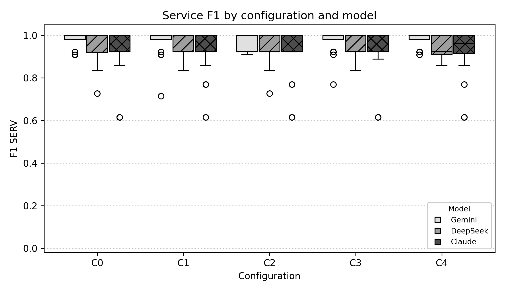

*Figure 1 - Distribution of the F1 of services. The boxes are compressed against the top of the scale in every configuration and model: service identification has reached the ceiling of the metric, and what remains is the left tail produced by a few systems.*

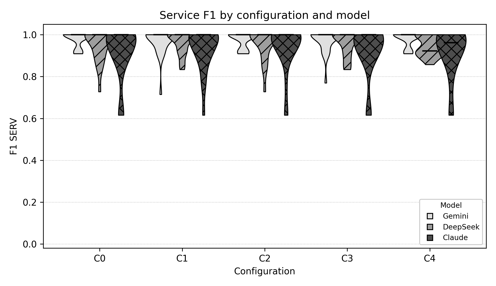

*Figure 2 - The same distributions as violins. The mass concentrated at 1.0 and the thin lower tail confirm the saturation: a refinement, a consolidation or a different model has almost nothing left to improve on this dimension.*

**Reading the descriptive tables.** The mean F1 of services stays between **0.9181** (Claude / C4) and **0.9790** (Gemini / C0) across the fifteen cells, a spread of 6.1 percentage points, and the best values are reached by Gemini / C0 and Gemini / C4 alike - by the simplest and by the second-simplest organisation of the agents. DeepSeek clusters between 0.9496 and 0.9656 and Claude Sonnet 4.5 between 0.9181 and 0.9391. The confidence intervals overlap massively, which is the descriptive counterpart of the conclusion that this dimension does not separate the configurations.

The F1 of interactions tells the opposite story. The best cell is **Gemini / C2 (0.9318)**, followed by Gemini / C1 (0.9187) and Gemini / C4 (0.8905); the weakest is **DeepSeek / C3 (0.7725)**. The ranking is dominated by the model rather than by the configuration: the three best cells are Gemini, the multi-agent cells of DeepSeek and Claude sit between 0.8257 and 0.8556, the single-agent baselines around 0.8270, and the ablated variants of Claude and DeepSeek fall to 0.8181.

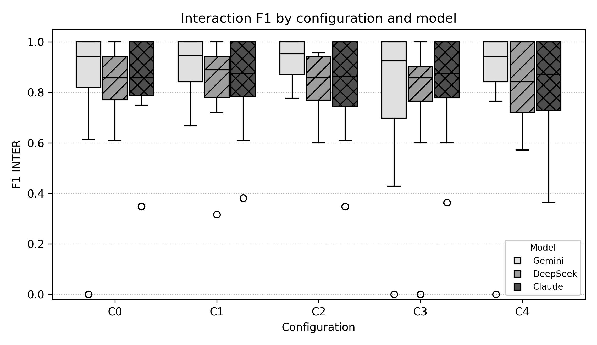

*Figure 3 - Distribution of the F1 of interactions. The dispersion is an order of magnitude larger than for services and it is heterogeneous: Gemini / C1 and Gemini / C2 concentrate their mass in a narrow band above 0.9, while the C0 and C3 boxes of every model stretch down to 0.4 or below. The lower outliers are always the same systems, examined in section 3.8.*

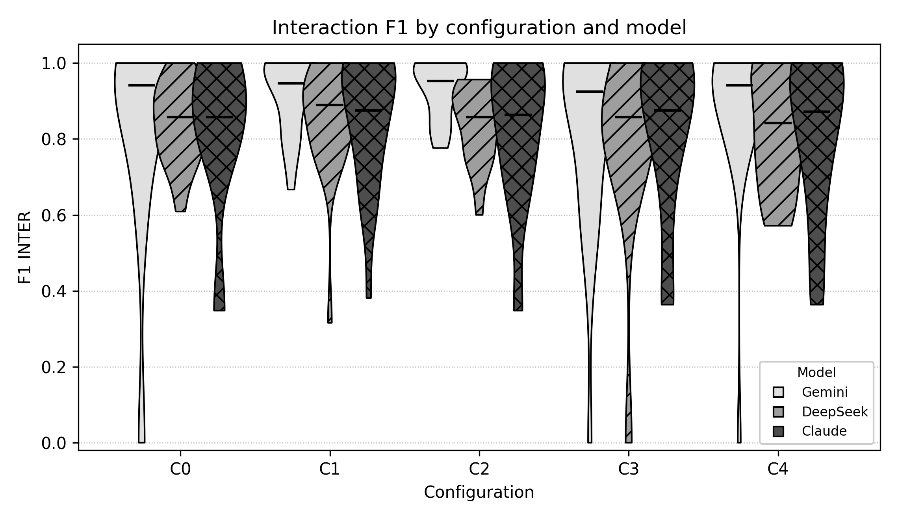

*Figure 4 - Violin view of the same data. Several cells are clearly bimodal: the upper mode gathers the systems whose dependencies are explicit in the requirements, the lower mode the systems whose dependencies must be inferred. The configuration decides how much of the second mode survives.*

A methodological caution follows from these two tables and is used throughout the report: the *combined F1*, the mean of the two metrics, is a convenient summary but a misleading one, because a saturated metric and a discriminating metric are averaged with equal weight. Gemini / C0 and DeepSeek / C2, for instance, have almost the same combined F1 (0.9030 against 0.9036) while differing by 2.0 points on interactions, which is the dimension that determines whether the generated architecture actually connects its services.

### 3.2 Paired tests: Wilcoxon signed-rank and Cliff's delta

Each contrast compares the per-system means of two configurations of the same model (eight paired units). Cells show Cliff's delta followed by the p-value of the Wilcoxon test in parentheses; an asterisk marks p < 0.05. A positive delta means that the first configuration of the pair tends to score higher, a negative delta the opposite. The complete table, with the number of non-zero pairs and the W statistic, is in Appendix A.

**F1 of services**

| Contrast | Gemini | DeepSeek | Claude |
|---|---|---|---|
| **C0 vs C1** | 0.0156 (1.0000) | 0.0156 (0.5000) | -0.0156 (1.0000) |
| **C0 vs C2** | 0.0938 (1.0000) | -0.0312 (1.0000) | -0.1562 (0.5000) |
| **C0 vs C3** | 0.0156 (1.0000) | -0.0312 (0.5000) | -0.0781 (1.0000) |
| **C0 vs C4** | 0.0000 (undefined, all pairs equal) | 0.1094 (0.8750) | 0.0000 (1.0000) |
| **C1 vs C2** | 0.0781 (1.0000) | -0.0469 (0.6250) | -0.1250 (1.0000) |
| **C1 vs C3** | -0.0156 (1.0000) | -0.0312 (1.0000) | -0.0625 (0.7500) |
| **C1 vs C4** | -0.0156 (1.0000) | 0.2188 (0.6250) | 0.0312 (0.3750) |
| **C2 vs C3** | -0.0781 (1.0000) | 0.0312 (1.0000) | 0.0938 (0.5000) |
| **C2 vs C4** | -0.0938 (1.0000) | 0.2500 (1.0000) | 0.1875 (0.2500) |
| **C3 vs C4** | -0.0156 (1.0000) | 0.1719 (0.6250) | 0.0625 (1.0000) |

**F1 of interactions**

| Contrast | Gemini | DeepSeek | Claude |
|---|---|---|---|
| **C0 vs C1** | -0.1719 (0.1875) | -0.1094 (0.6875) | -0.0625 (0.6875) |
| **C0 vs C2** | -0.2344 (0.0625) | 0.0156 (1.0000) | 0.0156 (1.0000) |
| **C0 vs C3** | 0.1719 (1.0000) | 0.2031 (0.9375) | -0.0312 (1.0000) |
| **C0 vs C4** | -0.1406 (0.0625) | 0.0938 (0.8438) | 0.0938 (0.8438) |
| **C1 vs C2** | -0.0312 (0.6250) | 0.0781 (0.9375) | 0.1250 (0.1562) |
| **C1 vs C3** | 0.3906 (0.0469)* | 0.2656 (0.3750) | 0.0625 (0.4375) |
| **C1 vs C4** | 0.0938 (0.6250) | 0.2188 (1.0000) | 0.0312 (0.5625) |
| **C2 vs C3** | 0.4688 (0.0312)* | 0.2031 (0.8125) | -0.0625 (0.8438) |
| **C2 vs C4** | 0.1250 (0.3125) | 0.1250 (0.6406) | 0.0312 (0.5625) |
| **C3 vs C4** | -0.3594 (0.0156)* | -0.0938 (0.6406) | 0.0000 (1.0000) |

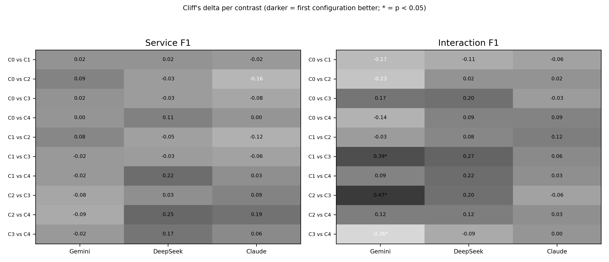

*Figure 5 - Cliff's delta of the sixty contrasts, in grayscale (darker tones mean that the first configuration of the pair is better). The service panel is uniformly light, the interaction panel is not, and the three cells that carry an asterisk are the only contrasts of the corpus that reach significance.*

**Reading the paired tests.** Only **3 of the 60 contrasts reach p < 0.05**, and all three belong to Gemini on the F1 of interactions: **C1 vs C3** (delta = 0.3906, medium, p = 0.0469), **C2 vs C3** (delta = 0.4688, p = 0.0312) and **C3 vs C4** (delta = -0.3594, p = 0.0156). Reading the sign, the first two say that the pipeline *without* the second independent proposal is worse than the pipeline with it, and the third says that a second proposal produced by a generalist architect (C4) is better than no second proposal at all (C3).

Three further patterns hold across the models even where significance is not reached. First, **every contrast on services is negligible** except DeepSeek / C2 vs C4 (delta = 0.25): the service dimension is insensitive to ablation, and every configuration recovers essentially the same catalogue of services.

Second, **the refinement stage pays for itself less than the second proposal**. The contrasts C1 vs C2 (Refiner removed) are negligible in all three models and for both metrics - the largest is -0.125 on services and 0.125 on interactions, both in Claude - and none approaches significance (smallest p = 0.1562). The contrast C1 vs C3 (Communication Specialist and Consolidator removed) is by comparison the most expressive of the corpus in Gemini (delta = 0.3906, p = 0.0469) and points the same way in DeepSeek (delta = 0.2656).

Third, **the gain of the pipeline over the single agent appears as an effect size long before it becomes significant**. In Gemini, C0 vs C2 has delta = -0.2344 (p = 0.0625) and C0 vs C1 delta = -0.1719 (p = 0.1875) on interactions: small effects in which five of the eight systems differ. The same contrasts are -0.1094 and 0.0156 in DeepSeek and -0.0625 and 0.0156 in Claude, that is, negligible. The pipeline therefore helps where the second proposal brings information the first architect missed, and in this corpus that happens in one model out of three.

### 3.3 The cost of the pipeline

Each cell below reports the mean tokens and the mean wall-clock duration per system execution, followed by the mean number of LLM calls of the round. The averages rest on the executions that recorded a budget: 24 per cell, except Claude Sonnet 4.5 / C4, whose round 3 recorded no consumption (20).

| Configuration | Gemini | DeepSeek | Claude |
|---|---|---|---|
| **C0** | 6,785 / 14.6 s / 1.0 | 2,735 / 4.2 s / 1.0 | 3,068 / 9.9 s / 1.0 |
| **C1** | 55,582 / 69.9 s / 6.2 | 32,332 / 20.8 s / 7.9 | 42,747 / 62.1 s / 6.9 |
| **C2** | 46,343 / 51.5 s / 4.1 | 28,058 / 17.6 s / 6.1 | 37,906 / 51.2 s / 5.0 |
| **C3** | 15,121 / 40.5 s / 2.0 | 5,350 / 6.7 s / 2.0 | 5,944 / 20.1 s / 2.0 |
| **C4** | 44,015 / 98.8 s / 6.2 | 19,915 / 17.0 s / 8.0 | 25,163 / 57.6 s / 7.0 |

*Tokens per execution / wall-clock time per execution / LLM calls per execution.*

**Cost index relative to the cheapest cell of the corpus** (DeepSeek / C0 = x1.0)

| Configuration | Gemini | DeepSeek | Claude |
|---|---|---|---|
| **C0** | x2.5 | x1.0 | x1.1 |
| **C1** | x20.3 | x11.8 | x15.6 |
| **C2** | x16.9 | x10.3 | x13.9 |
| **C3** | x5.5 | x2.0 | x2.2 |
| **C4** | x16.1 | x7.3 | x9.2 |

**Reading the cost tables.** The bill follows the number of agents that run, and it does so with a multiplier far from linear. The single-agent baseline costs **2,735 tokens** per architecture in DeepSeek, **3,068** in Claude and **6,785** in Gemini; the complete pipeline costs **32,332** (x11.8), **42,747** (x15.6) and **55,582** (x20.3) respectively. The most expensive cell of the corpus is therefore **Gemini / C1** and the cheapest is **DeepSeek / C0**, a factor of 20.3 between two architectures of the same experiment.

Model choice interacts with the configuration more strongly than one might expect. The same C1 pipeline costs 55,582 tokens in Gemini, 42,747 in Claude and 32,332 in DeepSeek, a spread of 1.7 times between the most and the least expensive model, while the mean number of calls is nearly identical (6.2, 6.9 and 7.9): the difference is prompt and completion length, not orchestration. Replacing the specialised Communication Specialist by Agent 2.1 (C1 to C4) removes a large part of that weight - **-20.8%** in Gemini, **-38.4%** in DeepSeek and **-41.1%** in Claude - at a quality cost that section 3.2 describes as negligible in two models out of three.

Wall-clock time does not follow tokens proportionally. Gemini / C4 is the slowest cell of the corpus (98.8 s per execution) although it spends fewer tokens than Gemini / C1, and C3 - three agents only - takes 40.5 s in Gemini and 20.1 s in Claude, more than four times the single-agent baseline for a fraction of the tokens. Latency is dominated by the sequential chaining of the agents, not by the volume of text exchanged.

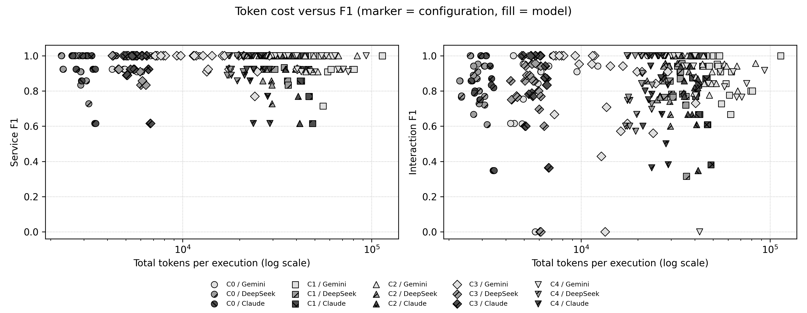

*Figure 6 - Token cost (logarithmic scale) against the two metrics, one point per execution, the marker encoding the configuration and the fill the model. The service panel is a horizontal band at the top of the scale, where more tokens buy nothing. The interaction panel is a cloud whose ceiling rises slightly to the right: the expensive configurations are also the ones that avoid the worst outcomes.*

### 3.4 Specification validity

Cells report well-formed specifications out of the executions of the cell, using the *normalised* verdict, with the *raw* verdict in parentheses. The normalisation restores the indentation destroyed by the PDF rendering, so the normalised column measures the structure of what the pipeline emitted, while the raw column measures the additional damage introduced by the extraction.

| Configuration | Gemini | DeepSeek | Claude |
|---|---|---|---|
| **C0** | 23/24 (0/24 raw) | 24/24 (0/24 raw) | 17/24 (0/24 raw) |
| **C1** | 22/24 (0/24 raw) | 24/24 (0/24 raw) | 18/24 (0/24 raw) |
| **C2** | 23/24 (0/24 raw) | 24/24 (0/24 raw) | 17/24 (0/24 raw) |
| **C3** | 23/24 (0/24 raw) | 24/24 (0/24 raw) | 18/24 (0/24 raw) |
| **C4** | 22/24 (0/24 raw) | 6/24 (0/24 raw) | 19/24 (4/24 raw) |

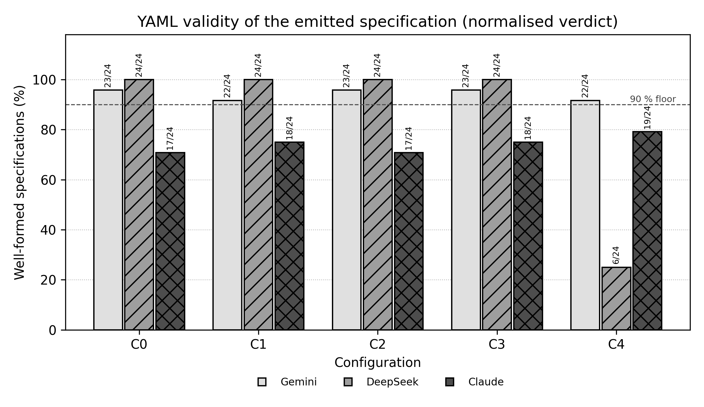

*Figure 7 - Share of well-formed specifications per cell, with the number of valid executions annotated and the 90% floor used by the cost-benefit analysis of section 4.4 drawn as a dashed line.*

**Reading the validity table.** Three findings stand out. First, service architecture and machine-readability are **not** produced by the same agent: the single-agent baseline, which has no dedicated exporter stage, still emits 23 of its 24 specifications in Gemini and 24 of 24 in DeepSeek, at the level of the complete pipeline. Second, validity is the dimension where the models differ most: Gemini stays between 96% and 92%, DeepSeek is perfect in four of its five cells, and **Claude Sonnet 4.5 never exceeds 79%**, which means that roughly one specification in four of that model cannot be parsed even after the normalisation. Third, the model-specific failure of DeepSeek / C4 (6 of 24, the worst cell of the corpus) shows that validity is not a monotone function of the pipeline: the same exporter stage is perfect in C3 and fails in three quarters of the C4 executions of that model, which concentrates the risk in the interaction between a configuration and a model.

Pooled over its five configurations, the normalised validity is 94.2% for Gemini, 85.0% for DeepSeek and 74.2% for Claude Sonnet 4.5. Because a malformed specification blocks every automated use of the architecture - validation, code scaffolding, comparison - this asymmetry is more consequential for practice than the two-point differences observed on the F1 metrics, and it is the reason why the cost-benefit analysis of section 4.4 treats validity as a hard constraint rather than as another score.

### 3.5 Precision and recall: over- and under-specification

The F1 aggregates two errors of different consequence for code generation: **precision** penalises services or interactions that the pipeline invented - artefacts that would become code nobody needs - and **recall** penalises those it failed to recover, which produce an implementation that does not work. The tables separate the two.

**Services - precision / recall**

| Configuration | Gemini | DeepSeek | Claude |
|---|---|---|---|
| **C0** | 1.0000 / 0.9613 | 0.9639 / 0.9474 | 0.9077 / 0.9405 |
| **C1** | 0.9844 / 0.9613 | 0.9611 / 0.9752 | 0.9196 / 0.9544 |
| **C2** | 0.9940 / 0.9613 | 0.9639 / 0.9613 | 0.9345 / 0.9474 |
| **C3** | 0.9881 / 0.9613 | 0.9653 / 0.9613 | 0.9119 / 0.9405 |
| **C4** | 1.0000 / 0.9613 | 0.9467 / 0.9613 | 0.8989 / 0.9440 |

**Interactions - precision / recall**

| Configuration | Gemini | DeepSeek | Claude |
|---|---|---|---|
| **C0** | 0.8609 / 0.8021 | 0.8200 / 0.8771 | 0.8182 / 0.8501 |
| **C1** | 0.9567 / 0.8886 | 0.8321 / 0.8910 | 0.8637 / 0.8659 |
| **C2** | 0.9659 / 0.9060 | 0.8132 / 0.9033 | 0.8423 / 0.8140 |
| **C3** | 0.8544 / 0.7928 | 0.7451 / 0.8153 | 0.8357 / 0.8419 |
| **C4** | 0.9201 / 0.8670 | 0.8318 / 0.8606 | 0.8298 / 0.8278 |

**Reading the table.** Services are almost perfectly precise in Gemini (1.0000 precision in C0 and C4, with recall 0.9613) and in DeepSeek (0.9639), whereas Claude invents services (0.9077 precision in C0) while recovering slightly more of the reference catalogue (0.9405 recall). The asymmetry is stronger on interactions: Gemini / C2 reaches 0.9659 precision with 0.9060 recall - the best trade-off of the corpus - while Gemini / C0 keeps a similar recall (0.8021) but a precision 10.4 points lower, and DeepSeek / C3 falls to 0.7451 precision because the ablation leaves it inventing connections that the reference architecture does not have. For a downstream implementation, the single agent therefore fails by omission, and the ablated variants fail by invention.

### 3.6 Cost, quality and validity: correlations

Spearman's rho is computed between the token cost of an execution and the three outcomes, first on the pooled corpus and then inside each configuration, which is the version that matters for the pipeline: does spending more tokens *inside a fixed configuration* buy a better architecture?

| Variable X | Variable Y | Scope | n | rho | p-value |
|---|---|---|---|---|---|
| Tokens | F1 of services | Pooled corpus | 355 | 0.0032 | 0.9514 |
| Tokens | F1 of services | C0 | 72 | 0.0336 | 0.7794 |
| Tokens | F1 of services | C1 | 72 | -0.1418 | 0.2346 |
| Tokens | F1 of services | C2 | 71 | -0.1780 | 0.1375 |
| Tokens | F1 of services | C3 | 72 | -0.0645 | 0.5903 |
| Tokens | F1 of services | C4 | 68 | 0.1491 | 0.2250 |
| Tokens | F1 of interactions | Pooled corpus | 355 | 0.0863 | 0.1046 |
| Tokens | F1 of interactions | C0 | 72 | 0.1818 | 0.1263 |
| Tokens | F1 of interactions | C1 | 72 | 0.0242 | 0.8403 |
| Tokens | F1 of interactions | C2 | 71 | 0.0844 | 0.4839 |
| Tokens | F1 of interactions | C3 | 72 | -0.0787 | 0.5112 |
| Tokens | F1 of interactions | C4 | 68 | 0.0874 | 0.4785 |
| Tokens | Well-formed specification | Pooled corpus | 359 | -0.0108 | 0.8382 |
| Tokens | Well-formed specification | C0 | 72 | 0.0234 | 0.8454 |
| Tokens | Well-formed specification | C1 | 72 | -0.2190 | 0.0645 |
| Tokens | Well-formed specification | C2 | 71 | -0.2239 | 0.0605 |
| Tokens | Well-formed specification | C3 | 72 | 0.1207 | 0.3126 |
| Tokens | Well-formed specification | C4 | 72 | 0.4303 | 0.0002 |

**Reading the correlations.** On the pooled corpus the association is negligible for both quality metrics (rho = 0.0032 against services and 0.0863 against interactions, n = 355) and for validity (rho = -0.0108, n = 359). Inside the configurations the only stable pattern is the **negative** association between cost and validity in C1 and C2 (rho = -0.219, p = 0.0645 and rho = -0.2239, p = 0.0605), which reflects the longer documents produced for the more complex systems rather than a causal effect, and the one **positive and strong** association of the corpus: in C4, rho = 0.4303 (p = 0.0002, n = 72) between tokens and well-formedness, driven by the DeepSeek / C4 failures discussed in section 3.4.

The practical conclusion is that **token cost is not a proxy for architectural quality**. The pipeline does not become better because it spends more; it spends more when the requirements are long, and the requirements are long because the system is complex, which is also what makes the F1 drop. Cost and quality are both driven by the system, not by each other - a confound that the per-system analysis of the next section makes explicit.

### 3.7 Per-system behaviour

Averaging over executions hides the structure of the experiment: the F1 of interactions is bimodal (figure 4) because some systems state their dependencies explicitly and others do not. The figure below shows the per-system mean of that metric for each model.

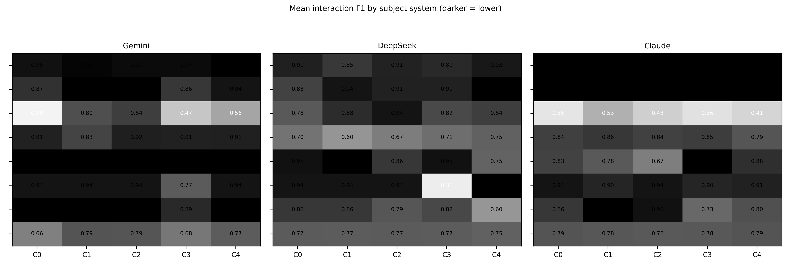

*Figure 8 - Mean interaction F1 of each subject system, one panel per model, darker cells meaning lower F1. The rows follow the canonical order of the experiment and the columns the configurations. The pattern is block-structured: a group of systems is recovered perfectly by every cell, and a smaller group concentrates all the variation.*

Pooled over the fifteen cells, the systems `7ep`, `AcmeAir`, `Jokul` and `PetClinic` are recovered near the ceiling of the metric in every configuration and every model (pooled mean >= 0.8838): their dependencies are explicit in the requirements. The variation of the corpus is concentrated in `Cargo-Tracker` (pooled mean 0.6205) and `TNTConcept` (0.7625), the systems whose communication structure must be inferred.

`Cargo-Tracker` is the clearest case: in Gemini it moves from 0.2807 in C0 to 0.8421 in C2 and 0.5614 in C4, and in DeepSeek it is the weakest row of that model's panel (0.8174 in C3). `TNTConcept` never exceeds 0.7920 in any of the fifteen cells. These two systems decide the ranking of the configurations, and they are also the reason why the effect sizes of section 3.2 are driven by five to seven of the eight pairs instead of all of them.

That is the mechanism behind every average reported so far: the pipeline does not improve the architectures that were already correct, it recovers part of the dependencies that the single agent leaves implicit. The per-system tables for all three models and both metrics are in Appendix B.

### 3.8 C4 in detail: two proposals and what the consolidation keeps

C4 exposes two heterogeneous proposals side by side - A from the DDD architect, B from the generalist second architect - and the table reports what the consolidation keeps from the pair.

| Model | Metric | Proposal A | Proposal B | Consolidated | A - B | Consolidated - A |
|---|---|---|---|---|---|---|
| Gemini | Services | 0.9790 | 0.9790 | 0.9790 | +0.0000 | +0.0000 |
| Gemini | Interactions | 0.7898 | 0.8654 | 0.8905 | -0.0756 | +0.1007 |
| DeepSeek | Services | 0.9496 | 0.9527 | 0.9496 | -0.0031 | +0.0000 |
| DeepSeek | Interactions | 0.8283 | 0.7814 | 0.8283 | +0.0469 | +0.0000 |
| Claude | Services | 0.9032 | 0.9214 | 0.9181 | -0.0182 | +0.0149 |
| Claude | Interactions | 0.7946 | 0.8179 | 0.8181 | -0.0233 | +0.0235 |

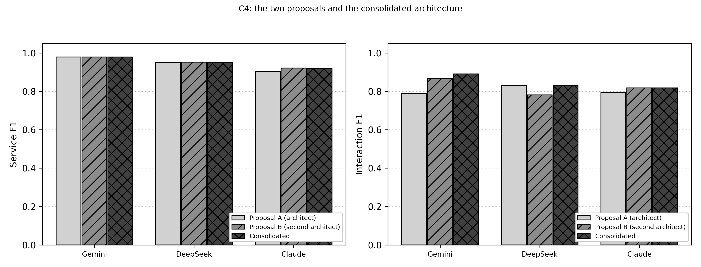

*Figure 9 - Proposal A, proposal B and the consolidated architecture in C4, per model and metric.*

**Reading the C4 table.** In Gemini the consolidation lands +0.0251 above the best of the two proposals and +0.1007 above proposal A: the generalist second architect produces a genuinely different proposal (0.8654 for B against 0.7898 for A) and the merge keeps information from both. In DeepSeek the consolidated architecture is exactly proposal A (+0.0000), so the second proposal contributes nothing that survives the merge - the quantitative reason why C4 is the cheapest DeepSeek configuration with no quality gain. Claude sits in between, with +0.0235 above its proposal A; its proposal B is the better of its own two candidates (0.8179 against 0.7946), which means that the consolidation keeps only part of the useful content there. Diversity in the second proposal is a property of the model as much as of the agent.

## 4. Discussion

### 4.1 What the data says

The corpus separates two dimensions that are usually reported together. The **service dimension is saturated**: every configuration of every model recovers 92% to 98% of the reference services, the confidence intervals overlap, and no ablation produces a noteworthy effect. Service identification is no longer a discriminating question for this pipeline; it is the dimension in which the models have already converged.

The **interaction dimension carries all the signal**. It is where the configuration matters (the three significant contrasts of the corpus are all there), where the models differ most (0.9318 for Gemini / C2 against 0.7725 for DeepSeek / C3), and where the systems differ from each other (section 3.7). It is also the dimension that decides whether the generated architecture can be implemented at all, because an architecture that omits its interactions describes services that never talk to each other.

Within that dimension the data attribute value to a **second independent proposal** - not to refinement, and not to the number of agents: removing the second proposal and the consolidation (C3) is the only ablation that produces medium effects and the only one that reaches significance, while removing the refinement (C2) is negligible in all three models. The single-agent baseline (C0) matches the multi-agent configurations on services and falls behind only on the systems whose dependencies have to be inferred.

### 4.2 The implementation effort of each configuration

Cost and quality are two faces of the same engineering decision: how many agents, carrying how much prompt, orchestrated how many times. The table below summarises the operational profile of each configuration, averaged over the three models.

| Configuration | Agents | Tokens | Calls | Time | Valid YAML |
|---|---|---|---|---|---|
| **C0** | 1 | 4,196 | 1.0 | 9.5 s | 89% |
| **C1** | 1, 2, 3, 4, 5 | 43,554 | 7.0 | 50.9 s | 89% |
| **C2** | 1, 2, 3, 5 | 37,436 | 5.1 | 40.1 s | 89% |
| **C3** | 1, 4, 5 | 8,805 | 2.0 | 22.5 s | 90% |
| **C4** | 1, 2.1, 3, 4, 5 | 29,698 | 7.0 | 57.8 s | 65% |

*Averages over the three models.*

**C0** is the cheapest configuration to build and to operate: one prompt, one call, no state to pass between stages, no failure mode beyond the model itself. It runs in seconds and costs a fraction of a cent per architecture. Its weakness is not the services it proposes, which are nearly perfect, but the interactions it omits.

**C1** is the most demanding configuration: two proposal generations that must both reach the refinement stage, a consolidation stage that has to reconcile two divergent documents, and an exporter that must serialise the result. It multiplies the token bill of C0 by 11.8 in DeepSeek and 8.2 in Gemini, and it adds a model-specific failure surface: the same topology that is flawless in DeepSeek produces the invalid specifications of Claude and, in Claude / C4, a round that lost four of its eight metrics.

**C2** is C1 with one stage less, and therefore the easiest multi-agent configuration to implement: the two proposals go straight to the consolidator. It is measurably cheaper than C1 in every model (13% in DeepSeek, 17% in Gemini, 11% in Claude) with no detectable quality loss (section 3.2). From an engineering standpoint C2 dominates C1.

**C3** looks cheap in tokens but is not cheap to operate: three agents chained sequentially make it the slowest configuration of Gemini (40.5 s per execution) for 15,121 tokens, and the ablation it implements yields the worst interaction quality of the corpus. It is a diagnostic configuration, not a candidate for production.

**C4** has the topology of C1 but not its prompt weight: Agent 2.1 shares the prompt of Agent 1 instead of carrying a catalogue of interaction patterns, and that is where the saved tokens come from. It is therefore *easier to maintain* than C1 - one prompt less to curate, no pattern catalogue to keep aligned with the reference architectures - and between 38% and 41% cheaper to run. Its risk is concentrated rather than eliminated: it is the configuration in which Claude lost a whole round of metrics and in which the DeepSeek exporter failed three quarters of its documents. The generalist agent is cheaper and simpler, and it pays for that with weaker guarantees about the artifact it produces.

In short, the implementation effort of a configuration in this pipeline is the number of sequential stages multiplied by the prompt weight of each stage, and the experiment shows that both factors can be reduced - one stage by C2, one prompt by C4 - without paying for it in architecture quality, provided the reduction is validated per model.

### 4.3 How each model behaved

| Model | Service F1 | Interaction F1 (sd) | Tokens / exec. | Calls / exec. | Valid YAML | Best interaction cell |
|---|---|---|---|---|---|---|
| Gemini | 0.9756 | 0.8772 (0.2022) | 33,569 | 3.90 | 94.2% | Gemini / C2 |
| DeepSeek | 0.9577 | 0.8291 (0.1617) | 17,678 | 4.99 | 85.0% | DeepSeek / C1 |
| Claude | 0.9273 | 0.8311 (0.1965) | 22,759 | 4.27 | 74.2% | Claude / C1 |

*Pooled over the five configurations of each model.*

**Gemini (gemini-flash-latest)** is the quality leader and the expensive one. It leads on interactions (0.8772 against 0.8311 for Claude and 0.8291 for DeepSeek), it owns the three best cells of the corpus, and it is the only model in which the pipeline produces an effect size that is worth mentioning. It also costs 1.7 times the tokens of DeepSeek for the same C1 topology and is the slowest model of the corpus (55.1 s per execution on average). Its specifications are well formed in 94.2% of the executions.

**DeepSeek** is the economical and the most disciplined. It is the cheapest model in every configuration (17,678 tokens per execution on average), the one that makes the most LLM calls (4.99, against 4.27 in Claude and 3.90 in Gemini), the one with the lowest dispersion of interaction F1 (0.1617) and the one that produces perfect specifications in four of its five cells. Its weakness is reach: it never reaches the interaction quality of Gemini (0.8556 at best) and its C4 cell is the only one of the corpus in which the exporter fails systematically.

**Claude Sonnet 4.5** is the most uneven. Its services are the weakest of the three (0.9273) and it invents services where the others do not (0.9077 precision in C0 against 1.0000 for Gemini); its interaction F1 (0.8311) is at the level of DeepSeek but with a dispersion 22% larger; it is the only model whose round lost four metrics and the only model whose specifications are malformed in about one execution in four (89 of 120 well formed after normalisation). It is also the model for which the pipeline buys the least: C0 vs C1 on interactions is delta = -0.0625, negligible.

Read together, the three profiles are complementary rather than ranked: Gemini recovers more of the architecture at a higher price, DeepSeek delivers a predictable and machine-readable artefact at the lowest price, and Claude delivers neither the quality of the first nor the discipline of the second in this task. No model is dominated on every dimension, which is why the recommendations of section 4.5 are conditional on the situation.

### 4.4 Cost-benefit: the recommended configuration

The ranking below orders the fifteen cells by the token cost of a system execution and reports, for each of them, the two quality metrics, the combined F1, the cost index relative to the cheapest cell and the efficiency expressed as combined F1 points per 1,000 tokens.

| Cell | Services | Interactions | Combined | Tokens | Cost | F1 / 1k tok. | Valid YAML |
|---|---|---|---|---|---|---|---|
| DeepSeek / C0 | 0.9526 | 0.8422 | 0.8974 | 2,735 | x1.0 | 0.328 | 24/24 |
| Claude / C0 | 0.9208 | 0.8265 | 0.8737 | 3,068 | x1.1 | 0.285 | 17/24 |
| DeepSeek / C3 | 0.9608 | 0.7725 | 0.8666 | 5,350 | x2.0 | 0.162 | 24/24 |
| Claude / C3 | 0.9234 | 0.8274 | 0.8754 | 5,944 | x2.2 | 0.147 | 18/24 |
| Gemini / C0 | 0.9790 | 0.8270 | 0.9030 | 6,785 | x2.5 | 0.133 | 23/24 |
| Gemini / C3 | 0.9732 | 0.8182 | 0.8957 | 15,121 | x5.5 | 0.059 | 23/24 |
| DeepSeek / C4 | 0.9496 | 0.8283 | 0.8890 | 19,915 | x7.3 | 0.045 | 6/24 |
| Claude / C4 | 0.9181 | 0.8181 | 0.8681 | 25,163 | x9.2 | 0.035 | 19/24 |
| DeepSeek / C2 | 0.9602 | 0.8469 | 0.9036 | 28,058 | x10.3 | 0.032 | 24/24 |
| DeepSeek / C1 | 0.9656 | 0.8556 | 0.9106 | 32,332 | x11.8 | 0.028 | 24/24 |
| Claude / C2 | 0.9391 | 0.8257 | 0.8824 | 37,906 | x13.9 | 0.023 | 17/24 |
| Claude / C1 | 0.9336 | 0.8559 | 0.8947 | 42,747 | x15.6 | 0.021 | 18/24 |
| Gemini / C4 | 0.9790 | 0.8905 | 0.9347 | 44,015 | x16.1 | 0.021 | 22/24 |
| Gemini / C2 | 0.9758 | 0.9318 | 0.9538 | 46,343 | x16.9 | 0.021 | 23/24 |
| Gemini / C1 | 0.9709 | 0.9187 | 0.9448 | 55,582 | x20.3 | 0.017 | 22/24 |

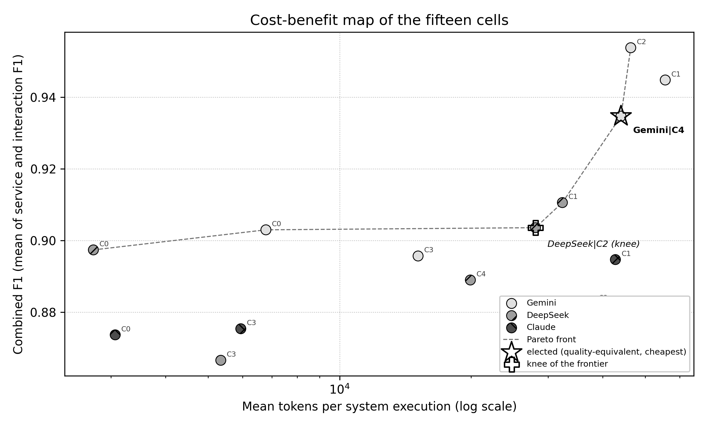

*Figure 10 - Combined F1 against the mean token cost per execution (logarithmic scale), with the Pareto frontier dashed. The star marks the elected cell of the quality-equivalence rule, the filled pentagon the knee of the frontier. Six cells are non-dominated, and the frontier is almost flat between 2,735 tokens and 32,332 tokens before it climbs steeply towards the Gemini cells.*

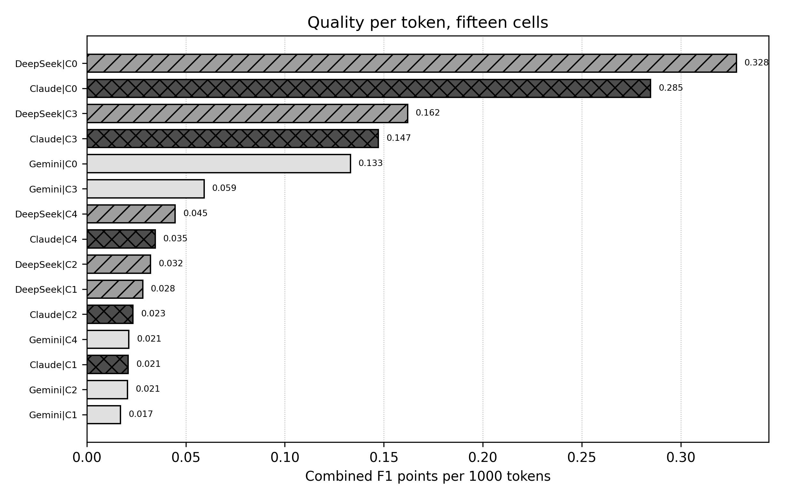

*Figure 11 - Quality per token, sorted. The three single-agent cells occupy the top of the ranking: the efficiency gap between them and the cells that reach the best architectural quality is of one order of magnitude.*

The efficiency column says something that the F1 tables cannot: **the metric saturates long before the budget does**. The single agent of DeepSeek produces 0.328 combined F1 points per 1,000 tokens, more than 2.0 times the best multi-agent cell (DeepSeek / C3, 0.162) and 16 times the peak-quality cell (Gemini / C2, 0.021). Any election therefore depends on a quality constraint chosen by the user, not on the data alone, which is why the decision rule is stated explicitly below.

**Decision rule.** The election is made in three steps, all of them reproducible from the data of this report: (i) the quality reference is the cell with the highest mean F1 of interactions, the metric that discriminates (Gemini / C2, 0.9318); (ii) a cell is *quality-equivalent* to the reference when Cliff's delta between its per-system vector and the reference vector is negligible, that is |delta| < 0.147, the threshold used by the paired tests of this study; (iii) among the quality-equivalent cells the election falls on the cheapest one in tokens. A second condition is applied throughout, because a malformed specification cannot be used downstream: at least 90% of the executions of the cell must emit a well-formed document.

**Elected cell: Gemini / C4.** The quality-equivalent set has 3 members: Gemini / C2 (delta = 0.000, 46,343 tokens); Gemini / C1 (delta = -0.031, 55,582 tokens); Gemini / C4 (delta = -0.125, 44,015 tokens). Among them the cheaper one is **Gemini / C4**, which is therefore the best cost-benefit cell of the corpus.

The justification rests on four independent observations.

1. **It loses nothing measurable against the reference.** Cliff's delta against the peak cell is -0.125 (negligible) and the difference of means is -0.0413 of interaction F1 (0.8905 against 0.9318), on a metric whose confidence intervals overlap over most of their range.
2. **It improves on the single agent where it matters.** Its service F1 is the best of the corpus (0.9790, tied with Gemini / C0) and, on interactions, it beats the single agent of the same model on both counts: precision 0.9201 against 0.8609 and recall 0.8670 against 0.8021, that is, it recovers connections that the isolated architect omits without inventing new ones.
3. **It is the cheapest way to keep both mechanisms that carry the quality.** It retains the second independent proposal and the consolidation - the stages that section 3.2 identifies as the source of the interaction gain - for 20.8% fewer tokens than the complete pipeline (44,015 against 55,582) and 5.0% fewer than the peak cell (44,015 against 46,343), by dropping the pattern catalogue that makes Agent 2 the heaviest prompt of the pipeline.
4. **It is the cell in which replacing the specialist is cheapest.** Against the complete pipeline of the same model, the generalist second architect saves 20.8% of the tokens in Gemini, 38.4% in DeepSeek and 41.1% in Claude, and the quality cost of the substitution is negligible in Gemini (delta = 0.0938) and Claude (delta = 0.0312) and small in DeepSeek (delta = 0.2188). The fifty hardcoded interaction patterns of the specialist are, to a large extent, prompt weight rather than value.

**Sensitivity of the election.** Because the election depends on a quality constraint, the same rule is applied for a range of interaction-F1 floors, always with the 90% validity requirement. The result is a clean staircase, and it is the honest form of the recommendation: the answer depends on how much quality the user is willing to trade for tokens.

| Interaction F1 floor | Eligible cells | Elected cell | Interaction F1 | Tokens | Cost index | Valid YAML |
|---|---|---|---|---|---|---|
| >= 0.92 | 1 | Gemini / C2 | 0.9318 | 46,343 | x16.9 | 23/24 |
| >= 0.90 | 2 | Gemini / C2 | 0.9318 | 46,343 | x16.9 | 23/24 |
| >= 0.87 | 3 | Gemini / C4 | 0.8905 | 44,015 | x16.1 | 22/24 |
| >= 0.85 | 4 | DeepSeek / C1 | 0.8556 | 32,332 | x11.8 | 24/24 |
| >= 0.80 | 8 | DeepSeek / C0 | 0.8422 | 2,735 | x1.0 | 24/24 |
| none | 9 | DeepSeek / C0 | 0.8422 | 2,735 | x1.0 | 24/24 |

**The two other answers worth naming.** At an interaction floor of 0.85 the election moves to **DeepSeek / C1** (32,332 tokens, 24/24 well-formed specifications, x11.8 the cheapest cell of the corpus); at 0.8469 the frontier knee of figure 10 - the point of the cost-quality curve farthest from the chord - falls on **DeepSeek / C2**, the cheapest cell of the corpus that keeps a second proposal and a consolidation (28,058 tokens, 13.2% below DeepSeek / C1, with a C1 vs C2 contrast that is negligible on both metrics). If the constraint is removed altogether, the answer is **DeepSeek / C0**: 0.328 combined F1 points per 1,000 tokens, 2,735 tokens per architecture, 24/24 well-formed specifications - a single agent that reaches 94.1% of the combined quality of the peak cell for 5.9% of its cost.

The recommendation is therefore three-layered, and the election proper is its first line: **Gemini with C4** when the architecture must be as good as the pipeline can make it; **DeepSeek with C2** when the budget is the binding constraint; and **DeepSeek with C0** when the requirements are complete enough that a single architect can be trusted with them. In all three cases the election is a statement about tokens per architecture, and the absolute bill is small: at the prices of mid-2026, the most expensive cell of this corpus costs a few cents per architecture, so the engineering decision is dominated by latency and by the reliability of the specification rather than by the token bill itself.

### 4.5 Which configuration and model for which situation

| Situation | Recommendation | Why |
|---|---|---|
| Requirements list their dependencies explicitly | **DeepSeek / C0** or **Gemini / C0** | Services and interactions are already stated; the single agent reaches 0.9790 / 0.8270 (Gemini) and 0.9526 / 0.8422 (DeepSeek) with 6,785 and 2,735 tokens, and 24/24 well-formed specifications. |
| Dependencies must be inferred from the domain | **Gemini / C4**, or **Gemini / C2** for the last points of interaction F1 | Interactions improve from 0.8270 (C0) to 0.8905 (C4) and 0.9318 (C2); the recovery happens in exactly the systems whose communication is implicit. |
| Token budget is the binding constraint | **DeepSeek / C2** | 28,058 tokens, 60.5% of the peak cell, 94.7% of its combined quality and 24/24 well-formed specifications; the cheapest cell that keeps the second proposal and the consolidation. |
| The specification must be parseable with certainty | **DeepSeek / C0**, and **DeepSeek / C2** when a multi-agent run is required | DeepSeek emits 24/24 well-formed documents in C0, C1, C2 and C3; Gemini stays at 22-23 of 24 and Claude never exceeds 19 of 24. |
| Latency matters more than tokens | **DeepSeek / C0** | 4.2 s per architecture against 20.8 s for the same model's C1; the multi-agent chain pays for its stages in wall-clock time, not in tokens. |
| Diagnosing the pipeline (the ablation study) | **C3** as a negative control, **C2** as the redundant-stage probe | C3 isolates the joint absence of the second proposal and the consolidation; C1 vs C2 shows that the refinement stage can be removed without a measurable effect. |

For the general case - a team that wants the best architecture it can obtain without deciding per project - the report recommends **DeepSeek / C2** as the default: it delivers 94.7% of the combined quality of the peak cell for 60.5% of its tokens, it keeps the two stages that carry the quality, and it is the configuration with the best validity record among the quality-relevant cells. Teams that cannot accept any loss of interaction quality should budget for **Gemini / C2**, and teams working on systems whose dependencies are always explicit should use the single agent and spend the saved tokens on evaluation instead.

### 4.6 Single agent versus the best multi-agent pipeline

The comparison that matters for practice is the cheapest configuration of each model against the best multi-agent configuration of the same model, because the two cells of a row share the model and differ only in the organisation of the agents.

| Model | Single agent (C0) | Best multi-agent | Interaction F1 | delta (p) | Services delta | Tokens | Multiplier |
|---|---|---|---|---|---|---|---|
| Gemini | 0.9790 / 0.8270 | 0.9758 / 0.9318 | +0.1048 | -0.2344 (0.0625) | -0.0032 | 6,785 -> 46,343 | x6.8 |
| DeepSeek | 0.9526 / 0.8422 | 0.9656 / 0.8556 | +0.0134 | -0.1094 (0.6875) | +0.0130 | 2,735 -> 32,332 | x11.8 |
| Claude | 0.9208 / 0.8265 | 0.9336 / 0.8559 | +0.0294 | -0.0625 (0.6875) | +0.0128 | 3,068 -> 42,747 | x13.9 |

*Each row reports the pair services / interactions F1 of both cells; the delta and the p-value belong to the interaction contrast C0 vs the best multi-agent configuration of the model.*

The table quantifies the trade-off that the averages hide. In **Gemini** the pipeline buys 0.1048 of interaction F1 - it moves from 0.8270 to 0.9318 - for 6.8 times the tokens, an effect of small magnitude whose p-value (0.0625) misses the 5% threshold only because eight systems are too few. In **DeepSeek** the same trade buys 0.0134 (from 0.8422 to 0.8556) for 11.8 times the tokens, and in **Claude** 0.0294 for 13.9 times the tokens; both effects are negligible, which means that for those two models the multi-agent organisation is not distinguishable from the single agent on architecture quality.

The service columns close the argument: across the three models the pipeline never improves service identification by more than 0.0130, and in Gemini (0.9790 against 0.9758) it even loses 0.0032. Whatever the multi-agent organisation buys, it buys on the interaction dimension, and only for models that can exploit a second proposal.

### 4.7 From the YAML specification to source code

The last agent of the pipeline, the exporter, is what turns an architectural opinion into an artefact: the YAML document lists the services and, for each of them, the directed interactions it participates in (`from` / `to`). That structure is the natural interface between the design phase evaluated here and the implementation phase that follows, and the results of this corpus say three concrete things about using it that way.

First, **the specification is a gate that can be checked automatically**. Schema validation, cycle detection, unreachable services and orphan interactions are all decidable on the emitted document, before a single line of code is generated. Because the corpus shows that generation quality and specification validity are **not correlated** - rho = -0.0108 on the pooled corpus - a pipeline that generates code from the architecture cannot rely on a high F1 as a proxy for a parseable document; the validity check has to be an explicit stage.

Second, **a validate-and-retry loop changes which configuration is cheapest**. If each malformed document has to be regenerated, the effective cost of an architecture is the token cost of the cell divided by its validity rate. On that metric the ranking of the frontier cells is:

| Cell | Tokens per attempt | Valid YAML | Effective tokens per usable architecture | Attempts expected |
|---|---|---|---|---|
| DeepSeek / C0 | 2,735 | 100.0% | 2,735 | 1.00 |
| DeepSeek / C2 | 28,058 | 100.0% | 28,058 | 1.00 |
| Gemini / C4 | 44,015 | 91.7% | 48,016 | 1.09 |
| Gemini / C2 | 46,343 | 95.8% | 48,358 | 1.04 |
| Claude / C1 | 42,747 | 75.0% | 56,996 | 1.33 |
| Claude / C2 | 37,906 | 70.8% | 53,515 | 1.41 |
| DeepSeek / C4 | 19,915 | 25.0% | 79,662 | 4.00 |

*The seven cells of the frontier or of the quality-equivalent set, plus the two cells with the weakest specification record.*

The consequence is direct: the cell with the best architecture per token changes when validity enters the cost. **DeepSeek / C2** costs 28,058 effective tokens per usable architecture because it never has to be re-run, while the elected cell of section 4.4 costs 48,016 (a 9% penalty) and Claude / C2 costs 53,515 (a 41% penalty). Validity is therefore cheaper to buy with a model choice than with a bigger pipeline.

Third, **the specification makes the architecture reviewable and testable**. Once the document is valid, each interaction can be turned into a contract test and each service into a module boundary, so the two metrics of this study map onto two distinct risks of the implementation: a low precision of interactions produces code that implements connections nobody asked for, a low recall produces a system that compiles and does not work. The corpus shows that these two risks are configuration-specific (section 3.5), which is an argument for choosing the configuration per risk profile rather than per average score.

### 4.8 Implications for industry

**The token bill is not the decision variable.** The most expensive cell of the corpus spends 55,582 tokens to produce one architecture, the cheapest 2,735. At the prices of mid-2026 for flash-class models that difference is a matter of cents per architecture, which means that the industrially relevant costs are the **latency** (98.8 s per architecture in the slowest cell of the corpus, 4.2 s in the fastest) and the **cost of using an architecture that is wrong**. Where a team generates dozens of architectures, the difference between C0 and C1 is a line in the cloud bill; the difference between recovering 0.9318 and 0.8270 of the interactions is a sprint of rework.

**Spend the budget on validity and on the second proposal, not on more agents.** The corpus prices each stage: the second independent proposal is worth a small-to-medium effect on interactions in the model that can exploit it, the refiner is worth nothing measurable anywhere, and the exporter is worth everything for automation even though it costs almost nothing (C0 reaches 24/24 valid documents without it). A production pipeline should therefore keep two proposal stages and the consolidation, drop the refinement stage, and wrap the whole run in a schema-validation gate with automatic retry.

**Choose the model per constraint, not per benchmark.** DeepSeek delivers a usable artefact at the lowest cost and the most reliable specification (24/24 well formed in four of its five cells); Gemini recovers more of the architecture (0.8772) at 1.7 to 2.8 times the tokens and with 22-23 of 24 valid documents; Claude Sonnet 4.5 combines the highest rate of malformed specifications (31 of 120) with the weakest service quality of the three models, and the corpus offers no contrast in which it is the best choice for this task. The practical rule that follows is to fix the model first (it dominates the quality of the result) and the configuration second (it dominates the cost).

**Stop optimising services; instrument interactions.** Every configuration and model of the corpus identifies more than 0.9181 of the services of the reference architecture, while the interactions vary by 15.9 percentage points. Teams that adopt an architecture generator should therefore direct their review effort - and their prompt engineering - at the communication structure, and should treat the recovered interaction graph, not the service list, as the acceptance criterion.

### 4.9 Implications for research

Four methodological consequences follow from this corpus, and each of them is also a direction for further work.

**The service metric is exhausted.** With means between 0.9181 and 0.9790 and every contrast negligible, the F1 of services no longer discriminates between architectures of this class; the metric that carries the signal is the interaction graph. Studies of architecture generation should therefore report structural metrics that degrade gradually - graph similarity of the interaction network, agreement of service responsibilities, coupling and cohesion of the proposed decomposition - instead of leaning on an F1 that has reached its ceiling. A partial-credit metric would also give the paired tests the resolution that the ties of today's metric destroy.

**Diversity, not specialisation, is what a second agent buys.** The generalist second architect of C4 matches or approaches the specialist of C1 in two of the three models while removing a large fraction of the prompt weight (-20.8% in Gemini, -38.4% in DeepSeek, -41.1% in Claude). The expected explanation is that a second *independent* sample of the design space carries the gain, not the domain catalogue in the prompt. The natural test is a controlled one: generate the second proposal from the same prompt at a different temperature and check whether the consolidation gain survives; if it does, the fifty-pattern catalogue can be retired from the pipeline.

**Machine-readability deserves to be an outcome variable.** The corpus shows that a model can be excellent on F1 and unreliable on structure (Claude Sonnet 4.5: 74.2% of well-formed specifications) or the reverse (DeepSeek: 85.0%, the lowest interaction mean of the three). Validity is not a nuisance of the extraction pipeline; it is a property of the generated artefact that decides whether it can be used, and it interacts with the configuration in a non-monotone way (DeepSeek perfect in C3, six of twenty-four in C4). Reporting it costs one column.

**Power, missing data and reproducibility.** With eight paired units, the smallest p-value a Wilcoxon test can produce is 0.0078 and a single discordant system moves a delta by more than 0.1; the honest unit of evidence is therefore the effect size with its bootstrap interval, which is what this report prioritises. The design also produced four lost executions and four unbudgeted runs inside a single cell, and a pipeline that silently drops them would overstate the stability of that model; publishing the missing cells, the per-system vectors and the seeds, as this report does, is what makes the ablation auditable.

### 4.10 Answers to the research questions

**RQ1 - Does the multi-agent pipeline improve the architecture over a single agent?** On services, no: every contrast is negligible in all three models. On interactions the answer is *yes, but conditionally*. The gain is +0.1048 in Gemini (delta = small, p = 0.0625), +0.0134 in DeepSeek (delta = negligible) and +0.0294 in Claude (delta = negligible): visible as an effect size in Gemini, negligible in the other two models, and never significant at the 5% level because eight systems cannot resolve it. The pipeline is worth its cost where the requirements leave dependencies implicit.

**RQ2 - Which stage carries the quality?** The second independent proposal and the consolidation that consumes it. Removing both (C3) is the only ablation that reaches significance and the only one that produces medium effects (C1 vs C3: delta = 0.3906, p = 0.0469 in Gemini). Removing the refinement stage (C2) changes nothing measurable in any model, and replacing the specialist by a generalist (C4) keeps the quality in two of the three models at a lower cost.

**RQ3 - Does replacing the Communication Specialist by a generalist architect change the result?** No in Gemini (C1 vs C4 delta = 0.0938, negligible) and in Claude (0.0312, negligible); marginally yes in DeepSeek (0.2188, small, in favour of the specialist). The substitution saves between 38.4% and 41.1% of the tokens, so the specialist's pattern catalogue behaves mostly as prompt overhead - and, in DeepSeek / C4, as a source of malformed specifications (6 of 24 well formed).

**RQ4 - What does the quality cost, and what is the best cost-benefit?** One architecture costs between 2,281 and 113,905 tokens depending on the cell, and the correlation between cost and quality inside a configuration is negligible (rho = 0.0032 on the pooled corpus, n = 355): more tokens do not buy a better architecture. Under the decision rule of section 4.4 the best cost-benefit cell is **Gemini / C4** (combined F1 0.9347 at 44,015 tokens, 20.8% cheaper than the complete pipeline of the same model), with **DeepSeek / C2** as the budget alternative and **DeepSeek / C0** as the efficiency champion.

## 5. Threats to validity

**Statistical conclusion validity.** Eight systems per contrast give the study little power: only 3 of 60 contrasts reach p < 0.05 and the smallest attainable p-value is 0.0078. No correction for multiple comparisons is applied, so the significant results carry an inflated risk of type I error; with a Bonferroni threshold of 0.00083 none of them would survive. The report therefore argues from effect sizes and bootstrap intervals, and every claim of *equivalence* is a claim of a negligible effect, not of proven equality.

**Construct validity.** Both quality metrics are computed against a single reference architecture per system, so a legitimate but different decomposition is penalised; the service metric additionally saturates, hiding differences that a partial-credit measure would capture. Reading F1 as *architectural quality* is a simplification: it measures agreement with one curated design.

**Internal validity.** Four executions of one cell carry no metrics, four carry no budget and one has no metadata at all, so the cost and metric tables rest on slightly different samples - a fact each table states. The extraction of the artefacts introduces two known distortions: PDF rendering destroys the indentation of the emitted YAML (corrected by the documented normalisation, which is why the raw verdict is reported next to it) and truncates long lines. The truncation affects the completeness of the extracted document but not the F1 values, which are read from the metrics tables.

**External validity.** Three commercial models at a fixed temperature, one prompt strategy per agent, eight Java-based open-source systems and three rounds: the conclusions describe this design. Other temperatures, longer contexts, other models or other domains may move the frontier, and the per-model asymmetry observed here - the generalist substitution being free in Gemini and Claude but not in DeepSeek - is precisely the kind of finding that should be re-tested before it is generalised.

**Reliability of the analysis.** Every number in this report is produced by the scripts of this folder from a single observation table, with a fixed seed for the bootstrap and deterministic statistical procedures. The intermediate tables (`descriptive.csv`, `wilcoxon.csv`, `spearman.csv`, `cost.csv`, `yaml.csv`, `precision_recall.csv`, `ranking.csv`, `per_system.csv`) and the consolidated `results.json` are shipped with it, so any claim can be traced back to its source.

## 6. Conclusions

The corpus of 360 architectures generated by three models over five configurations of the DAVINCI Architect pipeline supports four conclusions.

1. **Service identification is a solved problem in this setting** (0.9181 to 0.9790 across all cells) and no longer distinguishes configurations or models. The interaction graph is the discriminating dimension, with a spread of 15.9 percentage points and the only significant contrasts of the study.
2. **The pipeline is worth its second proposal, not its extra agents.** The joint ablation of the Communication Specialist and the Consolidator is the only one that reaches significance (Gemini, delta = 0.3906, p = 0.0469); the refinement stage is negligible everywhere; and replacing the specialist by a generalist preserves the quality in two models of three while cutting a fifth to two fifths of the token bill.
3. **The best cost-benefit cell of the corpus is Gemini / C4** (combined F1 0.9347, 44,015 tokens per architecture, 20.8% below the complete pipeline of the same model, interaction quality indistinguishable from the peak cell). The budget alternative is **DeepSeek / C2**, which keeps the two stages that carry the quality for 60.5% of the peak cell's cost, and the efficiency champion is the single agent **DeepSeek / C0**, which reaches 94.1% of the peak combined quality for 5.9% of its tokens.
4. **Machine-readability has to be measured.** Specification validity is uncorrelated with quality (rho = -0.0108), it differs by more than twenty points between models (94.2% for Gemini against 74.2% for Claude) and it can collapse inside a single cell (DeepSeek / C4, 6 of 24). A pipeline that generates code from these architectures must validate and retry, and must treat the YAML document - not the F1 score - as its interface to the next stage.

The practical reading is short. For architectures that must be as complete as the pipeline can make them, run **Gemini with C4**; for production volumes where the budget and the reliability of the artefact dominate, run **DeepSeek with C2**; for systems whose dependencies are documented in the requirements, run a single agent and spend the difference on review. In all three cases the acceptance test should be the interaction graph and the validity of the specification, because those are the two things that the numbers of this corpus show to matter.

## Appendix A. Complete paired-test table

Sixty contrasts: ten configuration pairs x two metrics x three models. `Non-zero` counts the systems whose difference is not zero; when it is zero the Wilcoxon statistic is undefined and only the effect size is reported.

| Metric | Contrast | Model | Pairs | Non-zero | W | p-value | Cliff's delta | Magnitude |
|---|---|---|---|---|---|---|---|---|
| Services | C0 vs C1 | Gemini | 8 | 1 | 0.0000 | 1.0000 | 0.0156 | negligible |
| Interactions | C0 vs C1 | Gemini | 8 | 5 | 2.0000 | 0.1875 | -0.1719 | small |
| Services | C0 vs C2 | Gemini | 8 | 1 | 0.0000 | 1.0000 | 0.0938 | negligible |
| Interactions | C0 vs C2 | Gemini | 8 | 5 | 0.0000 | 0.0625 | -0.2344 | small |
| Services | C0 vs C3 | Gemini | 8 | 1 | 0.0000 | 1.0000 | 0.0156 | negligible |
| Interactions | C0 vs C3 | Gemini | 8 | 6 | 10.0000 | 1.0000 | 0.1719 | small |
| Services | C0 vs C4 | Gemini | 8 | 0 | undefined | undefined | 0.0000 | negligible |
| Interactions | C0 vs C4 | Gemini | 8 | 5 | 0.0000 | 0.0625 | -0.1406 | negligible |
| Services | C1 vs C2 | Gemini | 8 | 2 | 1.0000 | 1.0000 | 0.0781 | negligible |
| Interactions | C1 vs C2 | Gemini | 8 | 4 | 3.0000 | 0.6250 | -0.0312 | negligible |
| Services | C1 vs C3 | Gemini | 8 | 1 | 0.0000 | 1.0000 | -0.0156 | negligible |
| Interactions | C1 vs C3 | Gemini | 8 | 7 | 2.0000 | 0.0469 | 0.3906 | medium |
| Services | C1 vs C4 | Gemini | 8 | 1 | 0.0000 | 1.0000 | -0.0156 | negligible |
| Interactions | C1 vs C4 | Gemini | 8 | 5 | 5.0000 | 0.6250 | 0.0938 | negligible |
| Services | C2 vs C3 | Gemini | 8 | 2 | 1.0000 | 1.0000 | -0.0781 | negligible |
| Interactions | C2 vs C3 | Gemini | 8 | 6 | 0.0000 | 0.0312 | 0.4688 | medium |
| Services | C2 vs C4 | Gemini | 8 | 1 | 0.0000 | 1.0000 | -0.0938 | negligible |
| Interactions | C2 vs C4 | Gemini | 8 | 5 | 3.0000 | 0.3125 | 0.1250 | negligible |
| Services | C3 vs C4 | Gemini | 8 | 1 | 0.0000 | 1.0000 | -0.0156 | negligible |
| Interactions | C3 vs C4 | Gemini | 8 | 7 | 0.0000 | 0.0156 | -0.3594 | medium |
| Services | C0 vs C1 | DeepSeek | 8 | 3 | 1.0000 | 0.5000 | 0.0156 | negligible |
| Interactions | C0 vs C1 | DeepSeek | 8 | 6 | 8.0000 | 0.6875 | -0.1094 | negligible |
| Services | C0 vs C2 | DeepSeek | 8 | 3 | 3.0000 | 1.0000 | -0.0312 | negligible |
| Interactions | C0 vs C2 | DeepSeek | 8 | 6 | 10.0000 | 1.0000 | 0.0156 | negligible |
| Services | C0 vs C3 | DeepSeek | 8 | 2 | 0.0000 | 0.5000 | -0.0312 | negligible |
| Interactions | C0 vs C3 | DeepSeek | 8 | 7 | 13.0000 | 0.9375 | 0.2031 | small |
| Services | C0 vs C4 | DeepSeek | 8 | 4 | 4.0000 | 0.8750 | 0.1094 | negligible |
| Interactions | C0 vs C4 | DeepSeek | 8 | 8 | 16.0000 | 0.8438 | 0.0938 | negligible |
| Services | C1 vs C2 | DeepSeek | 8 | 4 | 3.0000 | 0.6250 | -0.0469 | negligible |
| Interactions | C1 vs C2 | DeepSeek | 8 | 7 | 13.0000 | 0.9375 | 0.0781 | negligible |
| Services | C1 vs C3 | DeepSeek | 8 | 2 | 1.0000 | 1.0000 | -0.0312 | negligible |
| Interactions | C1 vs C3 | DeepSeek | 8 | 7 | 8.0000 | 0.3750 | 0.2656 | small |
| Services | C1 vs C4 | DeepSeek | 8 | 5 | 5.0000 | 0.6250 | 0.2188 | small |
| Interactions | C1 vs C4 | DeepSeek | 8 | 8 | 18.0000 | 1.0000 | 0.2188 | small |
| Services | C2 vs C3 | DeepSeek | 8 | 3 | 3.0000 | 1.0000 | 0.0312 | negligible |
| Interactions | C2 vs C3 | DeepSeek | 8 | 7 | 12.0000 | 0.8125 | 0.2031 | small |
| Services | C2 vs C4 | DeepSeek | 8 | 3 | 3.0000 | 1.0000 | 0.2500 | small |
| Interactions | C2 vs C4 | DeepSeek | 8 | 8 | 14.0000 | 0.6406 | 0.1250 | negligible |
| Services | C3 vs C4 | DeepSeek | 8 | 4 | 3.0000 | 0.6250 | 0.1719 | small |
| Interactions | C3 vs C4 | DeepSeek | 8 | 8 | 14.0000 | 0.6406 | -0.0938 | negligible |
| Services | C0 vs C1 | Claude | 8 | 1 | 0.0000 | 1.0000 | -0.0156 | negligible |
| Interactions | C0 vs C1 | Claude | 8 | 6 | 8.0000 | 0.6875 | -0.0625 | negligible |
| Services | C0 vs C2 | Claude | 8 | 2 | 0.0000 | 0.5000 | -0.1562 | small |
| Interactions | C0 vs C2 | Claude | 8 | 5 | 7.0000 | 1.0000 | 0.0156 | negligible |
| Services | C0 vs C3 | Claude | 8 | 2 | 1.0000 | 1.0000 | -0.0781 | negligible |
| Interactions | C0 vs C3 | Claude | 8 | 6 | 10.0000 | 1.0000 | -0.0312 | negligible |
| Services | C0 vs C4 | Claude | 8 | 4 | 5.0000 | 1.0000 | 0.0000 | negligible |
| Interactions | C0 vs C4 | Claude | 8 | 6 | 9.0000 | 0.8438 | 0.0938 | negligible |
| Services | C1 vs C2 | Claude | 8 | 2 | 1.0000 | 1.0000 | -0.1250 | negligible |
| Interactions | C1 vs C2 | Claude | 8 | 6 | 3.0000 | 0.1562 | 0.1250 | negligible |
| Services | C1 vs C3 | Claude | 8 | 3 | 2.0000 | 0.7500 | -0.0625 | negligible |
| Interactions | C1 vs C3 | Claude | 8 | 5 | 4.0000 | 0.4375 | 0.0625 | negligible |
| Services | C1 vs C4 | Claude | 8 | 4 | 2.0000 | 0.3750 | 0.0312 | negligible |
| Interactions | C1 vs C4 | Claude | 8 | 6 | 7.0000 | 0.5625 | 0.0312 | negligible |
| Services | C2 vs C3 | Claude | 8 | 2 | 0.0000 | 0.5000 | 0.0938 | negligible |
| Interactions | C2 vs C3 | Claude | 8 | 6 | 9.0000 | 0.8438 | -0.0625 | negligible |
| Services | C2 vs C4 | Claude | 8 | 3 | 0.0000 | 0.2500 | 0.1875 | small |
| Interactions | C2 vs C4 | Claude | 8 | 6 | 7.0000 | 0.5625 | 0.0312 | negligible |
| Services | C3 vs C4 | Claude | 8 | 4 | 5.0000 | 1.0000 | 0.0625 | negligible |
| Interactions | C3 vs C4 | Claude | 8 | 6 | 10.0000 | 1.0000 | 0.0000 | negligible |

## Appendix B. Per-system means

Means over the rounds of each system, per configuration, for the three models.

**Gemini - F1 of services**

| System | **C0** | **C1** | **C2** | **C3** | **C4** |
|---|---|---|---|---|---|
| 7ep | 1.0000 | 1.0000 | 1.0000 | 1.0000 | 1.0000 |
| AcmeAir | 1.0000 | 1.0000 | 1.0000 | 1.0000 | 1.0000 |
| Cargo-Tracker | 0.9091 | 0.8442 | 0.9091 | 0.8625 | 0.9091 |
| DayTrader7 | 1.0000 | 1.0000 | 0.9744 | 1.0000 | 1.0000 |
| Jokul | 1.0000 | 1.0000 | 1.0000 | 1.0000 | 1.0000 |
| JPetStore | 1.0000 | 1.0000 | 1.0000 | 1.0000 | 1.0000 |
| PetClinic | 1.0000 | 1.0000 | 1.0000 | 1.0000 | 1.0000 |
| TNTConcept | 0.9231 | 0.9231 | 0.9231 | 0.9231 | 0.9231 |

**Gemini - F1 of interactions**

| System | **C0** | **C1** | **C2** | **C3** | **C4** |
|---|---|---|---|---|---|
| 7ep | 0.9524 | 0.9841 | 0.9683 | 0.9683 | 1.0000 |
| AcmeAir | 0.8718 | 1.0000 | 1.0000 | 0.8571 | 0.9412 |
| Cargo-Tracker | 0.2807 | 0.8038 | 0.8421 | 0.4674 | 0.5614 |
| DayTrader7 | 0.9091 | 0.8283 | 0.9152 | 0.9091 | 0.9116 |
| Jokul | 1.0000 | 1.0000 | 1.0000 | 1.0000 | 1.0000 |
| JPetStore | 0.9412 | 0.9412 | 0.9412 | 0.7703 | 0.9412 |
| PetClinic | 1.0000 | 1.0000 | 1.0000 | 0.8889 | 1.0000 |
| TNTConcept | 0.6606 | 0.7920 | 0.7880 | 0.6844 | 0.7685 |

**DeepSeek - F1 of services**

| System | **C0** | **C1** | **C2** | **C3** | **C4** |
|---|---|---|---|---|---|
| 7ep | 1.0000 | 0.9778 | 1.0000 | 1.0000 | 1.0000 |
| AcmeAir | 1.0000 | 1.0000 | 1.0000 | 1.0000 | 1.0000 |
| Cargo-Tracker | 0.8838 | 0.9744 | 1.0000 | 0.9141 | 0.9091 |
| DayTrader7 | 0.8138 | 0.8492 | 0.8059 | 0.8492 | 0.9231 |
| Jokul | 1.0000 | 1.0000 | 0.9524 | 1.0000 | 0.9524 |
| JPetStore | 1.0000 | 1.0000 | 1.0000 | 1.0000 | 1.0000 |
| PetClinic | 1.0000 | 1.0000 | 1.0000 | 1.0000 | 0.8889 |
| TNTConcept | 0.9231 | 0.9231 | 0.9231 | 0.9231 | 0.9231 |

**DeepSeek - F1 of interactions**

| System | **C0** | **C1** | **C2** | **C3** | **C4** |
|---|---|---|---|---|---|
| 7ep | 0.9104 | 0.8538 | 0.9062 | 0.8889 | 0.9333 |
| AcmeAir | 0.8323 | 0.9412 | 0.9063 | 0.9063 | 1.0000 |
| Cargo-Tracker | 0.7758 | 0.8827 | 0.9407 | 0.8174 | 0.8421 |
| DayTrader7 | 0.6993 | 0.6017 | 0.6691 | 0.7128 | 0.7521 |
| Jokul | 0.9524 | 1.0000 | 0.8571 | 0.9524 | 0.7460 |
| JPetStore | 0.9412 | 0.9412 | 0.9412 | 0.3137 | 1.0000 |
| PetClinic | 0.8571 | 0.8571 | 0.7857 | 0.8214 | 0.6000 |
| TNTConcept | 0.7692 | 0.7669 | 0.7692 | 0.7669 | 0.7524 |

**Claude - F1 of services**

| System | **C0** | **C1** | **C2** | **C3** | **C4** |
|---|---|---|---|---|---|
| 7ep | 1.0000 | 1.0000 | 1.0000 | 1.0000 | 1.0000 |
| AcmeAir | 1.0000 | 1.0000 | 1.0000 | 1.0000 | 1.0000 |
| Cargo-Tracker | 0.6154 | 0.7179 | 0.6667 | 0.6154 | 0.6667 |
| DayTrader7 | 0.9231 | 0.9231 | 0.9231 | 0.9231 | 0.9231 |
| Jokul | 0.9047 | 0.9047 | 1.0000 | 1.0000 | 0.9285 |
| JPetStore | 1.0000 | 1.0000 | 1.0000 | 1.0000 | 1.0000 |
| PetClinic | 1.0000 | 1.0000 | 1.0000 | 0.9259 | 0.9445 |
| TNTConcept | 0.9231 | 0.9231 | 0.9231 | 0.9231 | 0.9231 |

**Claude - F1 of interactions**

| System | **C0** | **C1** | **C2** | **C3** | **C4** |
|---|---|---|---|---|---|
| 7ep | 1.0000 | 1.0000 | 1.0000 | 1.0000 | 1.0000 |
| AcmeAir | 1.0000 | 1.0000 | 1.0000 | 1.0000 | 1.0000 |
| Cargo-Tracker | 0.3478 | 0.5328 | 0.4348 | 0.3636 | 0.4149 |
| DayTrader7 | 0.8404 | 0.8575 | 0.8353 | 0.8454 | 0.7899 |
| Jokul | 0.8333 | 0.7778 | 0.6667 | 1.0000 | 0.8750 |
| JPetStore | 0.9412 | 0.8971 | 0.9412 | 0.8971 | 0.9081 |
| PetClinic | 0.8571 | 1.0000 | 0.9524 | 0.7333 | 0.8000 |
| TNTConcept | 0.7919 | 0.7817 | 0.7754 | 0.7795 | 0.7907 |

## Appendix C. Reproduction

The analysis is deterministic and self-contained. From this folder:

```
python prepare_data.py       # observation table (data.csv) from source_all_data.csv
python descriptive_stats.py  # descriptive.csv
python paired_tests.py       # wilcoxon.csv
python correlation.py        # spearman.csv
python cost_report.py        # cost.csv, yaml.csv, precision_recall.csv,
                             #   proposals_c4.csv, per_system.csv, ranking.csv,
                             #   results.json
python plots.py              # figures/*.png
python generate_report.py    # report.md
python render_report_html.py # report.html (figures embedded)
```

`source_all_data.csv` is the observation table extracted from the artifacts of the `2027-FSE-Report-and-Dates` tree by the frozen parsers of the original analysis pipeline; every other file in this folder is produced by the commands above. The bootstrap uses a fixed seed, the statistical tests are deterministic, and the figures are rendered at 300 dpi in grayscale.

